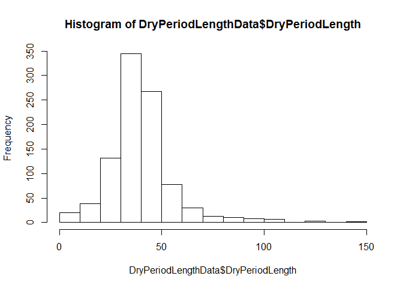

Association locomotion score 1-2 vs 3-5 on Week 4 with BCS
================

  - [Explanation](#explanation)
  - [Data extraction, transformation and
    loading](#data-extraction-transformation-and-loading)
      - [Packages loaded](#packages-loaded)
      - [Data anonymisation](#data-anonymisation)
      - [Locomotion data](#locomotion-data)
      - [BCS data](#bcs-data)
      - [Dry period data](#dry-period-data)
      - [Combined data](#combined-data)
  - [Association model locomotion score week
    4](#association-model-locomotion-score-week-4)
      - [Base models](#base-models)
      - [Univariate models](#univariate-models)
      - [Univariate comparison](#univariate-comparison)
      - [Multivariate models](#multivariate-models)
      - [Multivariate models with
        interactions](#multivariate-models-with-interactions)
  - [Final model selection](#final-model-selection)
      - [Summary](#summary)
      - [Confidence intervals](#confidence-intervals)
      - [Least square means and
        contrasts](#least-square-means-and-contrasts)

# Explanation

<https://bbolker.github.io/mixedmodels-misc/glmmFAQ.html#model-specification>

# Data extraction, transformation and loading

## Packages loaded

``` r
r = getOption("repos")
r["CRAN"] = "http://cran.us.r-project.org"
options(repos = r)
if (!require("readr")) {
  install.packages("readr", dependencies = TRUE)
  library(readr)
  citation("readr")
}
```

    ## Loading required package: readr

``` r
if (!require("plyr")) {
  install.packages("plyr", dependencies = TRUE)
  library(plyr)
  citation("plyr")
}
```

    ## Loading required package: plyr

``` r
#data manipulation
if (!require("dplyr")) {
  install.packages("dplyr", dependencies = TRUE)
  library(dplyr)
  citation("dplyr")
}
```

    ## Loading required package: dplyr

    ## 
    ## Attaching package: 'dplyr'

    ## The following objects are masked from 'package:plyr':
    ## 
    ##     arrange, count, desc, failwith, id, mutate, rename, summarise,
    ##     summarize

    ## The following objects are masked from 'package:stats':
    ## 
    ##     filter, lag

    ## The following objects are masked from 'package:base':
    ## 
    ##     intersect, setdiff, setequal, union

``` r
#data manipulation
if (!require("tidyr")) {
  install.packages("tidyr", dependencies = TRUE)
  library(tidyr)
  citation("tidyr")
}
```

    ## Loading required package: tidyr

``` r
if (!require("stringr")) {
  install.packages("stringr", dependencies = TRUE)
  library(stringr)
  citation("stringr")
}
```

    ## Loading required package: stringr

``` r
#%LIKE%
if (!require("data.table")) {
  install.packages("data.table", dependencies = TRUE)
  library(data.table)
  citation("data.table")
}
```

    ## Loading required package: data.table

    ## 
    ## Attaching package: 'data.table'

    ## The following objects are masked from 'package:dplyr':
    ## 
    ##     between, first, last

``` r
if (!require("lubridate")) {
  install.packages("lubridate", dependencies = TRUE) 
  library(lubridate)
  citation("lubridate")
}
```

    ## Loading required package: lubridate

    ## 
    ## Attaching package: 'lubridate'

    ## The following objects are masked from 'package:data.table':
    ## 
    ##     hour, isoweek, mday, minute, month, quarter, second, wday, week,
    ##     yday, year

    ## The following object is masked from 'package:plyr':
    ## 
    ##     here

    ## The following object is masked from 'package:base':
    ## 
    ##     date

``` r
#random forest
if (!require("caret")) {
  install.packages("caret", dependencies = TRUE)
  library(caret)
  citation(caret)
}
```

    ## Loading required package: caret

    ## Loading required package: lattice

    ## Loading required package: ggplot2

``` r
#Anova
if (!require("car")) {
  install.packages("car", dependencies = FALSE)
  library(car)
  citation(car)
}
```

    ## Loading required package: car

    ## Loading required package: carData

    ## 
    ## Attaching package: 'car'

    ## The following object is masked from 'package:dplyr':
    ## 
    ##     recode

## Data anonymisation

Make sure you have a file with Anonymization.R which contains some salt
for the anonymisation

``` r
source("../Anonymization.R")
#anony
if (!require("anonymizer")) {
  devtools::install_github("paulhendricks/anonymizer")
  library(anonymizer)
}
```

    ## Loading required package: anonymizer

``` r
citation("anonymizer")
```

    ## Warning in citation("anonymizer"): no date field in DESCRIPTION file of package
    ## 'anonymizer'

    ## 
    ## To cite package 'anonymizer' in publications use:
    ## 
    ##   Paul Hendricks (2020). anonymizer: Anonymize Data Containing
    ##   Personally Identifiable Information. R package version 0.2.2.
    ##   https://github.com/paulhendricks/anonymizer
    ## 
    ## A BibTeX entry for LaTeX users is
    ## 
    ##   @Manual{,
    ##     title = {anonymizer: Anonymize Data Containing Personally Identifiable Information},
    ##     author = {Paul Hendricks},
    ##     year = {2020},
    ##     note = {R package version 0.2.2},
    ##     url = {https://github.com/paulhendricks/anonymizer},
    ##   }

``` r
anoCols <- c("HerdIdentifier", "AnimalIdentifier", "AnimalEartag")
```

## Locomotion data

``` r
LocomotionData <- 
  read_csv(
    "../Data/LocomotionAndBCSData.csv", 
    col_types = cols(
      DaysInMilk = col_integer(), 
      HerdIdentifier = col_character(), 
      LOCO = col_double(), 
      LactationNumber = col_integer())) %>%
  dplyr::filter(LactationNumber > 1) %>%
  dplyr::mutate(
    CalvingDate = as.Date(CalvingTime, format="%Y-%m-%d"),
    CalvingSeason = case_when(
                    between(month(CalvingDate), 1, 3) ~ "Winter",
                    between(month(CalvingDate), 4, 6) ~ "Spring",
                    between(month(CalvingDate), 7, 9) ~ "Summer",
                    between(month(CalvingDate), 10, 12) ~ "Autumn"),
    AnimalEartag = as.character(AnimalNumber),
    HerdIdentifier = as.character(HerdIdentifier),
    AnimalIdentifier = as.character(AnimalIdentifier),
    LocomotionScore = as.factor(case_when(
                    LOCO <= 2 ~ "1-2",
                    TRUE ~ "3-5")),
    LocomotionScore = relevel(LocomotionScore, ref = "1-2")
    ) %>% # Only select the necesarry columns
  dplyr::mutate_at(vars(anoCols), anonymizer::anonymize, .char = anoSalt) %>%
  dplyr::select(
    AnimalIdentifier,
    HerdIdentifier,
    LactationNumber,
    LocomotionScore,
    ObservationPeriod,
    ObservationDate,
    CalvingSeason
  )

LocomotionDataWeek4 <- LocomotionData %>% dplyr::filter(ObservationPeriod == "WEEK 4")
LocomotionDataWeek8 <- LocomotionData %>% dplyr::filter(ObservationPeriod == "WEEK 8")
```

## BCS data

``` r
BCSData <- 
  read_csv(
    "../Data/LocomotionAndBCSData.csv", 
    col_types = cols(
      DaysInMilk = col_integer(), 
      HerdIdentifier = col_character(), 
      LactationNumber = col_integer())) %>%
  dplyr::filter(LactationNumber > 1) %>%
  dplyr::mutate(
    CalvingDate = as.Date(CalvingTime, format="%Y-%m-%d"),
    AnimalEartag = as.character(AnimalNumber),
    HerdIdentifier = as.character(HerdIdentifier),
    AnimalIdentifier = as.character(AnimalIdentifier),
    ObservationPeriod = case_when(
                    ObservationPeriod == "BEGIN DROOGSTAND" ~ "BCSEarlyDryPeriod",
                    ObservationPeriod == "EIND DROOGSTAND" ~ "BCSEndDryPeriod",
                    ObservationPeriod == "WEEK 4" ~ "BCSWeek4",
                    ObservationPeriod == "WEEK 8" ~ "BCSWeek8"),
    Parity = factor(case_when(
                    LactationNumber == 2 ~ "2",
                    LactationNumber == 3 ~ "3",
                    LactationNumber > 3 ~ ">3")),
    Parity = relevel(Parity, ref = "2")
    ) %>% # Only select the necesarry columns
  dplyr::mutate_at(vars(anoCols), anonymizer::anonymize, .char = anoSalt) %>%
  dplyr::group_by(
    AnimalIdentifier,
    HerdIdentifier,
    LactationNumber,
    ObservationPeriod,
    Parity
  ) %>%
  dplyr::summarise(BCS = mean(BCS, na.rm = TRUE)) %>%
  tidyr::spread(key = ObservationPeriod, value = BCS, convert = TRUE) %>%
  dplyr::mutate(
    BCSChangeDryPeriod = BCSEndDryPeriod - BCSEarlyDryPeriod,
    BCSChangeTransition =  BCSWeek4 - BCSEndDryPeriod,
    BCSEarlyDryPeriodCat = factor(case_when(
      BCSEarlyDryPeriod < 2.75 ~ "< 2.75",
      between(BCSEarlyDryPeriod, 2.75, 3.25) ~ "2.75 to 3.25",
      BCSEarlyDryPeriod > 3.25 ~ "> 3.25"),
      levels= c("2.75 to 3.25", "< 2.75",  "> 3.25")
    ),
    BCSEndDryPeriodCat = factor(case_when(
      BCSEndDryPeriod < 3.0 ~ "< 3.0",
      between(BCSEndDryPeriod, 3.0, 3.5) ~ "3.0 to 3.5",
      BCSEndDryPeriod > 3.5 ~ "> 3.5"),
      levels= c("3.0 to 3.5", "< 3.0",  "> 3.5")
    ),
    BCSWeek4Cat = factor(case_when(
      BCSWeek4 < 2.5 ~ "< 2.5",
      between(BCSWeek4, 2.5, 3.0) ~ "2.5 to 3.0",
      BCSWeek4 > 3.0 ~ "> 3.0"),
      levels= c("2.5 to 3.0", "< 2.5", "> 3.0")
    ),
    BCSChangeDryPeriodCat = factor(case_when(
      BCSChangeDryPeriod < 0.00 ~ "Decrease",
      between(BCSChangeDryPeriod, 0.0, 0.25) ~ "Increase 0.00 to 0.25",
      BCSChangeDryPeriod > 0.25 ~ "Increase > 0.25"),
      levels= c("Increase 0.00 to 0.25", "Decrease", "Increase > 0.25")
    ),
    BCSChangeTransitionCat = factor(case_when(
      BCSChangeTransition < -0.75 ~ "Decrease > 0.75",
      between(BCSChangeTransition, -0.75, -0.5) ~ "Decrease 0.50 to 0.75",      
      BCSChangeTransition > -0.5 ~ "Decrease < 0.50"),
      levels= c("Decrease < 0.50", "Decrease 0.50 to 0.75", "Decrease > 0.75")
    )
  )

print('BCSEarlyDryPeriod')
```

    ## [1] "BCSEarlyDryPeriod"

``` r
quantile(BCSData$BCSEarlyDryPeriod, c(0.33, 0.66), na.rm = TRUE)
```

    ##  33%  66% 
    ## 2.75 3.25

``` r
print('BCSEndDryPeriod')
```

    ## [1] "BCSEndDryPeriod"

``` r
quantile(BCSData$BCSEndDryPeriod, c(0.33, 0.66), na.rm = TRUE)
```

    ## 33% 66% 
    ## 3.0 3.5

``` r
print('BCSWeek4')
```

    ## [1] "BCSWeek4"

``` r
quantile(BCSData$BCSWeek4, c(0.33, 0.66), na.rm = TRUE)
```

    ## 33% 66% 
    ## 2.5 3.0

``` r
print('BCSWeek8')
```

    ## [1] "BCSWeek8"

``` r
quantile(BCSData$BCSWeek8, c(0.33, 0.66), na.rm = TRUE)
```

    ##  33%  66% 
    ## 2.25 2.75

``` r
print('BCSChangeDryPeriod')
```

    ## [1] "BCSChangeDryPeriod"

``` r
quantile(BCSData$BCSChangeDryPeriod, c(0.33, 0.66), na.rm = TRUE)
```

    ##  33%  66% 
    ## 0.00 0.25

``` r
print('BCSChangeTransition')
```

    ## [1] "BCSChangeTransition"

``` r
quantile(BCSData$BCSChangeTransition, c(0.33, 0.66), na.rm = TRUE)
```

    ##   33%   66% 
    ## -0.75 -0.50

``` r
write.csv2(BCSData, file="../Data/BCSDataWeek4.csv", na="", dec = ".", row.names = FALSE)
```

    ## Warning in write.csv2(BCSData, file = "../Data/BCSDataWeek4.csv", na = "", :
    ## attempt to set 'dec' ignored

``` r
library("ggpubr")
```

    ## Loading required package: magrittr

    ## 
    ## Attaching package: 'magrittr'

    ## The following object is masked from 'package:tidyr':
    ## 
    ##     extract

    ## 
    ## Attaching package: 'ggpubr'

    ## The following object is masked from 'package:plyr':
    ## 
    ##     mutate

``` r
ggscatter(BCSData, x = "BCSEarlyDryPeriod", y = "BCSChangeDryPeriod", 
          add = "reg.line", conf.int = FALSE, 
          cor.coef = TRUE, cor.method = "pearson")
```

    ## `geom_smooth()` using formula 'y ~ x'

    ## Warning: Removed 350 rows containing non-finite values (stat_smooth).

    ## Warning: Removed 350 rows containing non-finite values (stat_cor).

    ## Warning: Removed 350 rows containing missing values (geom_point).

<!-- -->

## Dry period data

``` r
DryPeriodLengthData <- 
  read_csv(
    "../Data/LocomotionAndBCSData.csv", 
    col_types = cols(
      DaysInMilk = col_integer(), 
      HerdIdentifier = col_character(), 
      LactationNumber = col_integer())) %>%
  dplyr::filter(ObservationPeriod == "BEGIN DROOGSTAND") %>%
  dplyr::mutate(
    CalvingDate = as.Date(CalvingTime, format="%Y-%m-%d"),
    AnimalEartag = as.character(AnimalNumber),
    HerdIdentifier = as.character(HerdIdentifier),
    AnimalIdentifier = as.character(AnimalIdentifier),
    ObservationPeriod = case_when(
                    ObservationPeriod == "BEGIN DROOGSTAND" ~ "BCSEarlyDryPeriod",
                    ObservationPeriod == "EIND DROOGSTAND" ~ "BCSEndDryPeriod",
                    ObservationPeriod == "WEEK 4" ~ "BCSWeek4",
                    ObservationPeriod == "WEEK 8" ~ "BCSWeek8"),
    Parity = as.factor(case_when(
                    LactationNumber == 2 ~ "2",
                    LactationNumber == 3 ~ "3",
                    TRUE ~ ">3")),
    Parity = relevel(Parity, ref = "2"),
    DryPeriodLength = as.numeric(difftime(CalvingDate,ObservationDate)),
    DryPeriodLengthCat = factor(case_when(
      DryPeriodLength < 34 ~ "Dry period <34",
      between(DryPeriodLength, 34, 43) ~ "Dry period 34-43",      
      DryPeriodLength > 43 ~ "Dry period >43"),
      levels= c("Dry period 34-43", "Dry period <34", "Dry period >43")
    ),
    DryPeriodLengthCat = relevel(DryPeriodLengthCat, ref = "Dry period 34-43"),
    ) %>% # Only select the necesarry columns
  dplyr::mutate_at(vars(anoCols), anonymizer::anonymize, .char = anoSalt) %>%
  dplyr::filter(between(DryPeriodLength, 0, 1000)) %>%
  dplyr::select(
      AnimalIdentifier, 
      HerdIdentifier, 
      LactationNumber,
      DryPeriodLength,
      DryPeriodLengthCat
  )

quantile(DryPeriodLengthData$DryPeriodLength, c(0.33, 0.66), na.rm = TRUE)
```

    ## 33% 66% 
    ##  34  43

``` r
hist(DryPeriodLengthData$DryPeriodLength)
```

<!-- -->

``` r
HerdDryPeriodLength <- DryPeriodLengthData %>% group_by(HerdIdentifier) %>% summarise(mean(DryPeriodLength),
                                                                                      quantile(DryPeriodLength, 0.25),
                                                                                      quantile(DryPeriodLength, 0.75))
```

## Combined data

``` r
Week4Data <- LocomotionDataWeek4 %>%
  inner_join(
    BCSData %>% dplyr::select(
      AnimalIdentifier, 
      HerdIdentifier, 
      LactationNumber,
      Parity,
      BCSEarlyDryPeriodCat,
      BCSEndDryPeriodCat,
      BCSWeek4Cat,
      BCSChangeDryPeriodCat,
      BCSChangeTransitionCat
      
    ),
    by = c("AnimalIdentifier", 
           "HerdIdentifier", 
           "LactationNumber")
    ) %>%
  inner_join(
    DryPeriodLengthData,
    by = c("AnimalIdentifier", 
           "HerdIdentifier", 
           "LactationNumber")
    ) %>%  drop_na() %>% 
  ungroup()

names(Week4Data) <- gsub("[^[:alnum:]]","",names(Week4Data))
```

# Association model locomotion score week 4

``` r
if (!require("lme4")) {
  install.packages("lme4", dependencies = TRUE)
  library(lme4)
  citation("lme4")
}
```

    ## Loading required package: lme4

    ## Loading required package: Matrix

    ## 
    ## Attaching package: 'Matrix'

    ## The following object is masked from 'package:tidyr':
    ## 
    ##     expand

    ## Registered S3 methods overwritten by 'lme4':
    ##   method                          from
    ##   cooks.distance.influence.merMod car 
    ##   influence.merMod                car 
    ##   dfbeta.influence.merMod         car 
    ##   dfbetas.influence.merMod        car

## Base models

``` r
Model0.0 <- glmer(formula = LocomotionScore ~ 1 + 
                     (1|HerdIdentifier),
                   data = Week4Data,
                   family = binomial(link = logit),
                   control=glmerControl(optimizer="bobyqa",
                                        optCtrl=list(maxfun=2e5)))
```

## Univariate models

``` r
Model1.0 <- glmer(formula = LocomotionScore ~ Parity +
                     (1|HerdIdentifier),
                   data = Week4Data,
                   family = binomial(link = logit),
                   control=glmerControl(optimizer="bobyqa",
                                        optCtrl=list(maxfun=2e5)))

Model1.1 <- glmer(formula = LocomotionScore ~ CalvingSeason + 
                     (1|HerdIdentifier),
                   data = Week4Data,
                   family = binomial(link = logit),
                   control=glmerControl(optimizer="bobyqa",
                                        optCtrl=list(maxfun=2e5)))

Model1.2 <- glmer(formula = LocomotionScore ~ BCSEndDryPeriodCat + 
                     (1|HerdIdentifier),
                   data = Week4Data,
                   family = binomial(link = logit),
                   control=glmerControl(optimizer="bobyqa",
                                        optCtrl=list(maxfun=2e5)))

Model1.3 <- glmer(formula = LocomotionScore ~ BCSChangeDryPeriodCat +   
                     (1|HerdIdentifier),
                   data = Week4Data,
                   family = binomial(link = logit),
                   control=glmerControl(optimizer="bobyqa",
                                        optCtrl=list(maxfun=2e5)))

Model1.4 <- glmer(formula = LocomotionScore ~ BCSChangeTransitionCat +  
                     (1|HerdIdentifier),
                   data = Week4Data,
                   family = binomial(link = logit),
                   control=glmerControl(optimizer="bobyqa",
                                        optCtrl=list(maxfun=2e5)))

Model1.5 <- glmer(formula = LocomotionScore ~ DryPeriodLengthCat +  
                     (1|HerdIdentifier),
                   data = Week4Data,
                   family = binomial(link = logit),
                   control=glmerControl(optimizer="bobyqa",
                                        optCtrl=list(maxfun=2e5)))

Model1.6 <- glmer(formula = LocomotionScore ~ DryPeriodLength +  
                     (1|HerdIdentifier),
                   data = Week4Data,
                   family = binomial(link = logit),
                   control=glmerControl(optimizer="bobyqa",
                                        optCtrl=list(maxfun=2e5)))


Model1.7 <- glmer(formula = LocomotionScore ~ BCSEarlyDryPeriodCat +  
                     (1|HerdIdentifier),
                   data = Week4Data,
                   family = binomial(link = logit),
                   control=glmerControl(optimizer="bobyqa",
                                        optCtrl=list(maxfun=2e5)))
```

## Univariate comparison

``` r
anova(Model0.0, Model1.0)
```

    ## Data: Week4Data
    ## Models:
    ## Model0.0: LocomotionScore ~ 1 + (1 | HerdIdentifier)
    ## Model1.0: LocomotionScore ~ Parity + (1 | HerdIdentifier)
    ##          Df    AIC    BIC  logLik deviance  Chisq Chi Df Pr(>Chisq)    
    ## Model0.0  2 980.27 989.42 -488.13   976.27                             
    ## Model1.0  4 928.78 947.08 -460.39   920.78 55.481      2  8.961e-13 ***
    ## ---
    ## Signif. codes:  0 '***' 0.001 '**' 0.01 '*' 0.05 '.' 0.1 ' ' 1

``` r
anova(Model0.0, Model1.1)
```

    ## Data: Week4Data
    ## Models:
    ## Model0.0: LocomotionScore ~ 1 + (1 | HerdIdentifier)
    ## Model1.1: LocomotionScore ~ CalvingSeason + (1 | HerdIdentifier)
    ##          Df    AIC    BIC  logLik deviance  Chisq Chi Df Pr(>Chisq)    
    ## Model0.0  2 980.27 989.42 -488.13   976.27                             
    ## Model1.1  5 959.21 982.09 -474.61   949.21 27.053      3  5.739e-06 ***
    ## ---
    ## Signif. codes:  0 '***' 0.001 '**' 0.01 '*' 0.05 '.' 0.1 ' ' 1

``` r
anova(Model0.0, Model1.2)
```

    ## Data: Week4Data
    ## Models:
    ## Model0.0: LocomotionScore ~ 1 + (1 | HerdIdentifier)
    ## Model1.2: LocomotionScore ~ BCSEndDryPeriodCat + (1 | HerdIdentifier)
    ##          Df    AIC     BIC  logLik deviance  Chisq Chi Df Pr(>Chisq)
    ## Model0.0  2 980.27  989.42 -488.13   976.27                         
    ## Model1.2  4 983.53 1001.83 -487.76   975.53 0.7371      2     0.6917

``` r
anova(Model0.0, Model1.3)
```

    ## Data: Week4Data
    ## Models:
    ## Model0.0: LocomotionScore ~ 1 + (1 | HerdIdentifier)
    ## Model1.3: LocomotionScore ~ BCSChangeDryPeriodCat + (1 | HerdIdentifier)
    ##          Df    AIC     BIC  logLik deviance Chisq Chi Df Pr(>Chisq)
    ## Model0.0  2 980.27  989.42 -488.13   976.27                        
    ## Model1.3  4 981.75 1000.05 -486.87   973.75 2.517      2     0.2841

``` r
anova(Model0.0, Model1.4)
```

    ## Data: Week4Data
    ## Models:
    ## Model0.0: LocomotionScore ~ 1 + (1 | HerdIdentifier)
    ## Model1.4: LocomotionScore ~ BCSChangeTransitionCat + (1 | HerdIdentifier)
    ##          Df    AIC    BIC  logLik deviance  Chisq Chi Df Pr(>Chisq)  
    ## Model0.0  2 980.27 989.42 -488.13   976.27                           
    ## Model1.4  4 976.36 994.67 -484.18   968.36 7.9003      2    0.01925 *
    ## ---
    ## Signif. codes:  0 '***' 0.001 '**' 0.01 '*' 0.05 '.' 0.1 ' ' 1

``` r
anova(Model0.0, Model1.5)
```

    ## Data: Week4Data
    ## Models:
    ## Model0.0: LocomotionScore ~ 1 + (1 | HerdIdentifier)
    ## Model1.5: LocomotionScore ~ DryPeriodLengthCat + (1 | HerdIdentifier)
    ##          Df    AIC    BIC  logLik deviance  Chisq Chi Df Pr(>Chisq)  
    ## Model0.0  2 980.27 989.42 -488.13   976.27                           
    ## Model1.5  4 979.58 997.88 -485.79   971.58 4.6892      2    0.09589 .
    ## ---
    ## Signif. codes:  0 '***' 0.001 '**' 0.01 '*' 0.05 '.' 0.1 ' ' 1

``` r
anova(Model0.0, Model1.6)
```

    ## Data: Week4Data
    ## Models:
    ## Model0.0: LocomotionScore ~ 1 + (1 | HerdIdentifier)
    ## Model1.6: LocomotionScore ~ DryPeriodLength + (1 | HerdIdentifier)
    ##          Df    AIC    BIC  logLik deviance  Chisq Chi Df Pr(>Chisq)  
    ## Model0.0  2 980.27 989.42 -488.13   976.27                           
    ## Model1.6  3 977.31 991.04 -485.66   971.31 4.9543      1    0.02603 *
    ## ---
    ## Signif. codes:  0 '***' 0.001 '**' 0.01 '*' 0.05 '.' 0.1 ' ' 1

``` r
anova(Model0.0, Model1.7)
```

    ## Data: Week4Data
    ## Models:
    ## Model0.0: LocomotionScore ~ 1 + (1 | HerdIdentifier)
    ## Model1.7: LocomotionScore ~ BCSEarlyDryPeriodCat + (1 | HerdIdentifier)
    ##          Df    AIC     BIC  logLik deviance Chisq Chi Df Pr(>Chisq)
    ## Model0.0  2 980.27  989.42 -488.13   976.27                        
    ## Model1.7  4 983.78 1002.08 -487.89   975.78 0.483      2     0.7855

## Multivariate models

All univariate with P \< 0.1

``` r
Model2.1 <- glmer(formula = LocomotionScore ~ Parity + CalvingSeason + DryPeriodLengthCat + 
                    BCSEarlyDryPeriodCat + BCSChangeTransitionCat + (1 | HerdIdentifier),
                   data = Week4Data,
                   family = binomial(link = logit),
                   control=glmerControl(optimizer="bobyqa",
                                        optCtrl=list(maxfun=2e5)))
drop1(Model2.1, test = "Chisq")
```

    ## Single term deletions
    ## 
    ## Model:
    ## LocomotionScore ~ Parity + CalvingSeason + DryPeriodLengthCat + 
    ##     BCSEarlyDryPeriodCat + BCSChangeTransitionCat + (1 | HerdIdentifier)
    ##                        Df    AIC    LRT   Pr(Chi)    
    ## <none>                    908.22                     
    ## Parity                  2 950.22 46.000 1.026e-10 ***
    ## CalvingSeason           3 936.68 34.462 1.583e-07 ***
    ## DryPeriodLengthCat      2 905.52  1.305   0.52073    
    ## BCSEarlyDryPeriodCat    2 904.48  0.267   0.87500    
    ## BCSChangeTransitionCat  2 909.94  5.722   0.05722 .  
    ## ---
    ## Signif. codes:  0 '***' 0.001 '**' 0.01 '*' 0.05 '.' 0.1 ' ' 1

## Multivariate models with interactions

``` r
Model2.2 <- glmer(formula = LocomotionScore ~ Parity + CalvingSeason + DryPeriodLengthCat +
                    DryPeriodLengthCat*BCSEarlyDryPeriodCat + 
                    DryPeriodLengthCat*BCSChangeTransitionCat + 
                    BCSEarlyDryPeriodCat*BCSChangeTransitionCat +
                    (1 | HerdIdentifier),
                   data = Week4Data,
                   family = binomial(link = logit),
                   control=glmerControl(optimizer="bobyqa",
                                        optCtrl=list(maxfun=2e5)))
drop1(Model2.2, test = "Chisq")
```

    ## Single term deletions
    ## 
    ## Model:
    ## LocomotionScore ~ Parity + CalvingSeason + DryPeriodLengthCat + 
    ##     DryPeriodLengthCat * BCSEarlyDryPeriodCat + DryPeriodLengthCat * 
    ##     BCSChangeTransitionCat + BCSEarlyDryPeriodCat * BCSChangeTransitionCat + 
    ##     (1 | HerdIdentifier)
    ##                                             Df    AIC    LRT   Pr(Chi)    
    ## <none>                                         924.91                     
    ## Parity                                       2 967.68 46.765 7.000e-11 ***
    ## CalvingSeason                                3 953.11 34.196 1.802e-07 ***
    ## DryPeriodLengthCat:BCSEarlyDryPeriodCat      4 919.07  2.163    0.7058    
    ## DryPeriodLengthCat:BCSChangeTransitionCat    4 921.11  4.195    0.3802    
    ## BCSEarlyDryPeriodCat:BCSChangeTransitionCat  4 918.13  1.223    0.8743    
    ## ---
    ## Signif. codes:  0 '***' 0.001 '**' 0.01 '*' 0.05 '.' 0.1 ' ' 1

# Final model selection

``` r
finalModel <- update(Model2.1, . ~ . - DryPeriodLengthCat - BCSEarlyDryPeriodCat)
drop1(finalModel, test = "Chisq")
```

    ## Single term deletions
    ## 
    ## Model:
    ## LocomotionScore ~ Parity + CalvingSeason + BCSChangeTransitionCat + 
    ##     (1 | HerdIdentifier)
    ##                        Df    AIC    LRT   Pr(Chi)    
    ## <none>                    901.80                     
    ## Parity                  2 946.50 48.696 2.666e-11 ***
    ## CalvingSeason           3 931.14 35.342 1.032e-07 ***
    ## BCSChangeTransitionCat  2 903.89  6.086   0.04769 *  
    ## ---
    ## Signif. codes:  0 '***' 0.001 '**' 0.01 '*' 0.05 '.' 0.1 ' ' 1

## Summary

``` r
summary(finalModel)
```

    ## Generalized linear mixed model fit by maximum likelihood (Laplace
    ##   Approximation) [glmerMod]
    ##  Family: binomial  ( logit )
    ## Formula: LocomotionScore ~ Parity + CalvingSeason + BCSChangeTransitionCat +  
    ##     (1 | HerdIdentifier)
    ##    Data: Week4Data
    ## Control: glmerControl(optimizer = "bobyqa", optCtrl = list(maxfun = 2e+05))
    ## 
    ##      AIC      BIC   logLik deviance df.resid 
    ##    901.8    943.0   -441.9    883.8      708 
    ## 
    ## Scaled residuals: 
    ##     Min      1Q  Median      3Q     Max 
    ## -3.3287 -0.8405  0.3677  0.8166  2.2684 
    ## 
    ## Random effects:
    ##  Groups         Name        Variance Std.Dev.
    ##  HerdIdentifier (Intercept) 0.2626   0.5124  
    ## Number of obs: 717, groups:  HerdIdentifier, 8
    ## 
    ## Fixed effects:
    ##                                             Estimate Std. Error z value
    ## (Intercept)                                 -0.06681    0.28475  -0.235
    ## Parity>3                                     1.37322    0.20367   6.742
    ## Parity3                                      0.61894    0.21111   2.932
    ## CalvingSeasonSpring                         -1.55330    0.27880  -5.571
    ## CalvingSeasonSummer                         -0.83212    0.23201  -3.587
    ## CalvingSeasonWinter                         -0.97554    0.23535  -4.145
    ## BCSChangeTransitionCatDecrease 0.50 to 0.75  0.30180    0.19333   1.561
    ## BCSChangeTransitionCatDecrease > 0.75        0.56589    0.23424   2.416
    ##                                             Pr(>|z|)    
    ## (Intercept)                                 0.814489    
    ## Parity>3                                    1.56e-11 ***
    ## Parity3                                     0.003370 ** 
    ## CalvingSeasonSpring                         2.53e-08 ***
    ## CalvingSeasonSummer                         0.000335 ***
    ## CalvingSeasonWinter                         3.40e-05 ***
    ## BCSChangeTransitionCatDecrease 0.50 to 0.75 0.118515    
    ## BCSChangeTransitionCatDecrease > 0.75       0.015698 *  
    ## ---
    ## Signif. codes:  0 '***' 0.001 '**' 0.01 '*' 0.05 '.' 0.1 ' ' 1
    ## 
    ## Correlation of Fixed Effects:
    ##             (Intr) Prty>3 Party3 ClvngSsnSp ClvngSsnSm ClvnSW BCS0t0
    ## Parity>3    -0.246                                                  
    ## Parity3     -0.285  0.514                                           
    ## ClvngSsnSpr -0.328 -0.068 -0.025                                    
    ## ClvngSsnSmm -0.427 -0.116 -0.030  0.498                             
    ## ClvngSsnWnt -0.385 -0.105 -0.057  0.533      0.580                  
    ## BCSCTCD0.t0 -0.297 -0.077 -0.046 -0.100     -0.039     -0.105       
    ## BCSCTCD>0.7 -0.170 -0.176 -0.122 -0.267     -0.044     -0.160  0.491

``` r
Anova(finalModel)
```

    ## Analysis of Deviance Table (Type II Wald chisquare tests)
    ## 
    ## Response: LocomotionScore
    ##                          Chisq Df Pr(>Chisq)    
    ## Parity                 45.8451  2  1.109e-10 ***
    ## CalvingSeason          33.1083  3  3.056e-07 ***
    ## BCSChangeTransitionCat  6.0206  2    0.04928 *  
    ## ---
    ## Signif. codes:  0 '***' 0.001 '**' 0.01 '*' 0.05 '.' 0.1 ' ' 1

## Confidence intervals

``` r
#confint(finalModel, parm="beta_")
confint(finalModel)
```

## Least square means and contrasts

``` r
lsmeans::contrast(lsmeans::lsmeans(finalModel, ~Parity, type = "response"), 
          alpha=0.05, 
          method="revpairwise", 
          adjust="Tukey")
```

    ##  contrast odds.ratio     SE  df z.ratio p.value
    ##  >3 / 2         3.95 0.8041 Inf  6.742  <.0001 
    ##  3 / 2          1.86 0.3920 Inf  2.932  0.0094 
    ##  3 / >3         0.47 0.0963 Inf -3.686  0.0007 
    ## 
    ## Results are averaged over the levels of: CalvingSeason, BCSChangeTransitionCat 
    ## P value adjustment: tukey method for comparing a family of 3 estimates 
    ## Tests are performed on the log odds ratio scale

``` r
confint(lsmeans::contrast(lsmeans::lsmeans(finalModel, ~Parity, type = "response"), 
          alpha=0.05, 
          method="revpairwise", 
          adjust="Tukey"))
```

    ##  contrast odds.ratio     SE  df asymp.LCL asymp.UCL
    ##  >3 / 2         3.95 0.8041 Inf     2.450      6.36
    ##  3 / 2          1.86 0.3920 Inf     1.132      3.05
    ##  3 / >3         0.47 0.0963 Inf     0.291      0.76
    ## 
    ## Results are averaged over the levels of: CalvingSeason, BCSChangeTransitionCat 
    ## Confidence level used: 0.95 
    ## Conf-level adjustment: tukey method for comparing a family of 3 estimates 
    ## Intervals are back-transformed from the log odds ratio scale

``` r
lsmeans::contrast(lsmeans::lsmeans(finalModel, ~CalvingSeason, type = "response"), 
          alpha=0.05, 
          method="revpairwise", 
          adjust="Tukey")
```

    ##  contrast        odds.ratio     SE  df z.ratio p.value
    ##  Spring / Autumn      0.212 0.0590 Inf -5.571  <.0001 
    ##  Summer / Autumn      0.435 0.1010 Inf -3.587  0.0019 
    ##  Summer / Spring      2.057 0.5327 Inf  2.784  0.0275 
    ##  Winter / Autumn      0.377 0.0887 Inf -4.145  0.0002 
    ##  Winter / Spring      1.782 0.4478 Inf  2.299  0.0982 
    ##  Winter / Summer      0.866 0.1855 Inf -0.670  0.9085 
    ## 
    ## Results are averaged over the levels of: Parity, BCSChangeTransitionCat 
    ## P value adjustment: tukey method for comparing a family of 4 estimates 
    ## Tests are performed on the log odds ratio scale

``` r
confint(lsmeans::contrast(lsmeans::lsmeans(finalModel, ~CalvingSeason, type = "response"), 
          alpha=0.05, 
          method="revpairwise", 
          adjust="Tukey"))
```

    ##  contrast        odds.ratio     SE  df asymp.LCL asymp.UCL
    ##  Spring / Autumn      0.212 0.0590 Inf     0.103     0.433
    ##  Summer / Autumn      0.435 0.1010 Inf     0.240     0.790
    ##  Summer / Spring      2.057 0.5327 Inf     1.057     4.001
    ##  Winter / Autumn      0.377 0.0887 Inf     0.206     0.690
    ##  Winter / Spring      1.782 0.4478 Inf     0.934     3.399
    ##  Winter / Summer      0.866 0.1855 Inf     0.500     1.502
    ## 
    ## Results are averaged over the levels of: Parity, BCSChangeTransitionCat 
    ## Confidence level used: 0.95 
    ## Conf-level adjustment: tukey method for comparing a family of 4 estimates 
    ## Intervals are back-transformed from the log odds ratio scale

``` r
lsmeans::contrast(lsmeans::lsmeans(finalModel, ~BCSChangeTransitionCat, type = "response"), 
          alpha=0.05, 
          method="revpairwise", 
          adjust="Tukey")
```

    ##  contrast                                odds.ratio    SE  df z.ratio p.value
    ##  Decrease 0.50 to 0.75 / Decrease < 0.50       1.35 0.261 Inf 1.561   0.2627 
    ##  Decrease > 0.75 / Decrease < 0.50             1.76 0.412 Inf 2.416   0.0415 
    ##  Decrease > 0.75 / Decrease 0.50 to 0.75       1.30 0.285 Inf 1.209   0.4480 
    ## 
    ## Results are averaged over the levels of: Parity, CalvingSeason 
    ## P value adjustment: tukey method for comparing a family of 3 estimates 
    ## Tests are performed on the log odds ratio scale

``` r
confint(lsmeans::contrast(lsmeans::lsmeans(finalModel, ~BCSChangeTransitionCat, type = "response"), 
          alpha=0.05, 
          method="revpairwise", 
          adjust="Tukey"))
```

    ##  contrast                                odds.ratio    SE  df asymp.LCL
    ##  Decrease 0.50 to 0.75 / Decrease < 0.50       1.35 0.261 Inf      0.86
    ##  Decrease > 0.75 / Decrease < 0.50             1.76 0.412 Inf      1.02
    ##  Decrease > 0.75 / Decrease 0.50 to 0.75       1.30 0.285 Inf      0.78
    ##  asymp.UCL
    ##       2.13
    ##       3.05
    ##       2.17
    ## 
    ## Results are averaged over the levels of: Parity, CalvingSeason 
    ## Confidence level used: 0.95 
    ## Conf-level adjustment: tukey method for comparing a family of 3 estimates 
    ## Intervals are back-transformed from the log odds ratio scale
