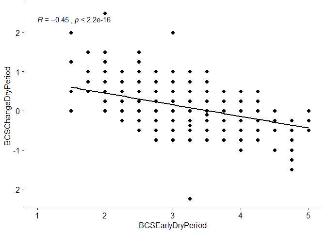
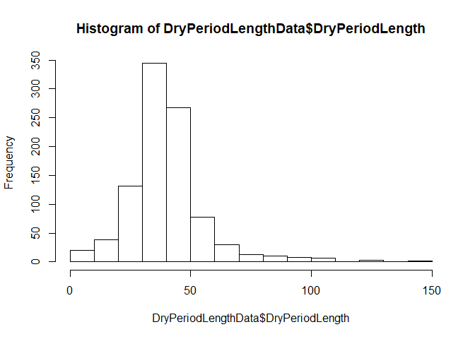

Association locomotion score 1-2 vs 3-5 on Week 8 with BCS
================

  - [Explanation](#explanation)
  - [Data extraction, transformation and
    loading](#data-extraction-transformation-and-loading)
      - [Packages loaded](#packages-loaded)
      - [Data anonymisation](#data-anonymisation)
      - [BCS data](#bcs-data)
      - [Dry period data](#dry-period-data)
      - [Combined data](#combined-data)
  - [Association model locomotion score week
    8](#association-model-locomotion-score-week-8)
      - [Base models](#base-models)
      - [Univariate models](#univariate-models)
      - [Univariate comparison](#univariate-comparison)
      - [Multivariate models](#multivariate-models)
  - [Final model selection](#final-model-selection)
      - [Summary](#summary)
      - [Confidence intervals](#confidence-intervals)
      - [Least square means and
        contrasts](#least-square-means-and-contrasts)

# Explanation

<https://bbolker.github.io/mixedmodels-misc/glmmFAQ.html#model-specification>

# Data extraction, transformation and loading

## Packages loaded

``` r
r = getOption("repos")
r["CRAN"] = "http://cran.us.r-project.org"
options(repos = r)
if (!require("readr")) {
  install.packages("readr", dependencies = TRUE)
  library(readr)
  citation("readr")
}
```

    ## Loading required package: readr

``` r
#data manipulation
if (!require("dplyr")) {
  install.packages("dplyr", dependencies = TRUE)
  library(dplyr)
  citation("dplyr")
}
```

    ## Loading required package: dplyr

    ## 
    ## Attaching package: 'dplyr'

    ## The following objects are masked from 'package:stats':
    ## 
    ##     filter, lag

    ## The following objects are masked from 'package:base':
    ## 
    ##     intersect, setdiff, setequal, union

``` r
#data manipulation
if (!require("tidyr")) {
  install.packages("tidyr", dependencies = TRUE)
  library(tidyr)
  citation("tidyr")
}
```

    ## Loading required package: tidyr

``` r
if (!require("stringr")) {
  install.packages("stringr", dependencies = TRUE)
  library(stringr)
  citation("stringr")
}
```

    ## Loading required package: stringr

``` r
#%LIKE%
if (!require("data.table")) {
  install.packages("data.table", dependencies = TRUE)
  library(data.table)
  citation("data.table")
}
```

    ## Loading required package: data.table

    ## 
    ## Attaching package: 'data.table'

    ## The following objects are masked from 'package:dplyr':
    ## 
    ##     between, first, last

``` r
if (!require("lubridate")) {
  install.packages("lubridate", dependencies = TRUE) 
  library(lubridate)
  citation("lubridate")
}
```

    ## Loading required package: lubridate

    ## 
    ## Attaching package: 'lubridate'

    ## The following objects are masked from 'package:data.table':
    ## 
    ##     hour, isoweek, mday, minute, month, quarter, second, wday, week,
    ##     yday, year

    ## The following object is masked from 'package:base':
    ## 
    ##     date

``` r
#random forest
if (!require("caret")) {
  install.packages("caret", dependencies = TRUE)
  library(caret)
}
```

    ## Loading required package: caret

    ## Loading required package: lattice

    ## Loading required package: ggplot2

``` r
#Anova
if (!require("car")) {
  install.packages("car", dependencies = TRUE)
  library(car)
}
```

    ## Loading required package: car

    ## Loading required package: carData

    ## 
    ## Attaching package: 'car'

    ## The following object is masked from 'package:dplyr':
    ## 
    ##     recode

## Data anonymisation

Make sure you have a file with Anonymization.R which contains some salt
for the anonymisation

``` r
source("../Anonymization.R")
#anony
if (!require("anonymizer")) {
  devtools::install_github("paulhendricks/anonymizer")
  library(anonymizer)
}
```

    ## Loading required package: anonymizer

``` r
citation("anonymizer")
```

    ## Warning in citation("anonymizer"): no date field in DESCRIPTION file of package
    ## 'anonymizer'

    ## 
    ## To cite package 'anonymizer' in publications use:
    ## 
    ##   Paul Hendricks (2020). anonymizer: Anonymize Data Containing
    ##   Personally Identifiable Information. R package version 0.2.2.
    ##   https://github.com/paulhendricks/anonymizer
    ## 
    ## A BibTeX entry for LaTeX users is
    ## 
    ##   @Manual{,
    ##     title = {anonymizer: Anonymize Data Containing Personally Identifiable Information},
    ##     author = {Paul Hendricks},
    ##     year = {2020},
    ##     note = {R package version 0.2.2},
    ##     url = {https://github.com/paulhendricks/anonymizer},
    ##   }

``` r
anoCols <- c("HerdIdentifier", "AnimalIdentifier", "AnimalEartag")
```

``` r
LocomotionData <- 
  read_csv(
    "../Data/LocomotionAndBCSData.csv", 
    col_types = cols(
      DaysInMilk = col_integer(), 
      HerdIdentifier = col_character(), 
      LOCO = col_double(), 
      LactationNumber = col_integer())) %>%
  dplyr::filter(LactationNumber > 1) %>%
  dplyr::mutate(
    CalvingDate = as.Date(CalvingTime, format="%Y-%m-%d"),
    CalvingSeason = case_when(
                    between(month(CalvingDate), 1, 3) ~ "Winter",
                    between(month(CalvingDate), 4, 6) ~ "Spring",
                    between(month(CalvingDate), 7, 9) ~ "Summer",
                    between(month(CalvingDate), 10, 12) ~ "Autumn"),
    AnimalEartag = as.character(AnimalNumber),
    HerdIdentifier = as.character(HerdIdentifier),
    AnimalIdentifier = as.character(AnimalIdentifier),
    LocomotionScore = as.factor(case_when(
                    LOCO <= 2 ~ "1-2",
                    TRUE ~ "3-5")),
    LocomotionScore = relevel(LocomotionScore, ref = "1-2")
    ) %>% # Only select the necesarry columns
  dplyr::mutate_at(vars(anoCols), anonymizer::anonymize, .char = anoSalt) %>%
  dplyr::select(
    AnimalIdentifier,
    HerdIdentifier,
    LactationNumber,
    LocomotionScore,
    ObservationPeriod,
    ObservationDate,
    CalvingSeason
  )

LocomotionDataWeek4 <- LocomotionData %>% dplyr::filter(ObservationPeriod == "WEEK 4")
LocomotionDataWeek8 <- LocomotionData %>% dplyr::filter(ObservationPeriod == "WEEK 8")
```

## BCS data

``` r
BCSData <- 
  read_csv(
    "../Data/LocomotionAndBCSData.csv", 
    col_types = cols(
      DaysInMilk = col_integer(), 
      HerdIdentifier = col_character(), 
      LactationNumber = col_integer())) %>%
  dplyr::mutate(
    CalvingDate = as.Date(CalvingTime, format="%Y-%m-%d"),
    AnimalEartag = as.character(AnimalNumber),
    HerdIdentifier = as.character(HerdIdentifier),
    AnimalIdentifier = as.character(AnimalIdentifier),
    ObservationPeriod = case_when(
                    ObservationPeriod == "BEGIN DROOGSTAND" ~ "BCSEarlyDryPeriod",
                    ObservationPeriod == "EIND DROOGSTAND" ~ "BCSEndDryPeriod",
                    ObservationPeriod == "WEEK 4" ~ "BCSWeek4",
                    ObservationPeriod == "WEEK 8" ~ "BCSWeek8"),
    Parity = as.factor(case_when(
                    LactationNumber == 2 ~ "2",
                    LactationNumber == 3 ~ "3",
                    TRUE ~ ">3")),
    Parity = relevel(Parity, ref = "2")
    ) %>% # Only select the necesarry columns
  dplyr::mutate_at(vars(anoCols), anonymizer::anonymize, .char = anoSalt) %>%
  dplyr::group_by(
    AnimalIdentifier,
    HerdIdentifier,
    LactationNumber,
    ObservationPeriod,
    Parity
  ) %>%
  dplyr::summarise(BCS = mean(BCS, na.rm = TRUE)) %>%
  tidyr::spread(key = ObservationPeriod, value = BCS, convert = TRUE) %>%
  dplyr::mutate(
    BCSChangeDryPeriod = BCSEndDryPeriod - BCSEarlyDryPeriod,
    BCSChangeTransition =  BCSWeek4 - BCSEndDryPeriod,
    BCSChangePost =  BCSWeek8 - BCSWeek4,
    BCSEarlyDryPeriodCat = factor(case_when(
      BCSEarlyDryPeriod < 2.75 ~ "< 2.75",
      between(BCSEarlyDryPeriod, 2.75, 3.25) ~ "2.75 to 3.25",
      BCSEarlyDryPeriod > 3.25 ~ "> 3.25"),
      levels= c("2.75 to 3.25", "< 2.75",  "> 3.25")
    ),
    BCSEndDryPeriodCat = factor(case_when(
      BCSEndDryPeriod < 3.0 ~ "< 3.0",
      between(BCSEndDryPeriod, 3.0, 3.5) ~ "3.0 to 3.5",
      BCSEndDryPeriod > 3.5 ~ "> 3.5"),
      levels= c("3.0 to 3.5", "< 3.0",  "> 3.5")
    ),
    BCSWeek4Cat = factor(case_when(
      BCSWeek4 < 2.5 ~ "< 2.5",
      between(BCSWeek4, 2.5, 3.0) ~ "2.5 to 3.0",
      BCSWeek4 > 3.0 ~ "> 3.0"),
      levels= c("2.5 to 3.0", "< 2.5", "> 3.0")
    ),
    BCSWeek8Cat = factor(case_when(
      BCSWeek8 < 2.25 ~ "< 2.25",
      between(BCSWeek8, 2.25, 2.75) ~ "2.25 to 2.75",
      BCSWeek8 > 2.75 ~ "> 2.75"),
      levels= c("2.25 to 2.75", "< 2.25", "> 2.75")
    ),
    BCSChangeDryPeriodCat = factor(case_when(
      BCSChangeDryPeriod < 0.00 ~ "Decrease",
      between(BCSChangeDryPeriod, 0.0, 0.25) ~ "Increase 0.00 to 0.25",
      BCSChangeDryPeriod > 0.25 ~ "Increase > 0.25"),
      levels= c("Increase 0.00 to 0.25", "Decrease", "Increase > 0.25")
    ),
    BCSChangeTransitionCat = factor(case_when(
      BCSChangeTransition < -0.75 ~ "Decrease > 0.75",
      between(BCSChangeTransition, -0.75, -0.25) ~ "Decrease 0.25 to 0.75",      
      BCSChangeTransition > -0.25 ~ "Decrease < 0.25"),
      levels= c("Decrease 0.25 to 0.75", "Decrease > 0.75", "Decrease < 0.25")
    ),
    BCSChangePostCat = factor(case_when(
      BCSChangePost < -0.25 ~ "Decrease > 0.25",
      between(BCSChangePost, -0.25, 0.00) ~ "Decrease 0.00 to 0.25",      
      BCSChangePost > 0.0 ~ "Increase/Stable"),
      levels= c("Decrease 0.00 to 0.25", "Decrease > 0.25", "Increase/Stable")
    )
  )

print('BCSEarlyDryPeriod')
```

    ## [1] "BCSEarlyDryPeriod"

``` r
quantile(BCSData$BCSEarlyDryPeriod, c(0.33, 0.66), na.rm = TRUE)
```

    ##  33%  66% 
    ## 2.75 3.25

``` r
print('BCSEndDryPeriod')
```

    ## [1] "BCSEndDryPeriod"

``` r
quantile(BCSData$BCSEndDryPeriod, c(0.33, 0.66), na.rm = TRUE)
```

    ## 33% 66% 
    ## 3.0 3.5

``` r
print('BCSWeek4')
```

    ## [1] "BCSWeek4"

``` r
quantile(BCSData$BCSWeek4, c(0.33, 0.66), na.rm = TRUE)
```

    ## 33% 66% 
    ## 2.5 3.0

``` r
print('BCSWeek8')
```

    ## [1] "BCSWeek8"

``` r
quantile(BCSData$BCSWeek8, c(0.33, 0.66), na.rm = TRUE)
```

    ##  33%  66% 
    ## 2.25 2.75

``` r
print('BCSChangeDryPeriod')
```

    ## [1] "BCSChangeDryPeriod"

``` r
quantile(BCSData$BCSChangeDryPeriod, c(0.33, 0.66), na.rm = TRUE)
```

    ##  33%  66% 
    ## 0.00 0.25

``` r
print('BCSChangeTransition')
```

    ## [1] "BCSChangeTransition"

``` r
quantile(BCSData$BCSChangeTransition, c(0.33, 0.66), na.rm = TRUE)
```

    ##   33%   66% 
    ## -0.75 -0.25

``` r
print('BCSChangePost')
```

    ## [1] "BCSChangePost"

``` r
quantile(BCSData$BCSChangePost, c(0.33, 0.66), na.rm = TRUE)
```

    ##   33%   66% 
    ## -0.25  0.00

``` r
library("ggpubr")
```

    ## Loading required package: magrittr

    ## 
    ## Attaching package: 'magrittr'

    ## The following object is masked from 'package:tidyr':
    ## 
    ##     extract

``` r
ggscatter(BCSData, x = "BCSEarlyDryPeriod", y = "BCSChangeDryPeriod", 
          add = "reg.line", conf.int = FALSE, 
          cor.coef = TRUE, cor.method = "pearson")
```

    ## `geom_smooth()` using formula 'y ~ x'

    ## Warning: Removed 677 rows containing non-finite values (stat_smooth).

    ## Warning: Removed 677 rows containing non-finite values (stat_cor).

    ## Warning: Removed 677 rows containing missing values (geom_point).

<!-- -->

``` r
write.csv2(BCSData, file="../Data/BCSDataWeek8.csv", na="", dec = ".", row.names = FALSE)
```

    ## Warning in write.csv2(BCSData, file = "../Data/BCSDataWeek8.csv", na = "", :
    ## attempt to set 'dec' ignored

## Dry period data

``` r
DryPeriodLengthData <- 
  read_csv(
    "../Data/LocomotionAndBCSData.csv", 
    col_types = cols(
      DaysInMilk = col_integer(), 
      HerdIdentifier = col_character(), 
      LactationNumber = col_integer())) %>%
  dplyr::filter(ObservationPeriod == "BEGIN DROOGSTAND") %>%
  dplyr::mutate(
    CalvingDate = as.Date(CalvingTime, format="%Y-%m-%d"),
    AnimalEartag = as.character(AnimalNumber),
    HerdIdentifier = as.character(HerdIdentifier),
    AnimalIdentifier = as.character(AnimalIdentifier),
    ObservationPeriod = case_when(
                    ObservationPeriod == "BEGIN DROOGSTAND" ~ "BCSEarlyDryPeriod",
                    ObservationPeriod == "EIND DROOGSTAND" ~ "BCSEndDryPeriod",
                    ObservationPeriod == "WEEK 4" ~ "BCSWeek4",
                    ObservationPeriod == "WEEK 8" ~ "BCSWeek8"),
    Parity = as.factor(case_when(
                    LactationNumber == 2 ~ "2",
                    LactationNumber == 3 ~ "3",
                    TRUE ~ ">3")),
    Parity = relevel(Parity, ref = "2"),
    DryPeriodLength = as.numeric(difftime(CalvingDate,ObservationDate)),
    DryPeriodLengthCat = factor(case_when(
      DryPeriodLength < 34 ~ "Dry period <34",
      between(DryPeriodLength, 34, 43) ~ "Dry period 34-43",      
      DryPeriodLength > 43 ~ "Dry period >43"),
      levels= c("Dry period 34-43", "Dry period <34", "Dry period >43")
    )
    ) %>% # Only select the necesarry columns
  dplyr::mutate_at(vars(anoCols), anonymizer::anonymize, .char = anoSalt) %>%
  dplyr::filter(between(DryPeriodLength, 0, 1000)) %>%
  dplyr::select(
      AnimalIdentifier, 
      HerdIdentifier, 
      LactationNumber,
      DryPeriodLength,
      DryPeriodLengthCat
  )

quantile(DryPeriodLengthData$DryPeriodLength, c(0.33, 0.66), na.rm = TRUE)
```

    ## 33% 66% 
    ##  34  43

``` r
hist(DryPeriodLengthData$DryPeriodLength)
```

<!-- -->

## Combined data

``` r
Week8Data <- LocomotionDataWeek8 %>%
  inner_join(
    BCSData %>% dplyr::select(
      AnimalIdentifier, 
      HerdIdentifier, 
      LactationNumber,
      Parity,
      BCSEarlyDryPeriodCat,
      BCSEndDryPeriodCat,
      BCSWeek4Cat,
      BCSWeek8Cat,
      BCSChangeDryPeriodCat,
      BCSChangeTransitionCat,
      BCSChangePostCat
    ),
    by = c("AnimalIdentifier", 
           "HerdIdentifier", 
           "LactationNumber")
    ) %>%
  inner_join(
    DryPeriodLengthData,
    by = c("AnimalIdentifier", 
           "HerdIdentifier", 
           "LactationNumber")
    ) %>%
  drop_na()

names(Week8Data) <- gsub("[^[:alnum:]]","",names(Week8Data))

xtabs(~Week8Data$BCSWeek4Cat + Week8Data$BCSChangeTransitionCat)
```

    ##                      Week8Data$BCSChangeTransitionCat
    ## Week8Data$BCSWeek4Cat Decrease 0.25 to 0.75 Decrease > 0.75 Decrease < 0.25
    ##            2.5 to 3.0                   206              85              67
    ##            < 2.5                        117              76              11
    ##            > 3.0                         71              11              25

# Association model locomotion score week 8

``` r
if (!require("lme4")) {
  install.packages("lme4", dependencies = TRUE)
  library(lme4)
  citation("lme4")
}
```

    ## Loading required package: lme4

    ## Loading required package: Matrix

    ## 
    ## Attaching package: 'Matrix'

    ## The following object is masked from 'package:tidyr':
    ## 
    ##     expand

    ## Registered S3 methods overwritten by 'lme4':
    ##   method                          from
    ##   cooks.distance.influence.merMod car 
    ##   influence.merMod                car 
    ##   dfbeta.influence.merMod         car 
    ##   dfbetas.influence.merMod        car

## Base models

``` r
Model0.0 <- glmer(formula = LocomotionScore ~ 1 + 
                     (1|HerdIdentifier),
                   data = Week8Data,
                   family = binomial(link = logit),
                   control=glmerControl(optimizer="bobyqa",
                                        optCtrl=list(maxfun=2e5)))
```

## Univariate models

``` r
Model1.0 <- glmer(formula = LocomotionScore ~ Parity +
                     (1|HerdIdentifier),
                   data = Week8Data,
                   family = binomial(link = logit),
                   control=glmerControl(optimizer="bobyqa",
                                        optCtrl=list(maxfun=2e5)))

Model1.1 <- glmer(formula = LocomotionScore ~ CalvingSeason + 
                     (1|HerdIdentifier),
                   data = Week8Data,
                   family = binomial(link = logit),
                   control=glmerControl(optimizer="bobyqa",
                                        optCtrl=list(maxfun=2e5)))

Model1.2 <- glmer(formula = LocomotionScore ~ BCSEndDryPeriodCat + 
                     (1|HerdIdentifier),
                   data = Week8Data,
                   family = binomial(link = logit),
                   control=glmerControl(optimizer="bobyqa",
                                        optCtrl=list(maxfun=2e5)))

Model1.3 <- glmer(formula = LocomotionScore ~ BCSChangeDryPeriodCat +   
                     (1|HerdIdentifier),
                   data = Week8Data,
                   family = binomial(link = logit),
                   control=glmerControl(optimizer="bobyqa",
                                        optCtrl=list(maxfun=2e5)))

Model1.4 <- glmer(formula = LocomotionScore ~ BCSChangeTransitionCat +  
                     (1|HerdIdentifier),
                   data = Week8Data,
                   family = binomial(link = logit),
                   control=glmerControl(optimizer="bobyqa",
                                        optCtrl=list(maxfun=2e5)))

Model1.5 <- glmer(formula = LocomotionScore ~ BCSWeek4Cat + 
                     (1|HerdIdentifier),
                   data = Week8Data,
                   family = binomial(link = logit),
                   control=glmerControl(optimizer="bobyqa",
                                        optCtrl=list(maxfun=2e5)))

Model1.6 <- glmer(formula = LocomotionScore ~ BCSWeek8Cat + 
                     (1|HerdIdentifier),
                   data = Week8Data,
                   family = binomial(link = logit),
                   control=glmerControl(optimizer="bobyqa",
                                        optCtrl=list(maxfun=2e5)))

Model1.7 <- glmer(formula = LocomotionScore ~ BCSChangePostCat +  
                     (1|HerdIdentifier),
                   data = Week8Data,
                   family = binomial(link = logit),
                   control=glmerControl(optimizer="bobyqa",
                                        optCtrl=list(maxfun=2e5)))

Model1.8 <- glmer(formula = LocomotionScore ~ DryPeriodLength +  
                     (1|HerdIdentifier),
                   data = Week8Data,
                   family = binomial(link = logit),
                   control=glmerControl(optimizer="bobyqa",
                                        optCtrl=list(maxfun=2e5)))
```

    ## Warning in checkConv(attr(opt, "derivs"), opt$par, ctrl = control$checkConv, :
    ## Model failed to converge with max|grad| = 0.0019846 (tol = 0.001, component 1)

``` r
Model1.9 <- glmer(formula = LocomotionScore ~ DryPeriodLengthCat +  
                     (1|HerdIdentifier),
                   data = Week8Data,
                   family = binomial(link = logit),
                   control=glmerControl(optimizer="bobyqa",
                                        optCtrl=list(maxfun=2e5)))

Model1.10 <- glmer(formula = LocomotionScore ~ BCSEarlyDryPeriodCat +  
                     (1|HerdIdentifier),
                   data = Week8Data,
                   family = binomial(link = logit),
                   control=glmerControl(optimizer="bobyqa",
                                        optCtrl=list(maxfun=2e5)))
```

## Univariate comparison

``` r
anova(Model0.0, Model1.0)
```

    ## Data: Week8Data
    ## Models:
    ## Model0.0: LocomotionScore ~ 1 + (1 | HerdIdentifier)
    ## Model1.0: LocomotionScore ~ Parity + (1 | HerdIdentifier)
    ##          Df    AIC    BIC  logLik deviance  Chisq Chi Df Pr(>Chisq)    
    ## Model0.0  2 912.34 921.35 -454.17   908.34                             
    ## Model1.0  4 862.58 880.60 -427.29   854.58 53.758      2  2.122e-12 ***
    ## ---
    ## Signif. codes:  0 '***' 0.001 '**' 0.01 '*' 0.05 '.' 0.1 ' ' 1

``` r
anova(Model0.0, Model1.1)
```

    ## Data: Week8Data
    ## Models:
    ## Model0.0: LocomotionScore ~ 1 + (1 | HerdIdentifier)
    ## Model1.1: LocomotionScore ~ CalvingSeason + (1 | HerdIdentifier)
    ##          Df    AIC    BIC  logLik deviance  Chisq Chi Df Pr(>Chisq)    
    ## Model0.0  2 912.34 921.35 -454.17   908.34                             
    ## Model1.1  5 882.40 904.93 -436.20   872.40 35.936      3  7.724e-08 ***
    ## ---
    ## Signif. codes:  0 '***' 0.001 '**' 0.01 '*' 0.05 '.' 0.1 ' ' 1

``` r
anova(Model0.0, Model1.2)
```

    ## Data: Week8Data
    ## Models:
    ## Model0.0: LocomotionScore ~ 1 + (1 | HerdIdentifier)
    ## Model1.2: LocomotionScore ~ BCSEndDryPeriodCat + (1 | HerdIdentifier)
    ##          Df    AIC    BIC  logLik deviance  Chisq Chi Df Pr(>Chisq)
    ## Model0.0  2 912.34 921.35 -454.17   908.34                         
    ## Model1.2  4 915.92 933.94 -453.96   907.92 0.4168      2     0.8119

``` r
anova(Model0.0, Model1.3)
```

    ## Data: Week8Data
    ## Models:
    ## Model0.0: LocomotionScore ~ 1 + (1 | HerdIdentifier)
    ## Model1.3: LocomotionScore ~ BCSChangeDryPeriodCat + (1 | HerdIdentifier)
    ##          Df    AIC    BIC  logLik deviance  Chisq Chi Df Pr(>Chisq)
    ## Model0.0  2 912.34 921.35 -454.17   908.34                         
    ## Model1.3  4 915.37 933.39 -453.68   907.37 0.9679      2     0.6163

``` r
anova(Model0.0, Model1.4)
```

    ## Data: Week8Data
    ## Models:
    ## Model0.0: LocomotionScore ~ 1 + (1 | HerdIdentifier)
    ## Model1.4: LocomotionScore ~ BCSChangeTransitionCat + (1 | HerdIdentifier)
    ##          Df    AIC    BIC  logLik deviance Chisq Chi Df Pr(>Chisq)
    ## Model0.0  2 912.34 921.35 -454.17   908.34                        
    ## Model1.4  4 916.32 934.34 -454.16   908.32 0.014      2      0.993

``` r
anova(Model0.0, Model1.5)
```

    ## Data: Week8Data
    ## Models:
    ## Model0.0: LocomotionScore ~ 1 + (1 | HerdIdentifier)
    ## Model1.5: LocomotionScore ~ BCSWeek4Cat + (1 | HerdIdentifier)
    ##          Df    AIC    BIC  logLik deviance  Chisq Chi Df Pr(>Chisq)
    ## Model0.0  2 912.34 921.35 -454.17   908.34                         
    ## Model1.5  4 915.44 933.46 -453.72   907.44 0.8978      2     0.6383

``` r
anova(Model0.0, Model1.6)
```

    ## Data: Week8Data
    ## Models:
    ## Model0.0: LocomotionScore ~ 1 + (1 | HerdIdentifier)
    ## Model1.6: LocomotionScore ~ BCSWeek8Cat + (1 | HerdIdentifier)
    ##          Df    AIC    BIC  logLik deviance  Chisq Chi Df Pr(>Chisq)
    ## Model0.0  2 912.34 921.35 -454.17   908.34                         
    ## Model1.6  4 913.03 931.06 -452.52   905.03 3.3012      2     0.1919

``` r
anova(Model0.0, Model1.7)
```

    ## Data: Week8Data
    ## Models:
    ## Model0.0: LocomotionScore ~ 1 + (1 | HerdIdentifier)
    ## Model1.7: LocomotionScore ~ BCSChangePostCat + (1 | HerdIdentifier)
    ##          Df    AIC    BIC  logLik deviance  Chisq Chi Df Pr(>Chisq)
    ## Model0.0  2 912.34 921.35 -454.17   908.34                         
    ## Model1.7  4 915.63 933.65 -453.81   907.63 0.7059      2     0.7026

``` r
anova(Model0.0, Model1.8)
```

    ## Data: Week8Data
    ## Models:
    ## Model0.0: LocomotionScore ~ 1 + (1 | HerdIdentifier)
    ## Model1.8: LocomotionScore ~ DryPeriodLength + (1 | HerdIdentifier)
    ##          Df    AIC    BIC  logLik deviance Chisq Chi Df Pr(>Chisq)
    ## Model0.0  2 912.34 921.35 -454.17   908.34                        
    ## Model1.8  3 913.94 927.46 -453.97   907.94 0.396      1     0.5292

``` r
anova(Model0.0, Model1.9)
```

    ## Data: Week8Data
    ## Models:
    ## Model0.0: LocomotionScore ~ 1 + (1 | HerdIdentifier)
    ## Model1.9: LocomotionScore ~ DryPeriodLengthCat + (1 | HerdIdentifier)
    ##          Df    AIC    BIC  logLik deviance  Chisq Chi Df Pr(>Chisq)
    ## Model0.0  2 912.34 921.35 -454.17   908.34                         
    ## Model1.9  4 913.53 931.55 -452.76   905.53 2.8071      2     0.2457

``` r
anova(Model0.0, Model1.10)
```

    ## Data: Week8Data
    ## Models:
    ## Model0.0: LocomotionScore ~ 1 + (1 | HerdIdentifier)
    ## Model1.10: LocomotionScore ~ BCSEarlyDryPeriodCat + (1 | HerdIdentifier)
    ##           Df    AIC    BIC  logLik deviance  Chisq Chi Df Pr(>Chisq)
    ## Model0.0   2 912.34 921.35 -454.17   908.34                         
    ## Model1.10  4 916.29 934.31 -454.14   908.29 0.0469      2     0.9768

## Multivariate models

``` r
Model2.0 <- glmer(formula = LocomotionScore ~ Parity + CalvingSeason + (1 | HerdIdentifier),
                   data = Week8Data,
                   family = binomial(link = logit),
                   control=glmerControl(optimizer="bobyqa",
                                        optCtrl=list(maxfun=2e5)))

drop1(Model2.0, test = "Chisq")
```

    ## Single term deletions
    ## 
    ## Model:
    ## LocomotionScore ~ Parity + CalvingSeason + (1 | HerdIdentifier)
    ##               Df    AIC    LRT   Pr(Chi)    
    ## <none>           831.02                     
    ## Parity         2 882.40 55.383 9.412e-13 ***
    ## CalvingSeason  3 862.58 37.562 3.499e-08 ***
    ## ---
    ## Signif. codes:  0 '***' 0.001 '**' 0.01 '*' 0.05 '.' 0.1 ' ' 1

``` r
Anova(Model2.0)
```

    ## Analysis of Deviance Table (Type II Wald chisquare tests)
    ## 
    ## Response: LocomotionScore
    ##                Chisq Df Pr(>Chisq)    
    ## Parity        51.225  2  7.528e-12 ***
    ## CalvingSeason 36.010  3  7.454e-08 ***
    ## ---
    ## Signif. codes:  0 '***' 0.001 '**' 0.01 '*' 0.05 '.' 0.1 ' ' 1

# Final model selection

``` r
finalModel <- Model2.0
```

## Summary

``` r
summary(finalModel)
```

    ## Generalized linear mixed model fit by maximum likelihood (Laplace
    ##   Approximation) [glmerMod]
    ##  Family: binomial  ( logit )
    ## Formula: LocomotionScore ~ Parity + CalvingSeason + (1 | HerdIdentifier)
    ##    Data: Week8Data
    ## Control: glmerControl(optimizer = "bobyqa", optCtrl = list(maxfun = 2e+05))
    ## 
    ##      AIC      BIC   logLik deviance df.resid 
    ##    831.0    862.6   -408.5    817.0      662 
    ## 
    ## Scaled residuals: 
    ##     Min      1Q  Median      3Q     Max 
    ## -3.0155 -0.8606  0.3992  0.8150  2.1605 
    ## 
    ## Random effects:
    ##  Groups         Name        Variance Std.Dev.
    ##  HerdIdentifier (Intercept) 0.2283   0.4778  
    ## Number of obs: 669, groups:  HerdIdentifier, 8
    ## 
    ## Fixed effects:
    ##                     Estimate Std. Error z value Pr(>|z|)    
    ## (Intercept)          0.09782    0.26144   0.374   0.7083    
    ## Parity>3             1.46586    0.20724   7.073 1.51e-12 ***
    ## Parity3              0.52037    0.21415   2.430   0.0151 *  
    ## CalvingSeasonSpring -1.35724    0.26762  -5.072 3.95e-07 ***
    ## CalvingSeasonSummer -0.29032    0.22774  -1.275   0.2024    
    ## CalvingSeasonWinter -1.04195    0.24148  -4.315 1.60e-05 ***
    ## ---
    ## Signif. codes:  0 '***' 0.001 '**' 0.01 '*' 0.05 '.' 0.1 ' ' 1
    ## 
    ## Correlation of Fixed Effects:
    ##             (Intr) Prty>3 Party3 ClvngSsnSp ClvngSsnSm
    ## Parity>3    -0.324                                    
    ## Parity3     -0.355  0.479                             
    ## ClvngSsnSpr -0.385 -0.103 -0.032                      
    ## ClvngSsnSmm -0.462 -0.056  0.004  0.466               
    ## ClvngSsnWnt -0.404 -0.124 -0.065  0.454      0.516

``` r
Anova(finalModel)
```

    ## Analysis of Deviance Table (Type II Wald chisquare tests)
    ## 
    ## Response: LocomotionScore
    ##                Chisq Df Pr(>Chisq)    
    ## Parity        51.225  2  7.528e-12 ***
    ## CalvingSeason 36.010  3  7.454e-08 ***
    ## ---
    ## Signif. codes:  0 '***' 0.001 '**' 0.01 '*' 0.05 '.' 0.1 ' ' 1

## Confidence intervals

``` r
#confint(finalModel, parm="beta_")
confint(finalModel)
```

## Least square means and contrasts

``` r
lsmeans::contrast(lsmeans::lsmeans(finalModel, ~Parity, type = "response"), 
          alpha=0.05, 
          method="revpairwise", 
          adjust="Tukey")
```

    ##  contrast odds.ratio     SE  df z.ratio p.value
    ##  >3 / 2        4.331 0.8976 Inf  7.073  <.0001 
    ##  3 / 2         1.683 0.3603 Inf  2.430  0.0400 
    ##  3 / >3        0.388 0.0836 Inf -4.395  <.0001 
    ## 
    ## Results are averaged over the levels of: CalvingSeason 
    ## P value adjustment: tukey method for comparing a family of 3 estimates 
    ## Tests are performed on the log odds ratio scale

``` r
confint(lsmeans::contrast(lsmeans::lsmeans(finalModel, ~Parity, type = "response"), 
          alpha=0.05, 
          method="revpairwise", 
          adjust="Tukey"))
```

    ##  contrast odds.ratio     SE  df asymp.LCL asymp.UCL
    ##  >3 / 2        4.331 0.8976 Inf     2.665     7.040
    ##  3 / 2         1.683 0.3603 Inf     1.019     2.780
    ##  3 / >3        0.388 0.0836 Inf     0.235     0.643
    ## 
    ## Results are averaged over the levels of: CalvingSeason 
    ## Confidence level used: 0.95 
    ## Conf-level adjustment: tukey method for comparing a family of 3 estimates 
    ## Intervals are back-transformed from the log odds ratio scale

``` r
lsmeans::contrast(lsmeans::lsmeans(finalModel, ~CalvingSeason, type = "response"), 
          alpha=0.05, 
          method="revpairwise", 
          adjust="Tukey")
```

    ##  contrast        odds.ratio     SE  df z.ratio p.value
    ##  Spring / Autumn      0.257 0.0689 Inf -5.072  <.0001 
    ##  Summer / Autumn      0.748 0.1704 Inf -1.275  0.5790 
    ##  Summer / Spring      2.906 0.7503 Inf  4.133  0.0002 
    ##  Winter / Autumn      0.353 0.0852 Inf -4.315  0.0001 
    ##  Winter / Spring      1.371 0.3657 Inf  1.182  0.6385 
    ##  Winter / Summer      0.472 0.1090 Inf -3.252  0.0063 
    ## 
    ## Results are averaged over the levels of: Parity 
    ## P value adjustment: tukey method for comparing a family of 4 estimates 
    ## Tests are performed on the log odds ratio scale

``` r
confint(lsmeans::contrast(lsmeans::lsmeans(finalModel, ~CalvingSeason, type = "response"), 
          alpha=0.05, 
          method="revpairwise", 
          adjust="Tukey"))
```

    ##  contrast        odds.ratio     SE  df asymp.LCL asymp.UCL
    ##  Spring / Autumn      0.257 0.0689 Inf     0.129     0.512
    ##  Summer / Autumn      0.748 0.1704 Inf     0.417     1.343
    ##  Summer / Spring      2.906 0.7503 Inf     1.497     5.641
    ##  Winter / Autumn      0.353 0.0852 Inf     0.190     0.656
    ##  Winter / Spring      1.371 0.3657 Inf     0.691     2.720
    ##  Winter / Summer      0.472 0.1090 Inf     0.260     0.854
    ## 
    ## Results are averaged over the levels of: Parity 
    ## Confidence level used: 0.95 
    ## Conf-level adjustment: tukey method for comparing a family of 4 estimates 
    ## Intervals are back-transformed from the log odds ratio scale
