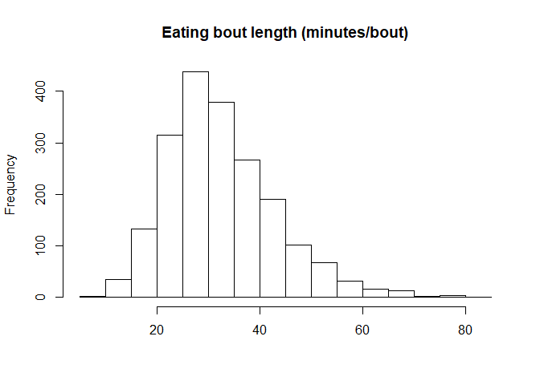
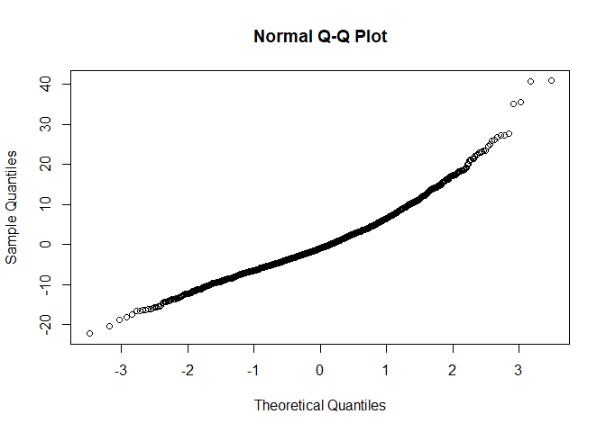
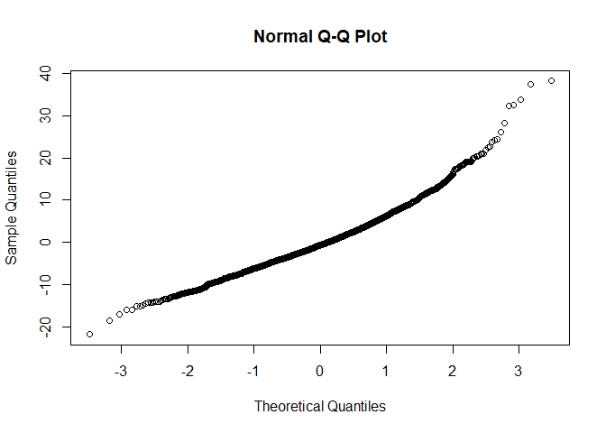
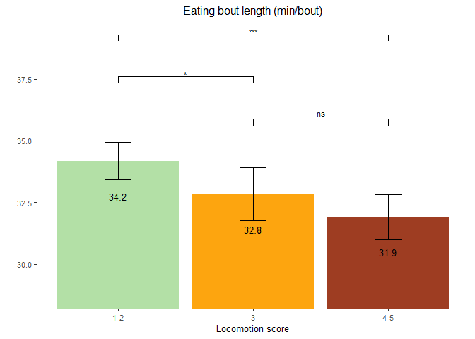

Eating Bout Length
================

  - [Read the data](#read-the-data)
  - [Data preparation](#data-preparation)
  - [Model building](#model-building)
      - [Baseline model without any
        variable](#baseline-model-without-any-variable)
      - [Full model using the nested repeated measures
        GLMM](#full-model-using-the-nested-repeated-measures-glmm)
      - [Comparison of baseline and nested
        model](#comparison-of-baseline-and-nested-model)
      - [Full model](#full-model)
      - [Full model](#full-model-1)
      - [Model fit 2-way interactions](#model-fit-2-way-interactions)
  - [Final model](#final-model)
      - [Model fit](#model-fit)
      - [Type 3 Analysis of Variance](#type-3-analysis-of-variance)
      - [Summary](#summary)
      - [Parameter estimate confidence
        intervals](#parameter-estimate-confidence-intervals)
      - [Least square means](#least-square-means)
  - [Fixed effect plot](#fixed-effect-plot)
      - [Data preparation](#data-preparation-1)
      - [Plot](#plot)

# Read the data

  - Filter only the locomotion scores
  - Refactor the scores to only 3 classes (1-2 vs 3 vs 4-5)
  - Refactor the observation moments

<!-- end list -->

``` r
load("../Data/AllData.RData")
```

# Data preparation

``` r
AnalysisData <- AllData %>% filter(
    SensorType %like% "eatingBoutsTimeDataDay_avgBoutLength" & 
    SensorValue < 100   #Has been added because of outliers
    ) %>%
  dplyr::mutate(
                  CalvingTime = as.Date(CalvingTime,format = "%Y-%m-%dT%H:%M:%OSZ"),
                  CalvingSeason = case_when(
                    between(month(CalvingTime), 1, 3) ~ "Winter",
                    between(month(CalvingTime), 4, 6) ~ "Spring",
                    between(month(CalvingTime), 7, 9) ~ "Summer",
                    between(month(CalvingTime), 10, 12) ~ "Autumn")
                  ) %>% 
  dplyr::group_by(
    AnimalNumber,
    HerdIdentifier,
    ObservationMoment,
    LocomotionScore,
    ObservationPeriod,
    LactationNumber,
    Parity,
    CalvingSeason
    ) %>% 
  dplyr::summarise(
    SensorValue = mean(SensorValue,na.rm = TRUE),
    SensorValues = n()
    )  %>%  
  dplyr::filter(
    SensorValues == 4
  ) %>%
  dplyr::arrange(AnimalNumber,HerdIdentifier) %>%
  dplyr::group_by(AnimalNumber, HerdIdentifier) %>%
  dplyr::mutate(LocomotionMoments = length(LocomotionScore)) %>%
  filter(LocomotionMoments == 4) %>%    #4 locomotionscores minimum
  drop_na()

AnalysisData %>% select("HerdIdentifier", "AnimalNumber", "LactationNumber") %>% n_distinct()
```

    ## [1] 513

``` r
hist(AnalysisData$SensorValue,
     main = "Eating bout length (minutes/bout)",
     xlab = "")
```

<!-- -->

# Model building

## Baseline model without any variable

``` r
baselineLMM <- lmer(
                  SensorValue ~ 1 + (1| AnimalNumber), 
                  data = AnalysisData
                  )
qqnorm(residuals(baselineLMM))
```

<!-- -->

## Full model using the nested repeated measures GLMM

``` r
LMM <- lmer(
                  SensorValue ~ 
                    LocomotionScore + ObservationPeriod + ObservationMoment + CalvingSeason +
                    ObservationPeriod:ObservationMoment +
                    ObservationPeriod:LocomotionScore +
                    ObservationMoment:LocomotionScore + 
                    ObservationPeriod:LocomotionScore:ObservationMoment + 
                    HerdIdentifier + 
                    Parity +  (1 | AnimalNumber),
                  REML = FALSE,
                  data = AnalysisData
                  )
qqnorm(residuals(LMM))
```

<!-- -->

## Comparison of baseline and nested model

``` r
anova(LMM,baselineLMM, test="Chisq")
```

    ## refitting model(s) with ML (instead of REML)

    ## Data: AnalysisData
    ## Models:
    ## baselineLMM: SensorValue ~ 1 + (1 | AnimalNumber)
    ## LMM: SensorValue ~ LocomotionScore + ObservationPeriod + ObservationMoment + 
    ## LMM:     CalvingSeason + ObservationPeriod:ObservationMoment + ObservationPeriod:LocomotionScore + 
    ## LMM:     ObservationMoment:LocomotionScore + ObservationPeriod:LocomotionScore:ObservationMoment + 
    ## LMM:     HerdIdentifier + Parity + (1 | AnimalNumber)
    ##             Df   AIC   BIC  logLik deviance  Chisq Chi Df Pr(>Chisq)    
    ## baselineLMM  3 14623 14640 -7308.4    14617                             
    ## LMM         26 14294 14440 -7121.1    14242 374.63     23  < 2.2e-16 ***
    ## ---
    ## Signif. codes:  0 '***' 0.001 '**' 0.01 '*' 0.05 '.' 0.1 ' ' 1

## Full model

``` r
LMMdrop <- drop1(LMM, test="Chisq")
if("Pr(>F)" %in% colnames(LMMdrop))
{
  Pvalues <- LMMdrop$`Pr(>F)`
} else 
{
  Pvalues <- LMMdrop$`Pr(Chi)`
}
LMMdrop
```

    ## Single term deletions using Satterthwaite's method:
    ## 
    ## Model:
    ## SensorValue ~ LocomotionScore + ObservationPeriod + ObservationMoment + 
    ##     CalvingSeason + ObservationPeriod:ObservationMoment + ObservationPeriod:LocomotionScore + 
    ##     ObservationMoment:LocomotionScore + ObservationPeriod:LocomotionScore:ObservationMoment + 
    ##     HerdIdentifier + Parity + (1 | AnimalNumber)
    ##                                                     Sum Sq Mean Sq NumDF   DenDF F value    Pr(>F)    
    ## CalvingSeason                                        646.0  215.33     3  534.10  3.8297  0.009849 ** 
    ## HerdIdentifier                                      8147.2 1163.89     7  502.22 20.7000 < 2.2e-16 ***
    ## Parity                                              1851.9  925.94     2  553.85 16.4681 1.129e-07 ***
    ## LocomotionScore:ObservationPeriod:ObservationMoment   55.0   27.50     2 1692.01  0.4890  0.613300    
    ## ---
    ## Signif. codes:  0 '***' 0.001 '**' 0.01 '*' 0.05 '.' 0.1 ' ' 1

## Full model

``` r
LMMReducedThreeWay = update(LMM, . ~ . - LocomotionScore:ObservationPeriod:ObservationMoment)
drop1(LMMReducedThreeWay, test="Chisq")
```

    ## Single term deletions using Satterthwaite's method:
    ## 
    ## Model:
    ## SensorValue ~ LocomotionScore + ObservationPeriod + ObservationMoment + 
    ##     CalvingSeason + HerdIdentifier + Parity + (1 | AnimalNumber) + 
    ##     ObservationPeriod:ObservationMoment + LocomotionScore:ObservationPeriod + 
    ##     LocomotionScore:ObservationMoment
    ##                                     Sum Sq Mean Sq NumDF   DenDF F value    Pr(>F)    
    ## CalvingSeason                        637.0  212.33     3  533.75  3.7736   0.01063 *  
    ## HerdIdentifier                      8191.0 1170.15     7  502.01 20.7965 < 2.2e-16 ***
    ## Parity                              1853.7  926.86     2  553.79 16.4727 1.124e-07 ***
    ## ObservationPeriod:ObservationMoment 1308.8 1308.83     1 1498.78 23.2613 1.558e-06 ***
    ## LocomotionScore:ObservationPeriod    235.8  117.91     2 1724.23  2.0956   0.12331    
    ## LocomotionScore:ObservationMoment    128.7   64.37     2 1682.32  1.1440   0.31880    
    ## ---
    ## Signif. codes:  0 '***' 0.001 '**' 0.01 '*' 0.05 '.' 0.1 ' ' 1

## Model fit 2-way interactions

``` r
LMMReducedTwoWay = update(LMMReducedThreeWay, . ~ . - LocomotionScore:ObservationMoment - LocomotionScore:ObservationPeriod) 
drop1(LMMReducedTwoWay, test="Chisq")
```

    ## Single term deletions using Satterthwaite's method:
    ## 
    ## Model:
    ## SensorValue ~ LocomotionScore + ObservationPeriod + ObservationMoment + 
    ##     CalvingSeason + HerdIdentifier + Parity + (1 | AnimalNumber) + 
    ##     ObservationPeriod:ObservationMoment
    ##                                     Sum Sq Mean Sq NumDF   DenDF F value    Pr(>F)    
    ## LocomotionScore                     1213.0  606.48     2 1876.11  10.739 2.306e-05 ***
    ## CalvingSeason                        589.5  196.48     3  531.14   3.479   0.01585 *  
    ## HerdIdentifier                      8157.4 1165.34     7  500.71  20.634 < 2.2e-16 ***
    ## Parity                              1848.4  924.19     2  552.89  16.364 1.246e-07 ***
    ## ObservationPeriod:ObservationMoment 1516.8 1516.81     1 1494.41  26.857 2.490e-07 ***
    ## ---
    ## Signif. codes:  0 '***' 0.001 '**' 0.01 '*' 0.05 '.' 0.1 ' ' 1

# Final model

## Model fit

``` r
drop1(LMMReducedTwoWay, test="Chisq")
```

    ## Single term deletions using Satterthwaite's method:
    ## 
    ## Model:
    ## SensorValue ~ LocomotionScore + ObservationPeriod + ObservationMoment + 
    ##     CalvingSeason + HerdIdentifier + Parity + (1 | AnimalNumber) + 
    ##     ObservationPeriod:ObservationMoment
    ##                                     Sum Sq Mean Sq NumDF   DenDF F value    Pr(>F)    
    ## LocomotionScore                     1213.0  606.48     2 1876.11  10.739 2.306e-05 ***
    ## CalvingSeason                        589.5  196.48     3  531.14   3.479   0.01585 *  
    ## HerdIdentifier                      8157.4 1165.34     7  500.71  20.634 < 2.2e-16 ***
    ## Parity                              1848.4  924.19     2  552.89  16.364 1.246e-07 ***
    ## ObservationPeriod:ObservationMoment 1516.8 1516.81     1 1494.41  26.857 2.490e-07 ***
    ## ---
    ## Signif. codes:  0 '***' 0.001 '**' 0.01 '*' 0.05 '.' 0.1 ' ' 1

## Type 3 Analysis of Variance

``` r
anova(LMMReducedTwoWay, ddf="Satterthwaite")
```

    ## Type III Analysis of Variance Table with Satterthwaite's method
    ##                                     Sum Sq Mean Sq NumDF   DenDF  F value    Pr(>F)    
    ## LocomotionScore                     1213.0   606.5     2 1876.11  10.7386 2.306e-05 ***
    ## ObservationPeriod                   7324.2  7324.2     1 1512.93 129.6847 < 2.2e-16 ***
    ## ObservationMoment                    158.3   158.3     1 1494.83   2.8035   0.09427 .  
    ## CalvingSeason                        589.5   196.5     3  531.14   3.4790   0.01585 *  
    ## HerdIdentifier                      8157.4  1165.3     7  500.71  20.6340 < 2.2e-16 ***
    ## Parity                              1848.4   924.2     2  552.89  16.3641 1.246e-07 ***
    ## ObservationPeriod:ObservationMoment 1516.8  1516.8     1 1494.41  26.8572 2.490e-07 ***
    ## ---
    ## Signif. codes:  0 '***' 0.001 '**' 0.01 '*' 0.05 '.' 0.1 ' ' 1

## Summary

``` r
print(summary(LMMReducedTwoWay, ddf="Satterthwaite"),correlation=FALSE)
```

    ## Linear mixed model fit by maximum likelihood . t-tests use Satterthwaite's method ['lmerModLmerTest']
    ## Formula: SensorValue ~ LocomotionScore + ObservationPeriod + ObservationMoment +  
    ##     CalvingSeason + HerdIdentifier + Parity + (1 | AnimalNumber) +      ObservationPeriod:ObservationMoment
    ##    Data: AnalysisData
    ## 
    ##      AIC      BIC   logLik deviance df.resid 
    ##  14289.4  14401.4  -7124.7  14249.4     1971 
    ## 
    ## Scaled residuals: 
    ##     Min      1Q  Median      3Q     Max 
    ## -2.8978 -0.5925 -0.0884  0.4990  5.0917 
    ## 
    ## Random effects:
    ##  Groups       Name        Variance Std.Dev.
    ##  AnimalNumber (Intercept) 30.06    5.483   
    ##  Residual                 56.48    7.515   
    ## Number of obs: 1991, groups:  AnimalNumber, 498
    ## 
    ## Fixed effects:
    ##                                                       Estimate Std. Error        df t value Pr(>|t|)    
    ## (Intercept)                                            44.3821     1.2809  575.3148  34.650  < 2e-16 ***
    ## LocomotionScore3                                       -1.3369     0.5462 1819.7775  -2.448  0.01447 *  
    ## LocomotionScore4-5                                     -2.2599     0.4987 1931.6243  -4.531 6.22e-06 ***
    ## ObservationPeriodPost Partum                           -5.6487     0.4811 1506.8284 -11.741  < 2e-16 ***
    ## ObservationMomentSecond                                -2.3136     0.4787 1495.8367  -4.833 1.48e-06 ***
    ## CalvingSeasonSpring                                    -1.8252     0.9622  552.9469  -1.897  0.05837 .  
    ## CalvingSeasonSummer                                    -2.1192     0.7745  522.9741  -2.736  0.00643 ** 
    ## CalvingSeasonWinter                                    -0.1324     0.9213  537.7125  -0.144  0.88578    
    ## HerdIdentifier544                                      -1.0793     1.2803  500.1129  -0.843  0.39965    
    ## HerdIdentifier2011                                     -8.6085     1.2032  500.2564  -7.154 3.01e-12 ***
    ## HerdIdentifier2297                                     -8.4172     1.3021  501.0757  -6.464 2.42e-10 ***
    ## HerdIdentifier2514                                     -4.1420     1.4016  503.7431  -2.955  0.00327 ** 
    ## HerdIdentifier2746                                     -5.9056     1.3854  500.1479  -4.263 2.42e-05 ***
    ## HerdIdentifier3314                                     -5.4378     1.3755  512.8446  -3.953 8.79e-05 ***
    ## HerdIdentifier5888                                      1.4951     1.3538  498.0988   1.104  0.26997    
    ## Parity3                                                -2.1190     0.7530  569.7798  -2.814  0.00506 ** 
    ## Parity>3                                               -4.0909     0.7155  544.0267  -5.717 1.79e-08 ***
    ## ObservationPeriodPost Partum:ObservationMomentSecond    3.4970     0.6748 1494.4069   5.182 2.49e-07 ***
    ## ---
    ## Signif. codes:  0 '***' 0.001 '**' 0.01 '*' 0.05 '.' 0.1 ' ' 1

## Parameter estimate confidence intervals

``` r
confint(LMMReducedTwoWay, parm="beta_")
```

    ## Computing profile confidence intervals ...

    ##                                                           2.5 %      97.5 %
    ## (Intercept)                                           41.869677 46.90049856
    ## LocomotionScore3                                      -2.407919 -0.26570353
    ## LocomotionScore4-5                                    -3.238482 -1.28170803
    ## ObservationPeriodPost Partum                          -6.592260 -4.70512551
    ## ObservationMomentSecond                               -3.252438 -1.37472612
    ## CalvingSeasonSpring                                   -3.718141  0.06204126
    ## CalvingSeasonSummer                                   -3.641497 -0.59940590
    ## CalvingSeasonWinter                                   -1.944135  1.67491907
    ## HerdIdentifier544                                     -3.594421  1.43408350
    ## HerdIdentifier2011                                   -10.972570 -6.24669222
    ## HerdIdentifier2297                                   -10.974999 -5.86088021
    ## HerdIdentifier2514                                    -6.895870 -1.39099991
    ## HerdIdentifier2746                                    -8.627380 -3.18594182
    ## HerdIdentifier3314                                    -8.140628 -2.73819759
    ## HerdIdentifier5888                                    -1.164489  4.15286911
    ## Parity3                                               -3.599789 -0.64215949
    ## Parity>3                                              -5.497512 -2.68713684
    ## ObservationPeriodPost Partum:ObservationMomentSecond   2.173553  4.82035889

## Least square means

``` r
multcomp::cld(marginalHerds <- lsmeans::lsmeans(LMMReducedTwoWay, ~ HerdIdentifier), alpha=0.05, Letters=letters, adjust="tukey")
```

    ##  HerdIdentifier lsmean    SE  df lower.CL upper.CL .group
    ##  2011             28.4 0.679 541     26.5     30.2  a    
    ##  2297             28.6 0.868 524     26.2     30.9  a    
    ##  2746             31.1 0.962 525     28.4     33.7  ab   
    ##  3314             31.5 0.930 530     29.0     34.1  ab   
    ##  2514             32.8 0.998 518     30.1     35.6   bc  
    ##  544              35.9 0.810 525     33.7     38.1    cd 
    ##  3                37.0 1.016 531     34.2     39.8    cd 
    ##  5888             38.5 0.957 527     35.9     41.1     d 
    ## 
    ## Results are averaged over the levels of: LocomotionScore, ObservationPeriod, ObservationMoment, CalvingSeason, Parity 
    ## Degrees-of-freedom method: kenward-roger 
    ## Confidence level used: 0.95 
    ## Conf-level adjustment: sidak method for 8 estimates 
    ## P value adjustment: tukey method for comparing a family of 8 estimates 
    ## significance level used: alpha = 0.05

``` r
multcomp::cld(marginalParity <- lsmeans::lsmeans(LMMReducedTwoWay, ~ Parity), alpha=0.05, Letters=letters, adjust="tukey") 
```

    ##  Parity lsmean    SE  df lower.CL upper.CL .group
    ##  >3       31.0 0.535 540     29.7     32.2  a    
    ##  3        32.9 0.598 590     31.5     34.4   b   
    ##  2        35.0 0.528 616     33.8     36.3    c  
    ## 
    ## Results are averaged over the levels of: LocomotionScore, ObservationPeriod, ObservationMoment, CalvingSeason, HerdIdentifier 
    ## Degrees-of-freedom method: kenward-roger 
    ## Confidence level used: 0.95 
    ## Conf-level adjustment: sidak method for 3 estimates 
    ## P value adjustment: tukey method for comparing a family of 3 estimates 
    ## significance level used: alpha = 0.05

``` r
multcomp::cld(marginalLocomotionScore <- lsmeans::lsmeans(LMMReducedTwoWay, ~ LocomotionScore), alpha=0.05, Letters=letters, adjust="tukey")
```

    ##  LocomotionScore lsmean    SE   df lower.CL upper.CL .group
    ##  4-5               31.9 0.464 1293     30.8     33.0  a    
    ##  3                 32.8 0.543 1730     31.5     34.1  a    
    ##  1-2               34.2 0.385  837     33.3     35.1   b   
    ## 
    ## Results are averaged over the levels of: ObservationPeriod, ObservationMoment, CalvingSeason, HerdIdentifier, Parity 
    ## Degrees-of-freedom method: kenward-roger 
    ## Confidence level used: 0.95 
    ## Conf-level adjustment: sidak method for 3 estimates 
    ## P value adjustment: tukey method for comparing a family of 3 estimates 
    ## significance level used: alpha = 0.05

``` r
multcomp::cld(marginalObservationMoment <- lsmeans::lsmeans(LMMReducedTwoWay, ~ ObservationMoment), alpha=0.05, Letters=letters, adjust="tukey")
```

    ## NOTE: Results may be misleading due to involvement in interactions

    ##  ObservationMoment lsmean    SE  df lower.CL upper.CL .group
    ##  Second              32.7 0.381 891     31.8     33.5  a    
    ##  First               33.3 0.384 910     32.4     34.1  a    
    ## 
    ## Results are averaged over the levels of: LocomotionScore, ObservationPeriod, CalvingSeason, HerdIdentifier, Parity 
    ## Degrees-of-freedom method: kenward-roger 
    ## Confidence level used: 0.95 
    ## Conf-level adjustment: sidak method for 2 estimates 
    ## significance level used: alpha = 0.05

``` r
multcomp::cld(marginalObservationMoment <- lsmeans::lsmeans(LMMReducedTwoWay, ~ CalvingSeason), alpha=0.05, Letters=letters, adjust="tukey")
```

    ##  CalvingSeason lsmean    SE  df lower.CL upper.CL .group
    ##  Summer          31.9 0.518 548     30.6     33.2  a    
    ##  Spring          32.2 0.751 582     30.3     34.0  ab   
    ##  Winter          33.9 0.718 562     32.1     35.7  ab   
    ##  Autumn          34.0 0.623 554     32.4     35.6   b   
    ## 
    ## Results are averaged over the levels of: LocomotionScore, ObservationPeriod, ObservationMoment, HerdIdentifier, Parity 
    ## Degrees-of-freedom method: kenward-roger 
    ## Confidence level used: 0.95 
    ## Conf-level adjustment: sidak method for 4 estimates 
    ## P value adjustment: tukey method for comparing a family of 4 estimates 
    ## significance level used: alpha = 0.05

``` r
multcomp::cld(marginalObservationMoment <- lsmeans::lsmeans(LMMReducedTwoWay, ~ ObservationPeriod), alpha=0.05, Letters=letters, adjust="tukey")
```

    ## NOTE: Results may be misleading due to involvement in interactions

    ##  ObservationPeriod lsmean    SE  df lower.CL upper.CL .group
    ##  Post Partum         31.0 0.378 867     30.2     31.9  a    
    ##  Pre Partum          34.9 0.389 946     34.1     35.8   b   
    ## 
    ## Results are averaged over the levels of: LocomotionScore, ObservationMoment, CalvingSeason, HerdIdentifier, Parity 
    ## Degrees-of-freedom method: kenward-roger 
    ## Confidence level used: 0.95 
    ## Conf-level adjustment: sidak method for 2 estimates 
    ## significance level used: alpha = 0.05

``` r
multcomp::cld(marginalInteraction <- lsmeans::lsmeans(LMMReducedTwoWay, ~ ObservationMoment|ObservationPeriod), alpha=0.05, Letters=letters, adjust="tukey")
```

    ## ObservationPeriod = Pre Partum:
    ##  ObservationMoment lsmean    SE   df lower.CL upper.CL .group
    ##  Second              33.8 0.456 1468     32.7     34.8  a    
    ##  First               36.1 0.458 1480     35.1     37.1   b   
    ## 
    ## ObservationPeriod = Post Partum:
    ##  ObservationMoment lsmean    SE   df lower.CL upper.CL .group
    ##  First               30.4 0.448 1420     29.4     31.4  a    
    ##  Second              31.6 0.445 1407     30.6     32.6   b   
    ## 
    ## Results are averaged over the levels of: LocomotionScore, CalvingSeason, HerdIdentifier, Parity 
    ## Degrees-of-freedom method: kenward-roger 
    ## Confidence level used: 0.95 
    ## Conf-level adjustment: sidak method for 2 estimates 
    ## significance level used: alpha = 0.05

# Fixed effect plot

## Data preparation

``` r
LSMs<-lsmeans::lsmeans(LMMReducedTwoWay, pairwise ~ LocomotionScore, glhargs=list())
dfPValues <- summary(LSMs)[[2]]
dfLMSs <- summary(LSMs)[[1]]
dfResults <- cbind(dfLMSs[,!(names(dfLMSs) %in% c("df", "ObservationPeriod", "SE"))], dfPValues)
dfPValuesSplit <- dfResults %>% 
                    tidyr::separate(contrast, c("group1", "group2"), " - ", remove=FALSE) %>%
                    dplyr::arrange(-lsmean) %>%
                    dplyr::mutate(
                                  p.value = round(p.value, 2),
                                  p.value.2 = cut(p.value, 
                                        breaks = c(-Inf,0.001,0.01,0.05,0.1,Inf),
                                        labels = c("***","**","*","†","ns")),
                                  y.position.2 = cummax(lsmean),
                                  y.position.3 = case_when(contrast == "1-2 - 4-5" ~ y.position.2*1.15, 
                                                           contrast == "1-2 - 3" ~ y.position.2*1.1,
                                                           TRUE ~ y.position.2*1.05)
                    )
```

## Plot

``` r
ggplot(
  data=dfPValuesSplit, 
  aes(
    x=LocomotionScore, 
    y=lsmean,
    fill=LocomotionScore)) + 
  geom_bar(
    stat="identity"
    ) + 
  coord_cartesian(ylim = c(min(dfPValuesSplit$lsmean)*0.9, 
                           max(dfPValuesSplit$lsmean)*1.15),
                  expand = TRUE) +
  scale_fill_manual(
    values=c("#b3e0a6","#fda50f", "#9e3d22")
    ) +
  geom_text(
    aes(
      label=sprintf("%0.1f", round(lsmean, digits = 1))
      ),
    vjust=5, 
    size=3.5
    )+
  geom_errorbar(
    aes(
      ymin=lower.CL, 
      ymax=upper.CL), 
    width=.2,
    position=position_dodge(.9)
    ) +
  labs(
    title = "Eating bout length (min/bout)", 
    x= "Locomotion score", 
    y=""
    )  + 
  theme_classic() + 
  theme(text=element_text(size=10)) +
  theme(plot.title = element_text(hjust = 0.5)) + 
  stat_pvalue_manual(comparisons = list( c("1-2", "3"), c("3", "4-5"), c("1-2", "4-5")),
                     label.size = 3,
                     data = dfPValuesSplit,
                     y.position =  "y.position.3",
                     label = "p.value.2") + 
  theme(legend.position = "none")
```

<!-- -->
