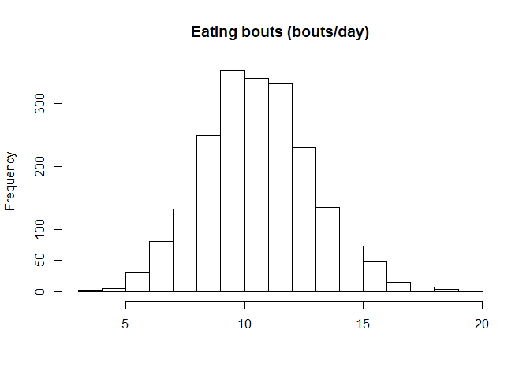
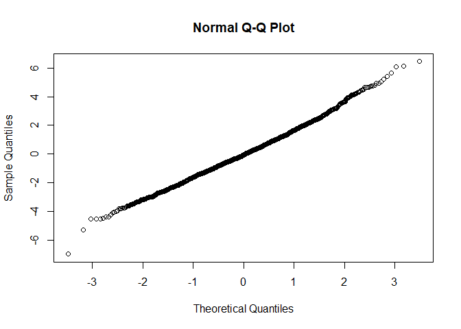
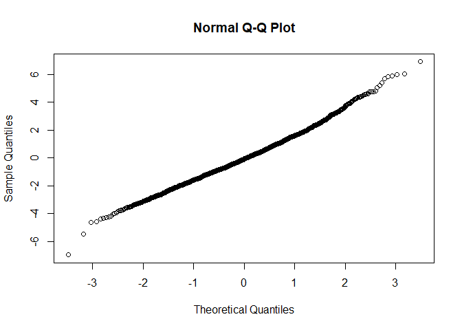
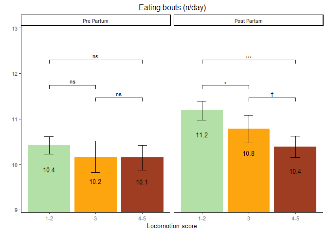

Eating Bouts
================

  - [Read the data](#read-the-data)
  - [Data preparation](#data-preparation)
  - [Model building](#model-building)
      - [Baseline model without any
        variable](#baseline-model-without-any-variable)
      - [Full model using the nested repeated measures
        GLMM](#full-model-using-the-nested-repeated-measures-glmm)
      - [Comparison of baseline and nested
        model](#comparison-of-baseline-and-nested-model)
      - [Full model](#full-model)
      - [Model fit 2-way interactions](#model-fit-2-way-interactions)
  - [Final model](#final-model)
      - [Model fit](#model-fit)
      - [Type 3 Analysis of Variance](#type-3-analysis-of-variance)
      - [Summary](#summary)
      - [Parameter estimate confidence
        intervals](#parameter-estimate-confidence-intervals)
      - [Least square means](#least-square-means)
      - [Interaction term contrasts](#interaction-term-contrasts)
  - [Interaction plots](#interaction-plots)
      - [Data preparation](#data-preparation-1)
      - [Plot](#plot)

# Read the data

  - Filter only the locomotion scores
  - Refactor the scores to only 3 classes (1-2 vs 3 vs 4-5)
  - Refactor the observation moments

<!-- end list -->

``` r
load("../Data/AllData.RData")
```

# Data preparation

``` r
AnalysisData <- AllData %>% 
  filter(
    SensorType %like% "eatingBoutsTimeDataDay_numberOfBouts"
    ) %>%
  dplyr::mutate(
                  CalvingTime = as.Date(CalvingTime,format = "%Y-%m-%dT%H:%M:%OSZ"),
                  CalvingSeason = case_when(
                    between(month(CalvingTime), 1, 3) ~ "Winter",
                    between(month(CalvingTime), 4, 6) ~ "Spring",
                    between(month(CalvingTime), 7, 9) ~ "Summer",
                    between(month(CalvingTime), 10, 12) ~ "Autumn")
                  ) %>% 
  dplyr::group_by(
    AnimalNumber,
    HerdIdentifier,
    ObservationMoment,
    LocomotionScore,
    ObservationPeriod,
    LactationNumber,
    Parity,
    CalvingSeason
    ) %>% 
  dplyr::summarise(
    SensorValue = mean(SensorValue,na.rm = TRUE),
    SensorValues = n()
    )  %>%  
  dplyr::filter(
    SensorValues == 4
  ) %>%  
  dplyr::arrange(AnimalNumber,HerdIdentifier) %>%
  dplyr::group_by(AnimalNumber, HerdIdentifier) %>%
  dplyr::mutate(LocomotionMoments = length(LocomotionScore)) %>%
  filter(LocomotionMoments == 4) %>%    #4 locomotionscores minimum
  drop_na()

AnalysisData %>% select("HerdIdentifier", "AnimalNumber", "LactationNumber") %>% n_distinct()
```

    ## [1] 525

``` r
hist(AnalysisData$SensorValue,
     main = "Eating bouts (bouts/day)",
     xlab = "")
```

<!-- -->

# Model building

## Baseline model without any variable

``` r
baselineLMM <- lmer(
                  SensorValue ~ 1 + (1| AnimalNumber), 
                  REML = F,
                  data = AnalysisData
                  )
qqnorm(residuals(baselineLMM))
```

<!-- -->

## Full model using the nested repeated measures GLMM

``` r
LMM <- lmer(
                  SensorValue ~ 
                    LocomotionScore + ObservationPeriod + ObservationMoment + CalvingSeason + 
                    ObservationPeriod:ObservationMoment +
                    ObservationPeriod:LocomotionScore +
                    ObservationMoment:LocomotionScore + 
                    ObservationPeriod:LocomotionScore:ObservationMoment + 
                    HerdIdentifier + 
                    Parity +  (1 | AnimalNumber),
                  REML = FALSE,
                  data = AnalysisData
                  )
qqnorm(residuals(LMM))
```

<!-- -->

## Comparison of baseline and nested model

``` r
anova(LMM,baselineLMM, test="Chisq")
```

    ## Data: AnalysisData
    ## Models:
    ## baselineLMM: SensorValue ~ 1 + (1 | AnimalNumber)
    ## LMM: SensorValue ~ LocomotionScore + ObservationPeriod + ObservationMoment + 
    ## LMM:     CalvingSeason + ObservationPeriod:ObservationMoment + ObservationPeriod:LocomotionScore + 
    ## LMM:     ObservationMoment:LocomotionScore + ObservationPeriod:LocomotionScore:ObservationMoment + 
    ## LMM:     HerdIdentifier + Parity + (1 | AnimalNumber)
    ##             Df    AIC    BIC  logLik deviance  Chisq Chi Df Pr(>Chisq)    
    ## baselineLMM  3 8910.5 8927.4 -4452.3   8904.5                             
    ## LMM         26 8726.5 8872.6 -4337.2   8674.5 230.05     23  < 2.2e-16 ***
    ## ---
    ## Signif. codes:  0 '***' 0.001 '**' 0.01 '*' 0.05 '.' 0.1 ' ' 1

## Full model

``` r
LMMdrop <- drop1(LMM, test="Chisq")
if("Pr(>F)" %in% colnames(LMMdrop))
{
  Pvalues <- LMMdrop$`Pr(>F)`
} else 
{
  Pvalues <- LMMdrop$`Pr(Chi)`
}
LMMdrop
```

    ## Single term deletions
    ## 
    ## Model:
    ## SensorValue ~ LocomotionScore + ObservationPeriod + ObservationMoment + 
    ##     CalvingSeason + ObservationPeriod:ObservationMoment + ObservationPeriod:LocomotionScore + 
    ##     ObservationMoment:LocomotionScore + ObservationPeriod:LocomotionScore:ObservationMoment + 
    ##     HerdIdentifier + Parity + (1 | AnimalNumber)
    ##                                                     Df    AIC    LRT   Pr(Chi)    
    ## <none>                                                 8726.5                     
    ## CalvingSeason                                        3 8738.7 18.203 0.0003995 ***
    ## HerdIdentifier                                       7 8794.9 82.365 4.533e-15 ***
    ## Parity                                               2 8749.7 27.259 1.204e-06 ***
    ## LocomotionScore:ObservationPeriod:ObservationMoment  2 8724.1  1.629 0.4428693    
    ## ---
    ## Signif. codes:  0 '***' 0.001 '**' 0.01 '*' 0.05 '.' 0.1 ' ' 1

## Model fit 2-way interactions

``` r
LMMReducedThreeWay = update(LMM, . ~ . - LocomotionScore:ObservationPeriod:ObservationMoment)
drop1(LMMReducedThreeWay, test="Chisq")
```

    ## Single term deletions
    ## 
    ## Model:
    ## SensorValue ~ LocomotionScore + ObservationPeriod + ObservationMoment + 
    ##     CalvingSeason + HerdIdentifier + Parity + (1 | AnimalNumber) + 
    ##     ObservationPeriod:ObservationMoment + LocomotionScore:ObservationPeriod + 
    ##     LocomotionScore:ObservationMoment
    ##                                     Df    AIC    LRT   Pr(Chi)    
    ## <none>                                 8724.1                     
    ## CalvingSeason                        3 8736.5 18.359 0.0003709 ***
    ## HerdIdentifier                       7 8793.2 83.078 3.241e-15 ***
    ## Parity                               2 8747.3 27.169 1.260e-06 ***
    ## ObservationPeriod:ObservationMoment  1 8734.4 12.239 0.0004680 ***
    ## LocomotionScore:ObservationPeriod    2 8727.5  7.360 0.0252267 *  
    ## LocomotionScore:ObservationMoment    2 8723.7  3.584 0.1666540    
    ## ---
    ## Signif. codes:  0 '***' 0.001 '**' 0.01 '*' 0.05 '.' 0.1 ' ' 1

# Final model

## Model fit

``` r
LMMReducedTwoWay = update(LMMReducedThreeWay, . ~ . - LocomotionScore:ObservationMoment)
drop1(LMMReducedTwoWay, test="Chisq")
```

    ## Single term deletions
    ## 
    ## Model:
    ## SensorValue ~ LocomotionScore + ObservationPeriod + ObservationMoment + 
    ##     CalvingSeason + HerdIdentifier + Parity + (1 | AnimalNumber) + 
    ##     ObservationPeriod:ObservationMoment + LocomotionScore:ObservationPeriod
    ##                                     Df    AIC    LRT   Pr(Chi)    
    ## <none>                                 8723.7                     
    ## CalvingSeason                        3 8735.5 17.840 0.0004745 ***
    ## HerdIdentifier                       7 8792.0 82.315 4.642e-15 ***
    ## Parity                               2 8746.7 26.964 1.396e-06 ***
    ## ObservationPeriod:ObservationMoment  1 8735.2 13.484 0.0002406 ***
    ## LocomotionScore:ObservationPeriod    2 8726.6  6.862 0.0323571 *  
    ## ---
    ## Signif. codes:  0 '***' 0.001 '**' 0.01 '*' 0.05 '.' 0.1 ' ' 1

## Type 3 Analysis of Variance

``` r
anova(LMMReducedTwoWay, ddf="Satterthwaite")
```

    ## Analysis of Variance Table
    ##                                     Df  Sum Sq Mean Sq F value
    ## LocomotionScore                      2 103.001  51.500 15.7934
    ## ObservationPeriod                    1 178.203 178.203 54.6487
    ## ObservationMoment                    1   5.468   5.468  1.6768
    ## CalvingSeason                        3  59.293  19.764  6.0611
    ## HerdIdentifier                       7 311.097  44.442 13.6289
    ## Parity                               2  92.723  46.362 14.2175
    ## ObservationPeriod:ObservationMoment  1  47.186  47.186 14.4703
    ## LocomotionScore:ObservationPeriod    2  22.421  11.210  3.4378

## Summary

``` r
print(summary(LMMReducedTwoWay, ddf="Satterthwaite"),correlation=FALSE)
```

    ## Warning in summary.merMod(LMMReducedTwoWay, ddf = "Satterthwaite"): additional arguments ignored

    ## Linear mixed model fit by maximum likelihood  ['lmerMod']
    ## Formula: SensorValue ~ LocomotionScore + ObservationPeriod + ObservationMoment +  
    ##     CalvingSeason + HerdIdentifier + Parity + (1 | AnimalNumber) +  
    ##     ObservationPeriod:ObservationMoment + LocomotionScore:ObservationPeriod
    ##    Data: AnalysisData
    ## 
    ##      AIC      BIC   logLik deviance df.resid 
    ##   8723.7   8847.3  -4339.8   8679.7     2017 
    ## 
    ## Scaled residuals: 
    ##     Min      1Q  Median      3Q     Max 
    ## -3.9327 -0.6115 -0.0461  0.5760  3.8254 
    ## 
    ## Random effects:
    ##  Groups       Name        Variance Std.Dev.
    ##  AnimalNumber (Intercept) 1.288    1.135   
    ##  Residual                 3.261    1.806   
    ## Number of obs: 2039, groups:  AnimalNumber, 510
    ## 
    ## Fixed effects:
    ##                                                      Estimate Std. Error t value
    ## (Intercept)                                           9.90273    0.27956  35.422
    ## LocomotionScore3                                     -0.25591    0.18585  -1.377
    ## LocomotionScore4-5                                   -0.27564    0.15858  -1.738
    ## ObservationPeriodPost Partum                          1.05541    0.13821   7.636
    ## ObservationMomentSecond                               0.38654    0.11380   3.397
    ## CalvingSeasonSpring                                   0.14533    0.20947   0.694
    ## CalvingSeasonSummer                                   0.40718    0.16678   2.442
    ## CalvingSeasonWinter                                  -0.36788    0.19754  -1.862
    ## HerdIdentifier544                                    -0.05475    0.27702  -0.198
    ## HerdIdentifier2011                                    1.25550    0.26083   4.813
    ## HerdIdentifier2297                                    1.05622    0.28120   3.756
    ## HerdIdentifier2514                                    0.16503    0.30514   0.541
    ## HerdIdentifier2746                                    1.52684    0.29373   5.198
    ## HerdIdentifier3314                                   -0.04122    0.29768  -0.138
    ## HerdIdentifier5888                                    0.82392    0.29406   2.802
    ## Parity3                                              -0.15166    0.16287  -0.931
    ## Parity>3                                             -0.77806    0.15512  -5.016
    ## ObservationPeriodPost Partum:ObservationMomentSecond -0.59017    0.16038  -3.680
    ## LocomotionScore3:ObservationPeriodPost Partum        -0.14933    0.25095  -0.595
    ## LocomotionScore4-5:ObservationPeriodPost Partum      -0.51784    0.19791  -2.617

## Parameter estimate confidence intervals

``` r
confint(LMMReducedTwoWay, parm="beta_")
```

    ## Computing profile confidence intervals ...

    ##                                                            2.5 %      97.5 %
    ## (Intercept)                                           9.35368384 10.45130701
    ## LocomotionScore3                                     -0.62033698  0.10856546
    ## LocomotionScore4-5                                   -0.58687016  0.03544901
    ## ObservationPeriodPost Partum                          0.78438330  1.32649469
    ## ObservationMomentSecond                               0.16337375  0.60973501
    ## CalvingSeasonSpring                                  -0.26568536  0.55689931
    ## CalvingSeasonSummer                                   0.07991593  0.73489325
    ## CalvingSeasonWinter                                  -0.75547483  0.02034683
    ## HerdIdentifier544                                    -0.59872571  0.48918921
    ## HerdIdentifier2011                                    0.74331466  1.76766222
    ## HerdIdentifier2297                                    0.50397863  1.60832812
    ## HerdIdentifier2514                                   -0.43420797  0.76413074
    ## HerdIdentifier2746                                    0.95001958  2.10356652
    ## HerdIdentifier3314                                   -0.62591127  0.54311708
    ## HerdIdentifier5888                                    0.24651528  1.40137944
    ## Parity3                                              -0.47131306  0.16819736
    ## Parity>3                                             -1.08271599 -0.47358918
    ## ObservationPeriodPost Partum:ObservationMomentSecond -0.90471157 -0.27565106
    ## LocomotionScore3:ObservationPeriodPost Partum        -0.64151697  0.34276453
    ## LocomotionScore4-5:ObservationPeriodPost Partum      -0.90593843 -0.12973241

## Least square means

``` r
multcomp::cld(marginalHerds <- emmeans(LMMReducedTwoWay, ~ HerdIdentifier), alpha=0.05, Letters=letters, adjust="tukey")
```

    ##  HerdIdentifier emmean    SE  df lower.CL upper.CL .group
    ##  544              9.87 0.176 539     9.39     10.3  a    
    ##  3314             9.88 0.201 546     9.33     10.4  ab   
    ##  3                9.92 0.220 549     9.32     10.5  ab   
    ##  2514            10.09 0.218 532     9.49     10.7  ab   
    ##  5888            10.75 0.209 541    10.18     11.3   bc  
    ##  2297            10.98 0.188 544    10.46     11.5    c  
    ##  2011            11.18 0.148 558    10.77     11.6    c  
    ##  2746            11.45 0.199 551    10.91     12.0    c  
    ## 
    ## Results are averaged over the levels of: LocomotionScore, ObservationPeriod, ObservationMoment, CalvingSeason, Parity 
    ## Degrees-of-freedom method: kenward-roger 
    ## Confidence level used: 0.95 
    ## Conf-level adjustment: sidak method for 8 estimates 
    ## P value adjustment: tukey method for comparing a family of 8 estimates 
    ## significance level used: alpha = 0.05

``` r
multcomp::cld(marginalParity <- emmeans(LMMReducedTwoWay, ~ Parity), alpha=0.05, Letters=letters, adjust="tukey") 
```

    ##  Parity emmean    SE  df lower.CL upper.CL .group
    ##  >3       10.0 0.116 557     9.77     10.3  a    
    ##  3        10.7 0.130 603    10.36     11.0   b   
    ##  2        10.8 0.115 641    10.55     11.1   b   
    ## 
    ## Results are averaged over the levels of: LocomotionScore, ObservationPeriod, ObservationMoment, CalvingSeason, HerdIdentifier 
    ## Degrees-of-freedom method: kenward-roger 
    ## Confidence level used: 0.95 
    ## Conf-level adjustment: sidak method for 3 estimates 
    ## P value adjustment: tukey method for comparing a family of 3 estimates 
    ## significance level used: alpha = 0.05

``` r
multcomp::cld(marginalLocomotionScore <- emmeans(LMMReducedTwoWay, ~ LocomotionScore), alpha=0.05, Letters=letters, adjust="tukey")
```

    ## NOTE: Results may be misleading due to involvement in interactions

    ##  LocomotionScore emmean     SE   df lower.CL upper.CL .group
    ##  4-5               10.3 0.1051 1387     10.0     10.5  a    
    ##  3                 10.5 0.1253 1846     10.2     10.8  a    
    ##  1-2               10.8 0.0846  891     10.6     11.0   b   
    ## 
    ## Results are averaged over the levels of: ObservationPeriod, ObservationMoment, CalvingSeason, HerdIdentifier, Parity 
    ## Degrees-of-freedom method: kenward-roger 
    ## Confidence level used: 0.95 
    ## Conf-level adjustment: sidak method for 3 estimates 
    ## P value adjustment: tukey method for comparing a family of 3 estimates 
    ## significance level used: alpha = 0.05

``` r
multcomp::cld(marginalObservationMoment <- emmeans(LMMReducedTwoWay, ~ ObservationMoment), alpha=0.05, Letters=letters, adjust="tukey")
```

    ## NOTE: Results may be misleading due to involvement in interactions

    ##  ObservationMoment emmean     SE   df lower.CL upper.CL .group
    ##  First               10.5 0.0852 1021     10.3     10.7  a    
    ##  Second              10.6 0.0846 1003     10.4     10.8  a    
    ## 
    ## Results are averaged over the levels of: LocomotionScore, ObservationPeriod, CalvingSeason, HerdIdentifier, Parity 
    ## Degrees-of-freedom method: kenward-roger 
    ## Confidence level used: 0.95 
    ## Conf-level adjustment: sidak method for 2 estimates 
    ## significance level used: alpha = 0.05

``` r
multcomp::cld(marginalObservationMoment <- emmeans(LMMReducedTwoWay, ~ CalvingSeason), alpha=0.05, Letters=letters, adjust="tukey")  
```

    ##  CalvingSeason emmean    SE  df lower.CL upper.CL .group
    ##  Winter          10.1 0.155 577     9.71     10.5  a    
    ##  Autumn          10.5 0.134 571    10.14     10.8  ab   
    ##  Spring          10.6 0.164 597    10.20     11.0  ab   
    ##  Summer          10.9 0.114 576    10.59     11.2   b   
    ## 
    ## Results are averaged over the levels of: LocomotionScore, ObservationPeriod, ObservationMoment, HerdIdentifier, Parity 
    ## Degrees-of-freedom method: kenward-roger 
    ## Confidence level used: 0.95 
    ## Conf-level adjustment: sidak method for 4 estimates 
    ## P value adjustment: tukey method for comparing a family of 4 estimates 
    ## significance level used: alpha = 0.05

``` r
multcomp::cld(marginalInteraction <- emmeans(LMMReducedTwoWay, ~ ObservationMoment|ObservationPeriod), alpha=0.05, Letters=letters, adjust="tukey")
```

    ## ObservationPeriod = Pre Partum:
    ##  ObservationMoment emmean    SE   df lower.CL upper.CL .group
    ##  First               10.1 0.108 1735     9.81     10.3  a    
    ##  Second              10.4 0.107 1723    10.20     10.7   b   
    ## 
    ## ObservationPeriod = Post Partum:
    ##  ObservationMoment emmean    SE   df lower.CL upper.CL .group
    ##  Second              10.7 0.102 1615    10.45     10.9  a    
    ##  First               10.9 0.103 1638    10.66     11.1  a    
    ## 
    ## Results are averaged over the levels of: LocomotionScore, CalvingSeason, HerdIdentifier, Parity 
    ## Degrees-of-freedom method: kenward-roger 
    ## Confidence level used: 0.95 
    ## Conf-level adjustment: sidak method for 2 estimates 
    ## significance level used: alpha = 0.05

``` r
multcomp::cld(marginalInteraction <- emmeans(LMMReducedTwoWay, ~ LocomotionScore|ObservationPeriod), alpha=0.05, Letters=letters, adjust="tukey")
```

    ## ObservationPeriod = Pre Partum:
    ##  LocomotionScore emmean     SE   df lower.CL upper.CL .group
    ##  4-5               10.1 0.1398 1952     9.81     10.5  a    
    ##  3                 10.2 0.1754 2059     9.75     10.6  a    
    ##  1-2               10.4 0.0977 1371    10.19     10.7  a    
    ## 
    ## ObservationPeriod = Post Partum:
    ##  LocomotionScore emmean     SE   df lower.CL upper.CL .group
    ##  4-5               10.4 0.1209 1817    10.10     10.7  a    
    ##  3                 10.8 0.1563 2043    10.41     11.2  ab   
    ##  1-2               11.2 0.1069 1574    10.93     11.4   b   
    ## 
    ## Results are averaged over the levels of: ObservationMoment, CalvingSeason, HerdIdentifier, Parity 
    ## Degrees-of-freedom method: kenward-roger 
    ## Confidence level used: 0.95 
    ## Conf-level adjustment: sidak method for 3 estimates 
    ## P value adjustment: tukey method for comparing a family of 3 estimates 
    ## significance level used: alpha = 0.05

## Interaction term contrasts

``` r
summary(multcomp::glht(LMMReducedTwoWay,  lsm(pairwise ~ LocomotionScore|ObservationPeriod, adjust="tukey")))
```

    ## Note: df set to 1916

    ## $`ObservationPeriod = Pre Partum`
    ## 
    ##   Simultaneous Tests for General Linear Hypotheses
    ## 
    ## Fit: lmer(formula = SensorValue ~ LocomotionScore + ObservationPeriod + 
    ##     ObservationMoment + CalvingSeason + HerdIdentifier + Parity + 
    ##     (1 | AnimalNumber) + ObservationPeriod:ObservationMoment + 
    ##     LocomotionScore:ObservationPeriod, data = AnalysisData, REML = FALSE)
    ## 
    ## Linear Hypotheses:
    ##                Estimate Std. Error t value Pr(>|t|)
    ## 1-2 - 3 == 0    0.25591    0.18585   1.377    0.349
    ## 1-2 - 4-5 == 0  0.27564    0.15858   1.738    0.188
    ## 3 - 4-5 == 0    0.01973    0.21110   0.093    0.995
    ## (Adjusted p values reported -- single-step method)
    ## 
    ## 
    ## $`ObservationPeriod = Post Partum`
    ## 
    ##   Simultaneous Tests for General Linear Hypotheses
    ## 
    ## Fit: lmer(formula = SensorValue ~ LocomotionScore + ObservationPeriod + 
    ##     ObservationMoment + CalvingSeason + HerdIdentifier + Parity + 
    ##     (1 | AnimalNumber) + ObservationPeriod:ObservationMoment + 
    ##     LocomotionScore:ObservationPeriod, data = AnalysisData, REML = FALSE)
    ## 
    ## Linear Hypotheses:
    ##                Estimate Std. Error t value Pr(>|t|)    
    ## 1-2 - 3 == 0     0.4052     0.1744   2.324   0.0521 .  
    ## 1-2 - 4-5 == 0   0.7935     0.1469   5.403   <1e-04 ***
    ## 3 - 4-5 == 0     0.3882     0.1822   2.131   0.0830 .  
    ## ---
    ## Signif. codes:  0 '***' 0.001 '**' 0.01 '*' 0.05 '.' 0.1 ' ' 1
    ## (Adjusted p values reported -- single-step method)

# Interaction plots

## Data preparation

``` r
# Contrast data for plotting
LSMs<-lsmeans::lsmeans(LMMReducedTwoWay, pairwise ~ LocomotionScore|ObservationPeriod, glhargs=list())
#print(LSMs)
dfPValues <- summary(LSMs)[[2]]
dfLMSs <- summary(LSMs)[[1]]
dfResults <- cbind(dfLMSs[,!(names(dfLMSs) %in% c("df", "ObservationPeriod", "SE"))], dfPValues)
dfPValuesSplit <- dfResults %>% 
                    tidyr::separate(contrast, c("group1", "group2"), " - ", remove=FALSE) %>%
                    dplyr::arrange(-lsmean) %>%                  
                    dplyr::mutate(
                                  p.value = round(p.value, 2),
                                  p.value.2 = cut(p.value, 
                                        breaks = c(-Inf,0.001,0.01,0.05,0.1,Inf),
                                        labels = c("***","**","*","†","ns")),
                                  y.position.2 = cummax(lsmean),
                                  y.position.3 = case_when(contrast == "1-2 - 4-5" ~ y.position.2*1.1, 
                                                           contrast == "1-2 - 3" ~ y.position.2*1.05,
                                                           TRUE ~ y.position.2*1.025)
                                  )
#Next lines do the same
#contrast <- multcomp::glht(LMMReducedTwoWay,  lsm(pairwise ~ LocomotionScore|ObservationPeriod, adjust="tukey"))
#summary(contrast)
```

## Plot

``` r
ggplot(
  data=transform(dfPValuesSplit, ObservationPeriod = factor(ObservationPeriod, levels= c("Pre Partum", "Post Partum"))), 
  aes(
    x=LocomotionScore, 
    y=lsmean,
    fill=LocomotionScore)) + 
  geom_bar(
    stat="identity"
    ) + 
  coord_cartesian(ylim = c(min(dfPValuesSplit$lsmean)*0.9, 
                           max(dfPValuesSplit$lsmean)*1.15),
                  expand = TRUE) +
  scale_fill_manual(
    values=c("#b3e0a6","#fda50f", "#9e3d22")
    ) +
  geom_text(
    aes(
      label=sprintf("%0.1f", round(lsmean, digits = 1))
      ),
    vjust=5.0, 
    size=3.5
    )+
  geom_errorbar(
    aes(
      ymin=lower.CL, 
      ymax=upper.CL), 
    width=.2,
    position=position_dodge(.9)
    ) +
  facet_wrap(~ObservationPeriod) + 
  labs(
    title = "Eating bouts (n/day)", 
    x= "Locomotion score", 
    y=""
    )  + 
  theme_classic() + 
  theme(text=element_text(size=10)) +
  theme(plot.title = element_text(hjust = 0.5)) + 
  stat_pvalue_manual(comparisons = list( c("1-2", "3"), c("3", "4-5"), c("1-2", "4-5")),
                     label.size = 3,
                     data = dfPValuesSplit,
                     y.position =  "y.position.3",
                     label = "p.value.2") + 
  theme(legend.position = "none")
```

<!-- -->
