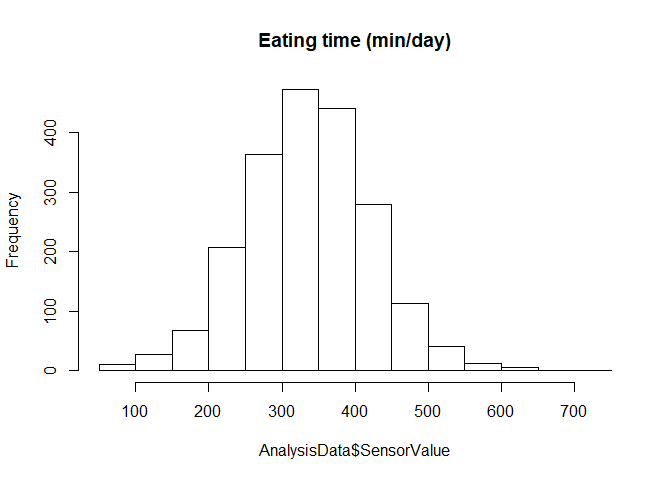
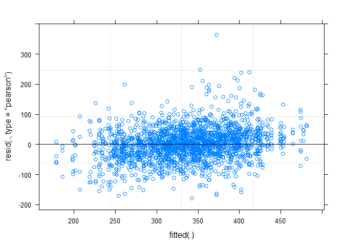
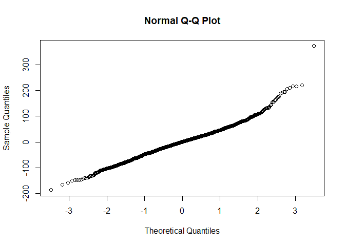
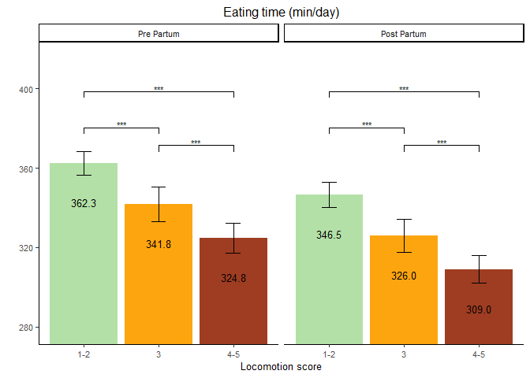

Eating time
================

  - [Read the data](#read-the-data)
  - [Data preparation](#data-preparation)
  - [Model building](#model-building)
      - [Baseline models](#baseline-models)
      - [Full model using the nested
        LMM](#full-model-using-the-nested-lmm)
      - [Comparison of baseline and nested
        model](#comparison-of-baseline-and-nested-model)
      - [Full model](#full-model)
      - [Model fit 2-way interactions](#model-fit-2-way-interactions)
  - [Final model](#final-model)
      - [Model fit](#model-fit)
      - [Type 3 Analysis of Variance](#type-3-analysis-of-variance)
      - [Summary](#summary)
      - [Parameter estimate confidence
        intervals](#parameter-estimate-confidence-intervals)
      - [Least square means](#least-square-means)
  - [Interaction plots](#interaction-plots)
      - [Data preparation](#data-preparation-1)
      - [Plot](#plot)

# Read the data

  - Filter only the locomotion scores
  - Refactor the scores to only 3 classes (1-2 vs 3 vs 4-5)
  - Refactor the observation moments

<!-- end list -->

``` r
load("../Data/AllData.RData")
```

# Data preparation

``` r
AnalysisData <- AllData %>% filter(
  SensorType%like% "eatingTimeDataDay" # &
    ) %>%
  dplyr::mutate(
                  CalvingTime = as.Date(CalvingTime,format = "%Y-%m-%dT%H:%M:%OSZ"),
                  CalvingSeason = case_when(
                    between(month(CalvingTime), 1, 3) ~ "Winter",
                    between(month(CalvingTime), 4, 6) ~ "Spring",
                    between(month(CalvingTime), 7, 9) ~ "Summer",
                    between(month(CalvingTime), 10, 12) ~ "Autumn")
                  ) %>% 
  dplyr::group_by(
    AnimalNumber,
    HerdIdentifier,
    ObservationMoment,
    LocomotionScore,
    ObservationPeriod,
    LactationNumber,
    Parity,
    CalvingSeason
    ) %>% 
  dplyr::summarise(
    SensorValue = mean(SensorValue,na.rm = TRUE),
    SensorValues = n()
    )  %>%  
  dplyr::filter(
    SensorValues == 4
  ) %>% 
  dplyr::arrange(AnimalNumber,HerdIdentifier) %>%
  dplyr::group_by(AnimalNumber, HerdIdentifier) %>%
  dplyr::mutate(LocomotionMoments = length(LocomotionScore)) %>%
  filter(LocomotionMoments == 4) %>%    #4 locomotionscores minimum
  drop_na()


AnalysisData %>% select("HerdIdentifier", "AnimalNumber", "LactationNumber") %>% n_distinct()
```

    ## [1] 526

``` r
hist(AnalysisData$SensorValue,
     main = "Eating time (min/day)")
```

<!-- -->

# Model building

## Baseline models

``` r
baselineLMM <- lmer(
                  SensorValue ~ 1 + (1| AnimalNumber), 
                  data = AnalysisData
                  )
plot(baselineLMM)
```

<!-- -->

## Full model using the nested LMM

``` r
LMM <- lmer(
                  SensorValue ~ 
                    LocomotionScore + ObservationPeriod + ObservationMoment + CalvingSeason +
                    ObservationPeriod:ObservationMoment +
                    ObservationPeriod:LocomotionScore +
                    ObservationMoment:LocomotionScore + 
                    ObservationPeriod:LocomotionScore:ObservationMoment + 
                    HerdIdentifier + 
                    Parity +  (1 | AnimalNumber),
                  REML = FALSE,
                  data = AnalysisData
                  )
qqnorm(residuals(LMM))
```

<!-- -->

## Comparison of baseline and nested model

``` r
anova(LMM,baselineLMM, test="Chisq")
```

    ## refitting model(s) with ML (instead of REML)

    ## Data: AnalysisData
    ## Models:
    ## baselineLMM: SensorValue ~ 1 + (1 | AnimalNumber)
    ## LMM: SensorValue ~ LocomotionScore + ObservationPeriod + ObservationMoment + 
    ## LMM:     CalvingSeason + ObservationPeriod:ObservationMoment + ObservationPeriod:LocomotionScore + 
    ## LMM:     ObservationMoment:LocomotionScore + ObservationPeriod:LocomotionScore:ObservationMoment + 
    ## LMM:     HerdIdentifier + Parity + (1 | AnimalNumber)
    ##             Df   AIC   BIC logLik deviance  Chisq Chi Df Pr(>Chisq)    
    ## baselineLMM  3 23404 23421 -11699    23398                             
    ## LMM         26 23011 23157 -11480    22959 439.16     23  < 2.2e-16 ***
    ## ---
    ## Signif. codes:  0 '***' 0.001 '**' 0.01 '*' 0.05 '.' 0.1 ' ' 1

Multilevel model fits better

## Full model

``` r
LMMdrop <- drop1(LMM, test="Chisq")
if("Pr(>F)" %in% colnames(LMMdrop))
{
  Pvalues <- LMMdrop$`Pr(>F)`
} else 
{
  Pvalues <- LMMdrop$`Pr(Chi)`
}
LMMdrop
```

    ## Single term deletions
    ## 
    ## Model:
    ## SensorValue ~ LocomotionScore + ObservationPeriod + ObservationMoment + 
    ##     CalvingSeason + ObservationPeriod:ObservationMoment + ObservationPeriod:LocomotionScore + 
    ##     ObservationMoment:LocomotionScore + ObservationPeriod:LocomotionScore:ObservationMoment + 
    ##     HerdIdentifier + Parity + (1 | AnimalNumber)
    ##                                                     Df   AIC     LRT Pr(Chi)    
    ## <none>                                                 23011                    
    ## CalvingSeason                                        3 23012   7.139 0.06759 .  
    ## HerdIdentifier                                       7 23116 119.257 < 2e-16 ***
    ## Parity                                               2 23122 114.693 < 2e-16 ***
    ## LocomotionScore:ObservationPeriod:ObservationMoment  2 23008   0.833 0.65924    
    ## ---
    ## Signif. codes:  0 '***' 0.001 '**' 0.01 '*' 0.05 '.' 0.1 ' ' 1

## Model fit 2-way interactions

``` r
LMMReduced = update(LMM, . ~ . - LocomotionScore:ObservationPeriod:ObservationMoment)
LMMdrop <- drop1(LMMReduced, test="Chisq")
if("Pr(>F)" %in% colnames(LMMdrop))
{
  Pvalues <- LMMdrop$`Pr(>F)`
} else 
{
  Pvalues <- LMMdrop$`Pr(Chi)`
}
LMMdrop
```

    ## Single term deletions
    ## 
    ## Model:
    ## SensorValue ~ LocomotionScore + ObservationPeriod + ObservationMoment + 
    ##     CalvingSeason + HerdIdentifier + Parity + (1 | AnimalNumber) + 
    ##     ObservationPeriod:ObservationMoment + LocomotionScore:ObservationPeriod + 
    ##     LocomotionScore:ObservationMoment
    ##                                     Df   AIC     LRT Pr(Chi)    
    ## <none>                                 23008                    
    ## CalvingSeason                        3 23009   7.110 0.06848 .  
    ## HerdIdentifier                       7 23113 119.521 < 2e-16 ***
    ## Parity                               2 23118 114.483 < 2e-16 ***
    ## ObservationPeriod:ObservationMoment  1 23011   5.090 0.02406 *  
    ## LocomotionScore:ObservationPeriod    2 23004   0.444 0.80079    
    ## LocomotionScore:ObservationMoment    2 23010   6.021 0.04927 *  
    ## ---
    ## Signif. codes:  0 '***' 0.001 '**' 0.01 '*' 0.05 '.' 0.1 ' ' 1

# Final model

## Model fit

``` r
LMMReducedTwoWay = update(LMMReduced, . ~ . - LocomotionScore:ObservationPeriod)
drop1(LMMReducedTwoWay, test="Chisq")
```

    ## Single term deletions
    ## 
    ## Model:
    ## SensorValue ~ LocomotionScore + ObservationPeriod + ObservationMoment + 
    ##     CalvingSeason + HerdIdentifier + Parity + (1 | AnimalNumber) + 
    ##     ObservationPeriod:ObservationMoment + LocomotionScore:ObservationMoment
    ##                                     Df   AIC     LRT Pr(Chi)    
    ## <none>                                 23004                    
    ## CalvingSeason                        3 23005   7.137 0.06765 .  
    ## HerdIdentifier                       7 23110 119.590 < 2e-16 ***
    ## Parity                               2 23115 114.318 < 2e-16 ***
    ## ObservationPeriod:ObservationMoment  1 23007   5.245 0.02201 *  
    ## LocomotionScore:ObservationMoment    2 23006   6.132 0.04660 *  
    ## ---
    ## Signif. codes:  0 '***' 0.001 '**' 0.01 '*' 0.05 '.' 0.1 ' ' 1

``` r
LMMReducedOneWay <- update(LMMReducedTwoWay, . ~ . - CalvingSeason)
drop1(LMMReducedOneWay, test="Chisq")
```

    ## Single term deletions
    ## 
    ## Model:
    ## SensorValue ~ LocomotionScore + ObservationPeriod + ObservationMoment + 
    ##     HerdIdentifier + Parity + (1 | AnimalNumber) + ObservationPeriod:ObservationMoment + 
    ##     LocomotionScore:ObservationMoment
    ##                                     Df   AIC     LRT Pr(Chi)    
    ## <none>                                 23005                    
    ## HerdIdentifier                       7 23107 115.759 < 2e-16 ***
    ## Parity                               2 23119 117.635 < 2e-16 ***
    ## ObservationPeriod:ObservationMoment  1 23009   5.210 0.02245 *  
    ## LocomotionScore:ObservationMoment    2 23007   6.063 0.04825 *  
    ## ---
    ## Signif. codes:  0 '***' 0.001 '**' 0.01 '*' 0.05 '.' 0.1 ' ' 1

## Type 3 Analysis of Variance

``` r
anova(LMMReducedOneWay, ddf="Satterthwaite")
```

    ## Analysis of Variance Table
    ##                                     Df Sum Sq Mean Sq  F value
    ## LocomotionScore                      2 727996  363998 109.8959
    ## ObservationPeriod                    1  98028   98028  29.5960
    ## ObservationMoment                    1   6526    6526   1.9704
    ## HerdIdentifier                       7 445837   63691  19.2292
    ## Parity                               2 433524  216762  65.4435
    ## ObservationPeriod:ObservationMoment  1  20930   20930   6.3190
    ## LocomotionScore:ObservationMoment    2  20140   10070   3.0402

## Summary

``` r
print(summary(LMMReducedOneWay, ddf="Satterthwaite"),correlation=FALSE)
```

    ## Warning in summary.merMod(LMMReducedOneWay, ddf = "Satterthwaite"): additional arguments ignored

    ## Linear mixed model fit by maximum likelihood  ['lmerMod']
    ## Formula: SensorValue ~ LocomotionScore + ObservationPeriod + ObservationMoment +  
    ##     HerdIdentifier + Parity + (1 | AnimalNumber) + ObservationPeriod:ObservationMoment +  
    ##     LocomotionScore:ObservationMoment
    ##    Data: AnalysisData
    ## 
    ##      AIC      BIC   logLik deviance df.resid 
    ##  23005.3  23112.2 -11483.7  22967.3     2024 
    ## 
    ## Scaled residuals: 
    ##     Min      1Q  Median      3Q     Max 
    ## -3.2609 -0.5538  0.0103  0.5277  6.4337 
    ## 
    ## Random effects:
    ##  Groups       Name        Variance Std.Dev.
    ##  AnimalNumber (Intercept) 1907     43.66   
    ##  Residual                 3312     57.55   
    ## Number of obs: 2043, groups:  AnimalNumber, 511
    ## 
    ## Fixed effects:
    ##                                                      Estimate Std. Error t value
    ## (Intercept)                                           410.604      8.386  48.965
    ## LocomotionScore3                                      -30.173      5.748  -5.249
    ## LocomotionScore4-5                                    -38.872      4.907  -7.922
    ## ObservationPeriodPost Partum                          -21.691      3.661  -5.925
    ## ObservationMomentSecond                               -13.991      4.216  -3.319
    ## HerdIdentifier544                                      -1.067      9.789  -0.109
    ## HerdIdentifier2011                                    -31.669      9.078  -3.488
    ## HerdIdentifier2297                                    -40.882     10.021  -4.079
    ## HerdIdentifier2514                                    -21.919     10.743  -2.040
    ## HerdIdentifier2746                                      4.673     10.245   0.456
    ## HerdIdentifier3314                                    -43.266     10.453  -4.139
    ## HerdIdentifier5888                                     45.716     10.486   4.360
    ## Parity3                                               -28.161      5.817  -4.841
    ## Parity>3                                              -62.663      5.508 -11.377
    ## ObservationPeriodPost Partum:ObservationMomentSecond   11.783      5.158   2.285
    ## LocomotionScore3:ObservationMomentSecond               19.337      7.883   2.453
    ## LocomotionScore4-5:ObservationMomentSecond              2.824      6.166   0.458

## Parameter estimate confidence intervals

``` r
confint(LMMReducedOneWay, parm="beta_")
```

    ## Computing profile confidence intervals ...

    ##                                                           2.5 %      97.5 %
    ## (Intercept)                                          394.150099 427.0748315
    ## LocomotionScore3                                     -41.445105 -18.8965522
    ## LocomotionScore4-5                                   -48.505207 -29.2443763
    ## ObservationPeriodPost Partum                         -28.870090 -14.5105148
    ## ObservationMomentSecond                              -22.257962  -5.7220128
    ## HerdIdentifier544                                    -20.292385  18.1532486
    ## HerdIdentifier2011                                   -49.498032 -13.8454776
    ## HerdIdentifier2297                                   -60.564091 -21.2072164
    ## HerdIdentifier2514                                   -43.021058  -0.8305072
    ## HerdIdentifier2746                                   -15.445960  24.7874092
    ## HerdIdentifier3314                                   -63.798786 -22.7496866
    ## HerdIdentifier5888                                    25.122185  66.3032202
    ## Parity3                                              -39.600200 -16.7515571
    ## Parity>3                                             -73.491423 -51.8579059
    ## ObservationPeriodPost Partum:ObservationMomentSecond   1.667992  21.8980530
    ## LocomotionScore3:ObservationMomentSecond               3.870465  34.7948370
    ## LocomotionScore4-5:ObservationMomentSecond            -9.268320  14.9165145

## Least square means

``` r
multcomp::cld(lsmeans::lsmeans(LMMReducedOneWay, ~ HerdIdentifier), alpha=0.05, Letters=letters, adjust="tukey")
```

    ##  HerdIdentifier lsmean   SE  df lower.CL upper.CL .group
    ##  3314              303 7.14 542      283      322  a    
    ##  2297              305 6.67 535      287      323  a    
    ##  2011              314 5.10 548      300      328  a    
    ##  2514              324 7.69 527      303      345  ab   
    ##  544               345 6.27 533      328      362   b   
    ##  3                 346 7.76 547      325      367   b   
    ##  2746              351 6.95 535      332      370   b   
    ##  5888              392 7.46 537      371      412    c  
    ## 
    ## Results are averaged over the levels of: LocomotionScore, ObservationPeriod, ObservationMoment, Parity 
    ## Degrees-of-freedom method: kenward-roger 
    ## Confidence level used: 0.95 
    ## Conf-level adjustment: sidak method for 8 estimates 
    ## P value adjustment: tukey method for comparing a family of 8 estimates 
    ## significance level used: alpha = 0.05

``` r
multcomp::cld(lsmeans::lsmeans(LMMReducedOneWay, ~ Parity), alpha=0.05, Letters=letters, adjust="tukey") 
```

    ##  Parity lsmean   SE  df lower.CL upper.CL .group
    ##  >3        303 4.01 550      293      312  a    
    ##  3         337 4.60 602      326      348   b   
    ##  2         365 4.02 627      356      375    c  
    ## 
    ## Results are averaged over the levels of: LocomotionScore, ObservationPeriod, ObservationMoment, HerdIdentifier 
    ## Degrees-of-freedom method: kenward-roger 
    ## Confidence level used: 0.95 
    ## Conf-level adjustment: sidak method for 3 estimates 
    ## P value adjustment: tukey method for comparing a family of 3 estimates 
    ## significance level used: alpha = 0.05

``` r
multcomp::cld(lsmeans::lsmeans(LMMReducedOneWay, ~ LocomotionScore), alpha=0.05, Letters=letters, adjust="tukey")
```

    ##  LocomotionScore lsmean   SE   df lower.CL upper.CL .group
    ##  4-5                317 3.48 1296      309      325  a    
    ##  3                  334 4.10 1793      324      344   b   
    ##  1-2                354 2.87  852      348      361    c  
    ## 
    ## Results are averaged over the levels of: ObservationPeriod, ObservationMoment, HerdIdentifier, Parity 
    ## Degrees-of-freedom method: kenward-roger 
    ## Confidence level used: 0.95 
    ## Conf-level adjustment: sidak method for 3 estimates 
    ## P value adjustment: tukey method for comparing a family of 3 estimates 
    ## significance level used: alpha = 0.05

``` r
multcomp::cld(lsmeans::lsmeans(LMMReducedOneWay, ~ ObservationMoment), alpha=0.05, Letters=letters, adjust="tukey")
```

    ##  ObservationMoment lsmean   SE   df lower.CL upper.CL .group
    ##  Second               335 2.93  995      328      341  a    
    ##  First                335 2.96 1031      329      342  a    
    ## 
    ## Results are averaged over the levels of: LocomotionScore, ObservationPeriod, HerdIdentifier, Parity 
    ## Degrees-of-freedom method: kenward-roger 
    ## Confidence level used: 0.95 
    ## Conf-level adjustment: sidak method for 2 estimates 
    ## significance level used: alpha = 0.05

``` r
multcomp::cld(lsmeans::lsmeans(LMMReducedOneWay, ~ ObservationPeriod|ObservationMoment), alpha=0.05, Letters=letters, adjust="tukey")
```

    ## ObservationMoment = First:
    ##  ObservationPeriod lsmean   SE   df lower.CL upper.CL .group
    ##  Post Partum          325 3.42 1517      317      332  a    
    ##  Pre Partum           346 3.55 1613      338      354   b   
    ## 
    ## ObservationMoment = Second:
    ##  ObservationPeriod lsmean   SE   df lower.CL upper.CL .group
    ##  Post Partum          330 3.38 1486      322      337  a    
    ##  Pre Partum           340 3.53 1594      332      348   b   
    ## 
    ## Results are averaged over the levels of: LocomotionScore, HerdIdentifier, Parity 
    ## Degrees-of-freedom method: kenward-roger 
    ## Confidence level used: 0.95 
    ## Conf-level adjustment: sidak method for 2 estimates 
    ## significance level used: alpha = 0.05

``` r
multcomp::cld(lsmeans::lsmeans(LMMReducedOneWay, ~ LocomotionScore|ObservationPeriod), alpha=0.05, Letters=letters, adjust="tukey")
```

    ## ObservationPeriod = Pre Partum:
    ##  LocomotionScore lsmean   SE   df lower.CL upper.CL .group
    ##  4-5                325 3.83 1575      316      334  a    
    ##  3                  342 4.36 1912      331      352   b   
    ##  1-2                362 3.04 1067      355      370    c  
    ## 
    ## ObservationPeriod = Post Partum:
    ##  LocomotionScore lsmean   SE   df lower.CL upper.CL .group
    ##  4-5                309 3.59 1439      300      318  a    
    ##  3                  326 4.23 1870      316      336   b   
    ##  1-2                346 3.26 1227      339      354    c  
    ## 
    ## Results are averaged over the levels of: ObservationMoment, HerdIdentifier, Parity 
    ## Degrees-of-freedom method: kenward-roger 
    ## Confidence level used: 0.95 
    ## Conf-level adjustment: sidak method for 3 estimates 
    ## P value adjustment: tukey method for comparing a family of 3 estimates 
    ## significance level used: alpha = 0.05

# Interaction plots

## Data preparation

``` r
# Contrast data for plotting
LSMs<-lsmeans::lsmeans(LMMReducedOneWay, pairwise ~ LocomotionScore|ObservationPeriod, glhargs=list())
#print(LSMs)
dfPValues <- summary(LSMs)[[2]]
dfLMSs <- summary(LSMs)[[1]]
dfResults <- cbind(dfLMSs[,!(names(dfLMSs) %in% c("df", "ObservationPeriod", "SE"))], dfPValues)
dfPValuesSplit <- dfResults %>% 
                    tidyr::separate(contrast, c("group1", "group2"), " - ", remove=FALSE) %>%
                    dplyr::arrange(-lsmean) %>%                  
                    dplyr::mutate(
                                  p.value = round(p.value, 2),
                                  p.value.2 = cut(p.value, 
                                        breaks = c(-Inf,0.001,0.01,0.05,0.1,Inf),
                                        labels = c("***","**","*","†","ns")),
                                  y.position.2 = cummax(lsmean),
                                  y.position.3 = case_when(contrast == "1-2 - 4-5" ~ y.position.2*1.1, 
                                                           contrast == "1-2 - 3" ~ y.position.2*1.05,
                                                           TRUE ~ y.position.2*1.025)
                                  )
#Next lines do the same
#contrast <- multcomp::glht(LMMReducedTwoWay,  lsm(pairwise ~ LocomotionScore|ObservationPeriod, adjust="tukey"))
#summary(contrast)
```

## Plot

``` r
ggplot(
  data=transform(dfPValuesSplit, ObservationPeriod = factor(ObservationPeriod, levels= c("Pre Partum", "Post Partum"))), 
  aes(
    x=LocomotionScore, 
    y=lsmean,
    fill=LocomotionScore)) + 
  geom_bar(
    stat="identity"
    ) + 
  coord_cartesian(ylim = c(min(dfPValuesSplit$lsmean)*0.9, 
                           max(dfPValuesSplit$lsmean)*1.15),
                  expand = TRUE) +
  scale_fill_manual(
    values=c("#b3e0a6","#fda50f", "#9e3d22")
    ) +
  geom_text(
    aes(
      label=sprintf("%0.1f", round(lsmean, digits = 1))
      ),
    vjust=5.0, 
    size=3.5
    )+
  geom_errorbar(
    aes(
      ymin=lower.CL, 
      ymax=upper.CL), 
    width=.2,
    position=position_dodge(.9)
    ) +
  facet_wrap(~ObservationPeriod) + 
  labs(
    title = "Eating time (min/day)", 
    x= "Locomotion score", 
    y=""
    )  + 
  theme_classic() + 
  theme(text=element_text(size=10)) +
  theme(plot.title = element_text(hjust = 0.5)) + 
  stat_pvalue_manual(comparisons = list( c("1-2", "3"), c("3", "4-5"), c("1-2", "4-5")),
                     label.size = 3,
                     data = dfPValuesSplit,
                     y.position =  "y.position.3",
                     label = "p.value.2") + 
  theme(legend.position = "none")
```

<!-- -->
