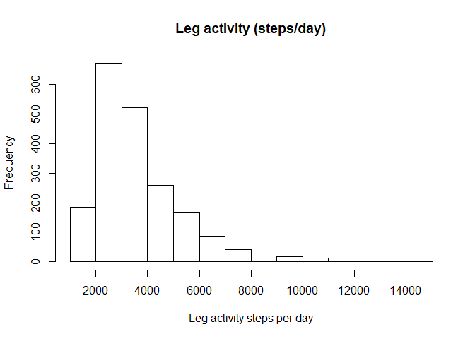
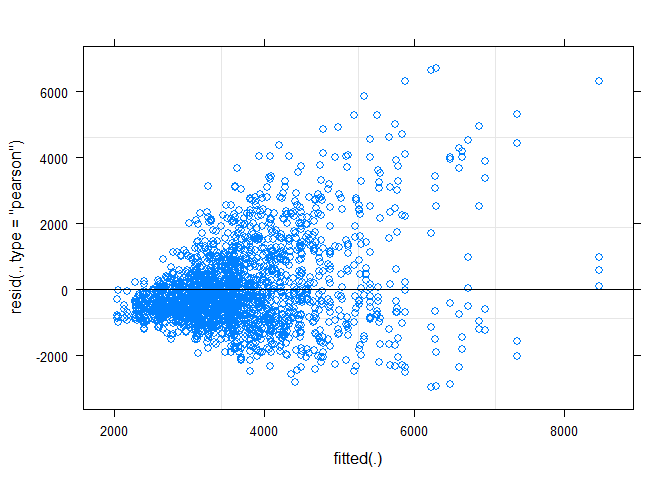
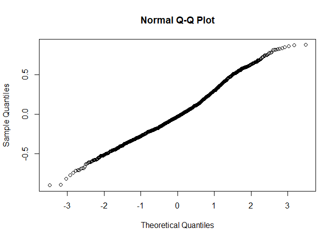
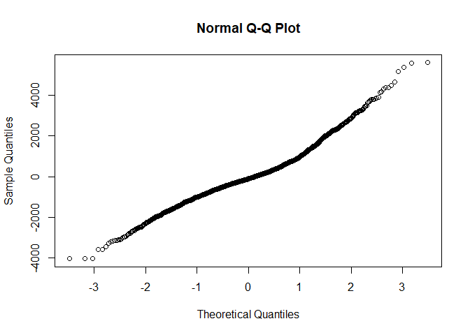
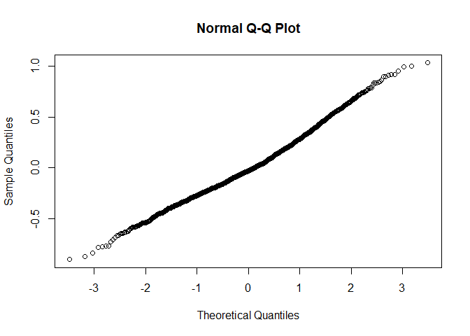
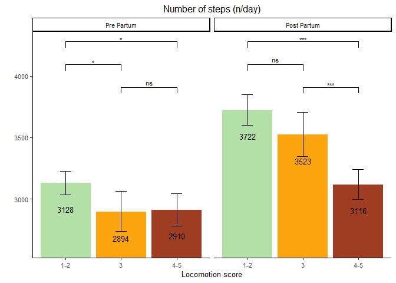

Leg activity
================

  - [Read the data](#read-the-data)
  - [Data preparation](#data-preparation)
  - [Model building](#model-building)
      - [Baseline models](#baseline-models)
          - [Linear model](#linear-model)
          - [Non-Linear model](#non-linear-model)
      - [Full model using the nested
        LMM](#full-model-using-the-nested-lmm)
      - [Comparison of baseline and nested
        model](#comparison-of-baseline-and-nested-model)
      - [Full model](#full-model)
      - [Model fit 2-way interactions](#model-fit-2-way-interactions)
      - [Model fit without
        interactions](#model-fit-without-interactions)
  - [Final model](#final-model)
      - [Model fit](#model-fit)
      - [Type 3 Analysis of Variance](#type-3-analysis-of-variance)
      - [Summary](#summary)
      - [Least square means](#least-square-means)
      - [Interaction term contrasts](#interaction-term-contrasts)
      - [Specific contrasts](#specific-contrasts)
  - [Interaction plots](#interaction-plots)
      - [Data preparation](#data-preparation-1)
      - [Plot](#plot)

# Read the data

  - Filter only the locomotion scores
  - Refactor the scores to only 3 classes (1-2 vs 3 vs 4-5)
  - Refactor the observation moments

<!-- end list -->

``` r
load("../Data/AllData.RData")
```

# Data preparation

``` r
AnalysisData <- AllData %>% filter(
                                SensorType%like% "legActivitySummary"  &
                                SensorValue > 100 # Values < 100 very unlikely
    ) %>%
  dplyr::mutate(
                  CalvingTime = as.Date(CalvingTime,format = "%Y-%m-%dT%H:%M:%OSZ"),
                  CalvingSeason = case_when(
                    between(month(CalvingTime), 1, 3) ~ "Winter",
                    between(month(CalvingTime), 4, 6) ~ "Spring",
                    between(month(CalvingTime), 7, 9) ~ "Summer",
                    between(month(CalvingTime), 10, 12) ~ "Autumn")
                  ) %>% 
  dplyr::group_by(
    AnimalNumber,
    HerdIdentifier,
    ObservationMoment,
    LocomotionScore,
    ObservationPeriod,
    LactationNumber,
    Parity,
    CalvingSeason
    ) %>% 
  dplyr::summarise(
    SensorValue = mean(SensorValue,na.rm = TRUE),
    SensorValues = n()
    )  %>%  
  dplyr::filter(
    SensorValues == 4
  ) %>% 
  dplyr::arrange(AnimalNumber,HerdIdentifier) %>%
  dplyr::group_by(AnimalNumber, HerdIdentifier) %>%
  dplyr::mutate(LocomotionMoments = length(LocomotionScore)) %>%
  filter(LocomotionMoments == 4) %>%    #4 locomotionscores minimum
  drop_na()

AnalysisData %>% select("HerdIdentifier", "AnimalNumber", "LactationNumber") %>% n_distinct()
```

    ## [1] 512

``` r
hist(AnalysisData$SensorValue,
     main = "Leg activity (steps/day)",
     xlab = "Leg activity steps per day")
```

<!-- -->

# Model building

## Baseline models

### Linear model

``` r
baselineLIN <- lmer(
                  SensorValue ~ 1 + (1| AnimalNumber), 
                  REML = F,
                  data = AnalysisData
                  )
plot(baselineLIN)
```

<!-- -->

### Non-Linear model

#### Log transformed LMM model

``` r
baselineLMM <- lmer(
                  log(SensorValue) ~ 1 + (1| AnimalNumber), 
                  REML = FALSE,
                  data = AnalysisData
                  )
qqnorm(residuals(baselineLMM))
```

<!-- -->

#### GLMM model

``` r
baselineGLMM <- glmer(
                  SensorValue ~ 1 + (1 | AnimalNumber), 
                  family=gaussian(link="log"),
                  data = AnalysisData
                  )
qqnorm(residuals(baselineGLMM))
```

<!-- -->

Best fit with log transformed model

## Full model using the nested LMM

``` r
LMM <- lmer(
                  log(SensorValue) ~ 
                    LocomotionScore + ObservationPeriod + ObservationMoment + CalvingSeason + 
                    ObservationPeriod:ObservationMoment +
                    ObservationPeriod:LocomotionScore +
                    ObservationMoment:LocomotionScore + 
                    ObservationPeriod:LocomotionScore:ObservationMoment + 
                    HerdIdentifier + 
                    Parity +  (1 | AnimalNumber),
                  REML = FALSE,
                  data = AnalysisData
                  )
qqnorm(residuals(LMM))
```

<!-- -->

## Comparison of baseline and nested model

``` r
anova(LMM,baselineLMM, test="Chisq")
```

    ## Data: AnalysisData
    ## Models:
    ## baselineLMM: log(SensorValue) ~ 1 + (1 | AnimalNumber)
    ## LMM: log(SensorValue) ~ LocomotionScore + ObservationPeriod + ObservationMoment + 
    ## LMM:     CalvingSeason + ObservationPeriod:ObservationMoment + ObservationPeriod:LocomotionScore + 
    ## LMM:     ObservationMoment:LocomotionScore + ObservationPeriod:LocomotionScore:ObservationMoment + 
    ## LMM:     HerdIdentifier + Parity + (1 | AnimalNumber)
    ##             Df    AIC    BIC  logLik deviance  Chisq Chi Df Pr(>Chisq)    
    ## baselineLMM  3 1811.4 1828.2 -902.69   1805.4                             
    ## LMM         26 1349.3 1494.8 -648.64   1297.3 508.09     23  < 2.2e-16 ***
    ## ---
    ## Signif. codes:  0 '***' 0.001 '**' 0.01 '*' 0.05 '.' 0.1 ' ' 1

## Full model

``` r
LMMdrop <- drop1(LMM, test="Chisq")
if("Pr(>F)" %in% colnames(LMMdrop))
{
  Pvalues <- LMMdrop$`Pr(>F)`
} else 
{
  Pvalues <- LMMdrop$`Pr(Chi)`
}
LMMdrop
```

    ## Single term deletions
    ## 
    ## Model:
    ## log(SensorValue) ~ LocomotionScore + ObservationPeriod + ObservationMoment + 
    ##     CalvingSeason + ObservationPeriod:ObservationMoment + ObservationPeriod:LocomotionScore + 
    ##     ObservationMoment:LocomotionScore + ObservationPeriod:LocomotionScore:ObservationMoment + 
    ##     HerdIdentifier + Parity + (1 | AnimalNumber)
    ##                                                     Df    AIC     LRT Pr(Chi)    
    ## <none>                                                 1349.3                    
    ## CalvingSeason                                        3 1562.9 219.640  <2e-16 ***
    ## HerdIdentifier                                       7 1496.6 161.279  <2e-16 ***
    ## Parity                                               2 1418.7  73.417  <2e-16 ***
    ## LocomotionScore:ObservationPeriod:ObservationMoment  2 1346.1   0.856  0.6518    
    ## ---
    ## Signif. codes:  0 '***' 0.001 '**' 0.01 '*' 0.05 '.' 0.1 ' ' 1

## Model fit 2-way interactions

``` r
LMMReduced = update(LMM, . ~ . - LocomotionScore:ObservationPeriod:ObservationMoment)
drop1(LMMReduced, test="Chisq")
```

    ## Single term deletions
    ## 
    ## Model:
    ## log(SensorValue) ~ LocomotionScore + ObservationPeriod + ObservationMoment + 
    ##     CalvingSeason + HerdIdentifier + Parity + (1 | AnimalNumber) + 
    ##     ObservationPeriod:ObservationMoment + LocomotionScore:ObservationPeriod + 
    ##     LocomotionScore:ObservationMoment
    ##                                     Df    AIC     LRT   Pr(Chi)    
    ## <none>                                 1346.1                      
    ## CalvingSeason                        3 1559.4 219.259 < 2.2e-16 ***
    ## HerdIdentifier                       7 1492.7 160.604 < 2.2e-16 ***
    ## Parity                               2 1415.5  73.378 < 2.2e-16 ***
    ## ObservationPeriod:ObservationMoment  1 1348.4   4.274  0.038706 *  
    ## LocomotionScore:ObservationPeriod    2 1353.8  11.670  0.002923 ** 
    ## LocomotionScore:ObservationMoment    2 1343.7   1.594  0.450763    
    ## ---
    ## Signif. codes:  0 '***' 0.001 '**' 0.01 '*' 0.05 '.' 0.1 ' ' 1

``` r
if (last(Pvalues) < 0.05) {
  finalLMM <- LMM
} else {
  finalLMM <- LMMReduced
}
```

## Model fit without interactions

``` r
LMMReduced = update(finalLMM, . ~ . - LocomotionScore:ObservationMoment)
```

# Final model

## Model fit

``` r
drop1(LMMReduced, test="Chisq")
```

    ## Single term deletions
    ## 
    ## Model:
    ## log(SensorValue) ~ LocomotionScore + ObservationPeriod + ObservationMoment + 
    ##     CalvingSeason + HerdIdentifier + Parity + (1 | AnimalNumber) + 
    ##     ObservationPeriod:ObservationMoment + LocomotionScore:ObservationPeriod
    ##                                     Df    AIC     LRT   Pr(Chi)    
    ## <none>                                 1343.7                      
    ## CalvingSeason                        3 1556.3 218.553 < 2.2e-16 ***
    ## HerdIdentifier                       7 1489.8 160.049 < 2.2e-16 ***
    ## Parity                               2 1413.9  74.212 < 2.2e-16 ***
    ## ObservationPeriod:ObservationMoment  1 1345.9   4.159  0.041418 *  
    ## LocomotionScore:ObservationPeriod    2 1351.5  11.754  0.002803 ** 
    ## ---
    ## Signif. codes:  0 '***' 0.001 '**' 0.01 '*' 0.05 '.' 0.1 ' ' 1

## Type 3 Analysis of Variance

``` r
anova(LMMReduced, ddf="Satterthwaite")
```

    ## Analysis of Variance Table
    ##                                     Df  Sum Sq Mean Sq  F value
    ## LocomotionScore                      2  8.2073  4.1036  42.8382
    ## ObservationPeriod                    1 11.3431 11.3431 118.4117
    ## ObservationMoment                    1  0.0003  0.0003   0.0029
    ## CalvingSeason                        3 22.6262  7.5421  78.7323
    ## HerdIdentifier                       7 16.5533  2.3648  24.6858
    ## Parity                               2  7.7545  3.8772  40.4747
    ## ObservationPeriod:ObservationMoment  1  0.4445  0.4445   4.6404
    ## LocomotionScore:ObservationPeriod    2  1.1302  0.5651   5.8990

## Summary

``` r
print(summary(LMMReduced, ddf="Satterthwaite"),correlation=FALSE)
```

    ## Warning in summary.merMod(LMMReduced, ddf = "Satterthwaite"): additional arguments ignored

    ## Linear mixed model fit by maximum likelihood  ['lmerMod']
    ## Formula: log(SensorValue) ~ LocomotionScore + ObservationPeriod + ObservationMoment +  
    ##     CalvingSeason + HerdIdentifier + Parity + (1 | AnimalNumber) +  
    ##     ObservationPeriod:ObservationMoment + LocomotionScore:ObservationPeriod
    ##    Data: AnalysisData
    ## 
    ##      AIC      BIC   logLik deviance df.resid 
    ##   1343.7   1466.9   -649.9   1299.7     1969 
    ## 
    ## Scaled residuals: 
    ##     Min      1Q  Median      3Q     Max 
    ## -2.8971 -0.6373 -0.0874  0.5711  3.2436 
    ## 
    ## Random effects:
    ##  Groups       Name        Variance Std.Dev.
    ##  AnimalNumber (Intercept) 0.02155  0.1468  
    ##  Residual                 0.09579  0.3095  
    ## Number of obs: 1991, groups:  AnimalNumber, 498
    ## 
    ## Fixed effects:
    ##                                                      Estimate Std. Error t value
    ## (Intercept)                                           8.21771    0.04458 184.335
    ## LocomotionScore3                                     -0.07777    0.03090  -2.517
    ## LocomotionScore4-5                                   -0.07224    0.02684  -2.691
    ## ObservationPeriodPost Partum                          0.20239    0.02373   8.528
    ## ObservationMomentSecond                               0.02452    0.01974   1.242
    ## CalvingSeasonSpring                                   0.10738    0.03064   3.504
    ## CalvingSeasonSummer                                   0.26470    0.02545  10.400
    ## CalvingSeasonWinter                                  -0.17566    0.02943  -5.969
    ## HerdIdentifier544                                    -0.25983    0.04249  -6.115
    ## HerdIdentifier2011                                   -0.04343    0.04094  -1.061
    ## HerdIdentifier2297                                   -0.06660    0.04389  -1.518
    ## HerdIdentifier2514                                   -0.34780    0.04388  -7.925
    ## HerdIdentifier2746                                    0.10471    0.04738   2.210
    ## HerdIdentifier3314                                   -0.18030    0.04985  -3.617
    ## HerdIdentifier5888                                   -0.15374    0.04535  -3.390
    ## Parity3                                              -0.13760    0.02484  -5.538
    ## Parity>3                                             -0.20011    0.02300  -8.700
    ## ObservationPeriodPost Partum:ObservationMomentSecond -0.05678    0.02783  -2.041
    ## LocomotionScore3:ObservationPeriodPost Partum         0.02260    0.04218   0.536
    ## LocomotionScore4-5:ObservationPeriodPost Partum      -0.10548    0.03409  -3.095

## Least square means

``` r
multcomp::cld(marginalHerds <- lsmeans::lsmeans(LMMReduced, ~ HerdIdentifier, type = "response"), alpha=0.05, Letters=letters, adjust="tukey")
```

    ##  HerdIdentifier response    SE  df lower.CL upper.CL .group 
    ##  2514               2545  70.6 522     2359     2746  a     
    ##  544                2779  69.1 536     2596     2975  ab    
    ##  3314               3009 106.3 537     2732     3315   bc   
    ##  5888               3090  93.6 533     2844     3357   bcd  
    ##  2297               3371  93.1 535     3126     3636    cde 
    ##  2011               3450  75.7 553     3249     3664     de 
    ##  3                  3604 128.6 535     3268     3973      ef
    ##  2746               4001 129.7 538     3662     4373       f
    ## 
    ## Results are averaged over the levels of: LocomotionScore, ObservationPeriod, ObservationMoment, CalvingSeason, Parity 
    ## Degrees-of-freedom method: kenward-roger 
    ## Confidence level used: 0.95 
    ## Conf-level adjustment: sidak method for 8 estimates 
    ## Intervals are back-transformed from the log scale 
    ## P value adjustment: tukey method for comparing a family of 8 estimates 
    ## Tests are performed on the log scale 
    ## significance level used: alpha = 0.05

``` r
multcomp::cld(marginalParity <- lsmeans::lsmeans(LMMReduced, ~ Parity, type = "response"), alpha=0.05, Letters=letters, adjust="tukey") 
```

    ##  Parity response   SE  df lower.CL upper.CL .group
    ##  >3         2933 50.3 547     2815     3056  a    
    ##  3          3122 63.2 583     2974     3277   b   
    ##  2          3583 61.7 636     3438     3733    c  
    ## 
    ## Results are averaged over the levels of: LocomotionScore, ObservationPeriod, ObservationMoment, CalvingSeason, HerdIdentifier 
    ## Degrees-of-freedom method: kenward-roger 
    ## Confidence level used: 0.95 
    ## Conf-level adjustment: sidak method for 3 estimates 
    ## Intervals are back-transformed from the log scale 
    ## P value adjustment: tukey method for comparing a family of 3 estimates 
    ## Tests are performed on the log scale 
    ## significance level used: alpha = 0.05

``` r
multcomp::cld(marginalLocomotionScore <- lsmeans::lsmeans(LMMReduced, ~ LocomotionScore, type = "response"), alpha=0.05, Letters=letters, adjust="tukey")
```

    ##  LocomotionScore response   SE   df lower.CL upper.CL .group
    ##  4-5                 3011 51.1 1390     2892     3136  a    
    ##  3                   3193 64.9 1828     3041     3352   b   
    ##  1-2                 3412 44.9  908     3306     3521    c  
    ## 
    ## Results are averaged over the levels of: ObservationPeriod, ObservationMoment, CalvingSeason, HerdIdentifier, Parity 
    ## Degrees-of-freedom method: kenward-roger 
    ## Confidence level used: 0.95 
    ## Conf-level adjustment: sidak method for 3 estimates 
    ## Intervals are back-transformed from the log scale 
    ## P value adjustment: tukey method for comparing a family of 3 estimates 
    ## Tests are performed on the log scale 
    ## significance level used: alpha = 0.05

``` r
multcomp::cld(marginalLocomotionScore <- lsmeans::lsmeans(LMMReduced, ~ ObservationPeriod, type = "response"), alpha=0.05, Letters=letters, adjust="tukey")
```

    ##  ObservationPeriod response   SE   df lower.CL upper.CL .group
    ##  Pre Partum            2975 42.8 1306     2881     3073  a    
    ##  Post Partum           3444 46.3 1131     3342     3550   b   
    ## 
    ## Results are averaged over the levels of: LocomotionScore, ObservationMoment, CalvingSeason, HerdIdentifier, Parity 
    ## Degrees-of-freedom method: kenward-roger 
    ## Confidence level used: 0.95 
    ## Conf-level adjustment: sidak method for 2 estimates 
    ## Intervals are back-transformed from the log scale 
    ## Tests are performed on the log scale 
    ## significance level used: alpha = 0.05

``` r
multcomp::cld(marginalLocomotionScore <- lsmeans::lsmeans(LMMReduced, ~ CalvingSeason, type = "response"), alpha=0.05, Letters=letters, adjust="tukey")
```

    ##  CalvingSeason response   SE  df lower.CL upper.CL .group
    ##  Winter            2557 58.1 564     2416     2706  a    
    ##  Autumn            3048 62.3 564     2896     3208   b   
    ##  Spring            3393 80.9 591     3197     3602    c  
    ##  Summer            3972 69.7 569     3801     4150     d 
    ## 
    ## Results are averaged over the levels of: LocomotionScore, ObservationPeriod, ObservationMoment, HerdIdentifier, Parity 
    ## Degrees-of-freedom method: kenward-roger 
    ## Confidence level used: 0.95 
    ## Conf-level adjustment: sidak method for 4 estimates 
    ## Intervals are back-transformed from the log scale 
    ## P value adjustment: tukey method for comparing a family of 4 estimates 
    ## Tests are performed on the log scale 
    ## significance level used: alpha = 0.05

``` r
multcomp::cld(marginalLocomotionScore <- lsmeans::lsmeans(LMMReduced, ~ LocomotionScore|ObservationPeriod, type = "response"), alpha=0.05, Letters=letters, adjust="tukey")
```

    ## ObservationPeriod = Pre Partum:
    ##  LocomotionScore response   SE   df lower.CL upper.CL .group
    ##  3                   2894 83.2 2011     2702     3100  a    
    ##  4-5                 2910 67.6 1921     2753     3076  a    
    ##  1-2                 3128 48.9 1458     3013     3247   b   
    ## 
    ## ObservationPeriod = Post Partum:
    ##  LocomotionScore response   SE   df lower.CL upper.CL .group
    ##  4-5                 3116 62.6 1849     2970     3270  a    
    ##  3                   3523 91.3 1997     3311     3748   b   
    ##  1-2                 3722 64.1 1634     3572     3879   b   
    ## 
    ## Results are averaged over the levels of: ObservationMoment, CalvingSeason, HerdIdentifier, Parity 
    ## Degrees-of-freedom method: kenward-roger 
    ## Confidence level used: 0.95 
    ## Conf-level adjustment: sidak method for 3 estimates 
    ## Intervals are back-transformed from the log scale 
    ## P value adjustment: tukey method for comparing a family of 3 estimates 
    ## Tests are performed on the log scale 
    ## significance level used: alpha = 0.05

``` r
multcomp::cld(marginalLocomotionScore <- lsmeans::lsmeans(LMMReduced, ~ ObservationPeriod|ObservationMoment, type = "response"), alpha=0.05, Letters=letters, adjust="tukey")
```

    ## ObservationMoment = First:
    ##  ObservationPeriod response   SE   df lower.CL upper.CL .group
    ##  Pre Partum            2939 51.4 1835     2826     3056  a    
    ##  Post Partum           3500 58.8 1781     3371     3635   b   
    ## 
    ## ObservationMoment = Second:
    ##  ObservationPeriod response   SE   df lower.CL upper.CL .group
    ##  Pre Partum            3012 52.6 1835     2897     3132  a    
    ##  Post Partum           3389 56.0 1762     3266     3517   b   
    ## 
    ## Results are averaged over the levels of: LocomotionScore, CalvingSeason, HerdIdentifier, Parity 
    ## Degrees-of-freedom method: kenward-roger 
    ## Confidence level used: 0.95 
    ## Conf-level adjustment: sidak method for 2 estimates 
    ## Intervals are back-transformed from the log scale 
    ## Tests are performed on the log scale 
    ## significance level used: alpha = 0.05

## Interaction term contrasts

``` r
summary(multcomp::glht(LMMReduced,  lsm(pairwise ~ LocomotionScore, adjust="tukey")))
```

    ## NOTE: Results may be misleading due to involvement in interactions

    ## Note: df set to 1981

    ## 
    ##   Simultaneous Tests for General Linear Hypotheses
    ## 
    ## Fit: lmer(formula = log(SensorValue) ~ LocomotionScore + ObservationPeriod + 
    ##     ObservationMoment + CalvingSeason + HerdIdentifier + Parity + 
    ##     (1 | AnimalNumber) + ObservationPeriod:ObservationMoment + 
    ##     LocomotionScore:ObservationPeriod, data = AnalysisData, REML = FALSE)
    ## 
    ## Linear Hypotheses:
    ##                Estimate Std. Error t value Pr(>|t|)    
    ## 1-2 - 3 == 0    0.06647    0.02161   3.077   0.0059 ** 
    ## 1-2 - 4-5 == 0  0.12498    0.01956   6.390   <0.001 ***
    ## 3 - 4-5 == 0    0.05850    0.02423   2.414   0.0414 *  
    ## ---
    ## Signif. codes:  0 '***' 0.001 '**' 0.01 '*' 0.05 '.' 0.1 ' ' 1
    ## (Adjusted p values reported -- single-step method)

## Specific contrasts

``` r
marginalHerds
```

    ##  HerdIdentifier response    SE  df lower.CL upper.CL
    ##  3                  3604 128.6 535     3360     3865
    ##  544                2779  69.1 536     2647     2918
    ##  2011               3450  75.7 553     3305     3602
    ##  2297               3371  93.1 535     3193     3559
    ##  2514               2545  70.6 522     2410     2687
    ##  2746               4001 129.7 538     3754     4264
    ##  3314               3009 106.3 537     2807     3225
    ##  5888               3090  93.6 533     2912     3280
    ## 
    ## Results are averaged over the levels of: LocomotionScore, ObservationPeriod, ObservationMoment, CalvingSeason, Parity 
    ## Degrees-of-freedom method: kenward-roger 
    ## Confidence level used: 0.95 
    ## Intervals are back-transformed from the log scale

``` r
Best = c(1,1,0,0,0,0,0,1)
Worst = c(0,0,0,1,1,0,1,0)
contrast(lsmeans::lsmeans(LMMReduced, ~ HerdIdentifier, type = "response"), 
         method = list("Best vs Worst" = Best - Worst))
```

    ##  contrast      ratio     SE  df t.ratio p.value
    ##  Best vs Worst   1.2 0.0887 533 2.446   0.0148 
    ## 
    ## Results are averaged over the levels of: LocomotionScore, ObservationPeriod, ObservationMoment, CalvingSeason, Parity 
    ## Degrees-of-freedom method: kenward-roger 
    ## Tests are performed on the log scale

# Interaction plots

## Data preparation

``` r
# Contrast data for plotting
LSMs<-lsmeans::lsmeans(LMMReduced, pairwise ~ LocomotionScore|ObservationPeriod, type = "response", glhargs=list())
#print(LSMs)
dfPValues <- summary(LSMs)[[2]]
dfLMSs <- summary(LSMs)[[1]]
dfResults <- cbind(dfLMSs[,!(names(dfLMSs) %in% c("df", "ObservationPeriod", "SE"))], dfPValues)
dfPValuesSplit <- dfResults %>% 
                    tidyr::separate(contrast, c("group1", "group2"), " / ", remove=FALSE) %>%
                    #dplyr::arrange(-lsmean) %>%
                    dplyr::mutate(
                                  p.value = round(p.value, 2),
                                  p.value.2 = cut(p.value, 
                                        breaks = c(-Inf,0.001,0.01,0.05,0.1,Inf),
                                        labels = c("***","**","*","†","ns")),
                                  y.position.2 = max(response),
                                  y.position.3 = case_when(contrast == "1-2 / 4-5" ~ y.position.2*1.15, 
                                                           contrast == "1-2 / 3" ~ y.position.2*1.1,
                                                           TRUE ~ y.position.2*1.05)
                    )
```

## Plot

``` r
ggplot(
  data=transform(dfPValuesSplit, ObservationPeriod = factor(ObservationPeriod, levels= c("Pre Partum", "Post Partum"))), 
  aes(
    x=LocomotionScore, 
    y=response,
    fill=LocomotionScore)) + 
  geom_bar(
    stat="identity"
    ) + 
  coord_cartesian(ylim = c(min(dfPValuesSplit$response)*0.9, 
                           max(dfPValuesSplit$response)*1.15),
                  expand = TRUE) +
  scale_fill_manual(
    values=c("#b3e0a6","#fda50f", "#9e3d22")
    ) +
  geom_text(
    aes(
      label=sprintf("%0.0f", round(response, digits = 0))
      ),
    vjust=4.5, 
    size=3.5
    )+
  geom_errorbar(
    aes(
      ymin=lower.CL, 
      ymax=upper.CL), 
    width=.2,
    position=position_dodge(.9)
    ) +
  facet_wrap(~ObservationPeriod) + 
  labs(
    title = "Number of steps (n/day)", 
    x= "Locomotion score", 
    y=""
    )  + 
  theme_classic() + 
  theme(text=element_text(size=10)) +
  theme(plot.title = element_text(hjust = 0.5)) + 
  stat_pvalue_manual(comparisons = list( c("1-2", "3"), c("3", "4-5"), c("1-2", "4-5")),
                     label.size = 3,
                     data = dfPValuesSplit,
                     y.position =  "y.position.3",
                     label = "p.value.2") + 
  theme(legend.position = "none")
```

<!-- -->
