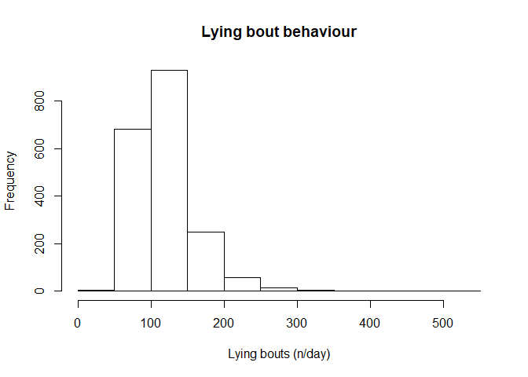
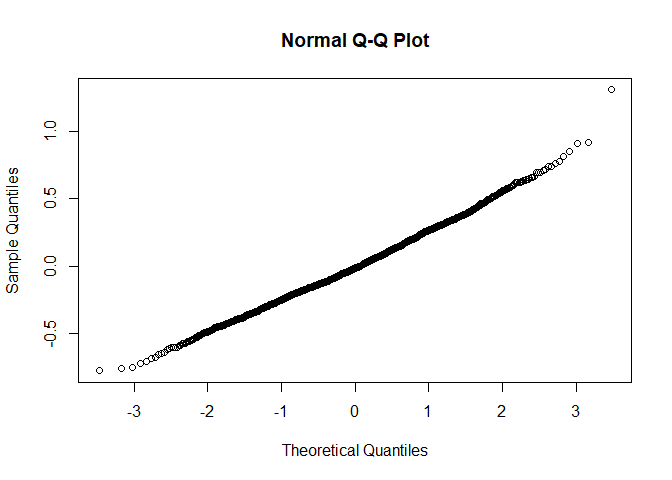
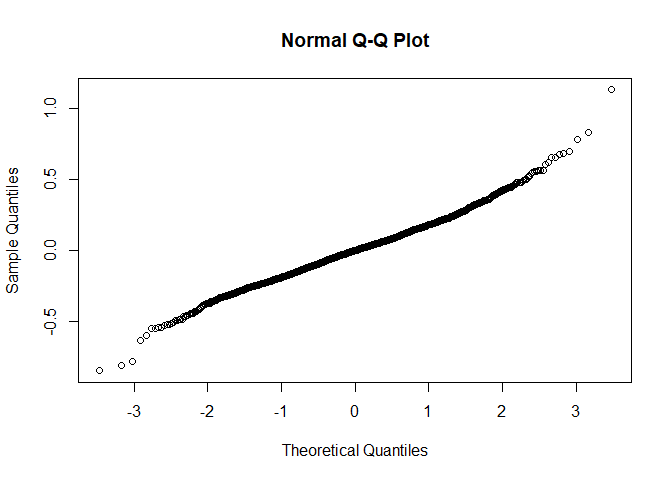
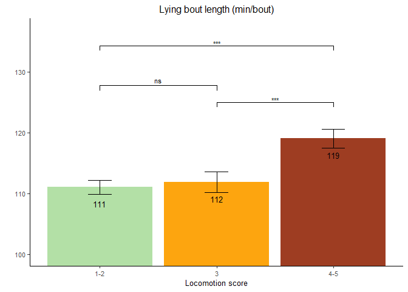
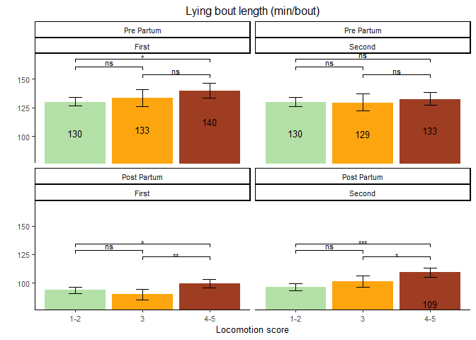

Lying bout length
================

  - [Read the data](#read-the-data)
  - [Data preparation](#data-preparation)
  - [Model building](#model-building)
      - [Baseline model without any
        variable](#baseline-model-without-any-variable)
      - [Full model using the nested repeated measures
        GLMM](#full-model-using-the-nested-repeated-measures-glmm)
      - [Comparison of baseline and nested
        model](#comparison-of-baseline-and-nested-model)
      - [Full model](#full-model)
  - [Final model](#final-model)
      - [Model fit](#model-fit)
      - [Type 3 Analysis of Variance](#type-3-analysis-of-variance)
      - [Summary](#summary)
      - [Least square means](#least-square-means)
      - [Specific contrasts](#specific-contrasts)
  - [Fixed effect plot](#fixed-effect-plot)
      - [Data preparation](#data-preparation-1)
  - [Interaction plot](#interaction-plot)
      - [Data preparation](#data-preparation-2)
      - [Plot](#plot)

# Read the data

  - Filter only the locomotion scores
  - Refactor the scores to only 3 classes (1-2 vs 3 vs 4-5)
  - Refactor the observation moments

<!-- end list -->

``` r
load("../Data/AllData.RData")
```

# Data preparation

``` r
AnalysisData <- AllData %>% filter(
    SensorType  %like% "lyingBoutSummary_Mean_boutlength"
    ) %>%
  dplyr::mutate(
                  CalvingTime = as.Date(CalvingTime,format = "%Y-%m-%dT%H:%M:%OSZ"),
                  CalvingSeason = case_when(
                    between(month(CalvingTime), 1, 3) ~ "Winter",
                    between(month(CalvingTime), 4, 6) ~ "Spring",
                    between(month(CalvingTime), 7, 9) ~ "Summer",
                    between(month(CalvingTime), 10, 12) ~ "Autumn")
                  ) %>% 
  dplyr::group_by(
    AnimalNumber,
    HerdIdentifier,
    ObservationMoment,
    LocomotionScore,
    ObservationPeriod,
    LactationNumber,
    Parity,
    CalvingSeason
    ) %>% 
  dplyr::summarise(
    SensorValue = mean(SensorValue,na.rm = TRUE),
    SensorValues = n()
    )  %>%  
  dplyr::filter(
    SensorValues == 4
  ) %>% 
  dplyr::arrange(AnimalNumber,HerdIdentifier) %>%
  dplyr::group_by(AnimalNumber, HerdIdentifier) %>%
  dplyr::mutate(LocomotionMoments = length(LocomotionScore)) %>%
  filter(LocomotionMoments == 4) %>%    #4 locomotionscores minimum
  drop_na()

AnalysisData %>% select("HerdIdentifier", "AnimalNumber", "LactationNumber") %>% n_distinct()
```

    ## [1] 500

``` r
hist(AnalysisData$SensorValue,
     main = "Lying bout behaviour",
     xlab = "Lying bouts (n/day)")
```

<!-- -->

# Model building

## Baseline model without any variable

``` r
baselineLMM <- lmer(
                  log(SensorValue) ~ 1 + (1| AnimalNumber), 
                  REML = F,
                  data = AnalysisData
                  )
qqnorm(residuals(baselineLMM, type = 'pearson'))
```

<!-- -->

## Full model using the nested repeated measures GLMM

``` r
LMM <- lmer(
                  log(SensorValue) ~ 
                    LocomotionScore + ObservationPeriod + ObservationMoment + CalvingSeason +                     ObservationPeriod:ObservationMoment +
                    ObservationPeriod:LocomotionScore +
                    ObservationMoment:LocomotionScore + 
                    ObservationPeriod:LocomotionScore:ObservationMoment + 
                    HerdIdentifier + 
                    Parity +  (1 | AnimalNumber),
                  REML = FALSE,
                  data = AnalysisData
                  )
qqnorm(residuals(LMM))
```

<!-- -->

## Comparison of baseline and nested model

``` r
anova(LMM,baselineLMM, test="Chisq")
```

    ## Data: AnalysisData
    ## Models:
    ## baselineLMM: log(SensorValue) ~ 1 + (1 | AnimalNumber)
    ## LMM: log(SensorValue) ~ LocomotionScore + ObservationPeriod + ObservationMoment + 
    ## LMM:     CalvingSeason + ObservationPeriod:ObservationMoment + ObservationPeriod:LocomotionScore + 
    ## LMM:     ObservationMoment:LocomotionScore + ObservationPeriod:LocomotionScore:ObservationMoment + 
    ## LMM:     HerdIdentifier + Parity + (1 | AnimalNumber)
    ##             Df    AIC    BIC  logLik deviance  Chisq Chi Df Pr(>Chisq)    
    ## baselineLMM  3 832.91 849.62 -413.45   826.91                             
    ## LMM         26  30.68 175.55   10.66   -21.32 848.23     23  < 2.2e-16 ***
    ## ---
    ## Signif. codes:  0 '***' 0.001 '**' 0.01 '*' 0.05 '.' 0.1 ' ' 1

## Full model

``` r
LMMdrop <- drop1(LMM, test="Chisq")
if("Pr(>F)" %in% colnames(LMMdrop))
{
  Pvalues <- LMMdrop$`Pr(>F)`
} else 
{
  Pvalues <- LMMdrop$`Pr(Chi)`
}
LMMdrop
```

    ## Single term deletions
    ## 
    ## Model:
    ## log(SensorValue) ~ LocomotionScore + ObservationPeriod + ObservationMoment + 
    ##     CalvingSeason + ObservationPeriod:ObservationMoment + ObservationPeriod:LocomotionScore + 
    ##     ObservationMoment:LocomotionScore + ObservationPeriod:LocomotionScore:ObservationMoment + 
    ##     HerdIdentifier + Parity + (1 | AnimalNumber)
    ##                                                     Df    AIC    LRT   Pr(Chi)
    ## <none>                                                 30.678                 
    ## CalvingSeason                                        3 45.931 21.252 9.330e-05
    ## HerdIdentifier                                       7 76.646 59.967 1.532e-10
    ## Parity                                               2 31.179  4.501   0.10537
    ## LocomotionScore:ObservationPeriod:ObservationMoment  2 34.872  8.194   0.01662
    ##                                                        
    ## <none>                                                 
    ## CalvingSeason                                       ***
    ## HerdIdentifier                                      ***
    ## Parity                                                 
    ## LocomotionScore:ObservationPeriod:ObservationMoment *  
    ## ---
    ## Signif. codes:  0 '***' 0.001 '**' 0.01 '*' 0.05 '.' 0.1 ' ' 1

# Final model

## Model fit

``` r
LMMReduced <- update(LMM, . ~ . - Parity)
```

## Type 3 Analysis of Variance

``` r
anova(LMMReduced, ddf="Satterthwaite")
```

    ## Analysis of Variance Table
    ##                                                     Df Sum Sq Mean Sq  F value
    ## LocomotionScore                                      2  0.419   0.209   4.5906
    ## ObservationPeriod                                    1 43.303  43.303 949.9028
    ## ObservationMoment                                    1  0.255   0.255   5.5916
    ## CalvingSeason                                        3  0.895   0.298   6.5408
    ## HerdIdentifier                                       7  2.921   0.417   9.1525
    ## ObservationPeriod:ObservationMoment                  1  0.885   0.885  19.4154
    ## LocomotionScore:ObservationPeriod                    2  0.194   0.097   2.1300
    ## LocomotionScore:ObservationMoment                    2  0.054   0.027   0.5936
    ## LocomotionScore:ObservationPeriod:ObservationMoment  2  0.384   0.192   4.2103

## Summary

``` r
print(summary(LMMReduced, ddf="Satterthwaite"),correlation=FALSE)
```

    ## Warning in summary.merMod(LMMReduced, ddf = "Satterthwaite"): additional
    ## arguments ignored

    ## Linear mixed model fit by maximum likelihood  ['lmerMod']
    ## Formula: 
    ## log(SensorValue) ~ LocomotionScore + ObservationPeriod + ObservationMoment +  
    ##     CalvingSeason + HerdIdentifier + (1 | AnimalNumber) + ObservationPeriod:ObservationMoment +  
    ##     LocomotionScore:ObservationPeriod + LocomotionScore:ObservationMoment +  
    ##     LocomotionScore:ObservationPeriod:ObservationMoment
    ##    Data: AnalysisData
    ## 
    ##      AIC      BIC   logLik deviance df.resid 
    ##     31.2    164.9      8.4    -16.8     1919 
    ## 
    ## Scaled residuals: 
    ##     Min      1Q  Median      3Q     Max 
    ## -3.9594 -0.6005 -0.0010  0.5515  5.3271 
    ## 
    ## Random effects:
    ##  Groups       Name        Variance Std.Dev.
    ##  AnimalNumber (Intercept) 0.01855  0.1362  
    ##  Residual                 0.04559  0.2135  
    ## Number of obs: 1943, groups:  AnimalNumber, 486
    ## 
    ## Fixed effects:
    ##                                                                           Estimate
    ## (Intercept)                                                              4.8349764
    ## LocomotionScore3                                                         0.0244187
    ## LocomotionScore4-5                                                       0.0731173
    ## ObservationPeriodPost Partum                                            -0.3294044
    ## ObservationMomentSecond                                                 -0.0008296
    ## CalvingSeasonSpring                                                     -0.0069883
    ## CalvingSeasonSummer                                                     -0.0120437
    ## CalvingSeasonWinter                                                      0.0833180
    ## HerdIdentifier544                                                        0.1289180
    ## HerdIdentifier2011                                                       0.0233238
    ## HerdIdentifier2297                                                      -0.0644004
    ## HerdIdentifier2514                                                       0.0252429
    ## HerdIdentifier2746                                                      -0.0618475
    ## HerdIdentifier3314                                                       0.0987862
    ## HerdIdentifier5888                                                      -0.0131876
    ## ObservationPeriodPost Partum:ObservationMomentSecond                     0.0278417
    ## LocomotionScore3:ObservationPeriodPost Partum                           -0.0649056
    ## LocomotionScore4-5:ObservationPeriodPost Partum                         -0.0143411
    ## LocomotionScore3:ObservationMomentSecond                                -0.0290292
    ## LocomotionScore4-5:ObservationMomentSecond                              -0.0537114
    ## LocomotionScore3:ObservationPeriodPost Partum:ObservationMomentSecond    0.1200513
    ## LocomotionScore4-5:ObservationPeriodPost Partum:ObservationMomentSecond  0.1211650
    ##                                                                         Std. Error
    ## (Intercept)                                                              0.0353813
    ## LocomotionScore3                                                         0.0298579
    ## LocomotionScore4-5                                                       0.0267697
    ## ObservationPeriodPost Partum                                             0.0189333
    ## ObservationMomentSecond                                                  0.0180682
    ## CalvingSeasonSpring                                                      0.0248068
    ## CalvingSeasonSummer                                                      0.0208243
    ## CalvingSeasonWinter                                                      0.0242124
    ## HerdIdentifier544                                                        0.0345212
    ## HerdIdentifier2011                                                       0.0332473
    ## HerdIdentifier2297                                                       0.0355656
    ## HerdIdentifier2514                                                       0.0355327
    ## HerdIdentifier2746                                                       0.0392742
    ## HerdIdentifier3314                                                       0.0405453
    ## HerdIdentifier5888                                                       0.0368751
    ## ObservationPeriodPost Partum:ObservationMomentSecond                     0.0271190
    ## LocomotionScore3:ObservationPeriodPost Partum                            0.0424188
    ## LocomotionScore4-5:ObservationPeriodPost Partum                          0.0343739
    ## LocomotionScore3:ObservationMomentSecond                                 0.0430707
    ## LocomotionScore4-5:ObservationMomentSecond                               0.0345235
    ## LocomotionScore3:ObservationPeriodPost Partum:ObservationMomentSecond    0.0594754
    ## LocomotionScore4-5:ObservationPeriodPost Partum:ObservationMomentSecond  0.0472939
    ##                                                                         t value
    ## (Intercept)                                                             136.654
    ## LocomotionScore3                                                          0.818
    ## LocomotionScore4-5                                                        2.731
    ## ObservationPeriodPost Partum                                            -17.398
    ## ObservationMomentSecond                                                  -0.046
    ## CalvingSeasonSpring                                                      -0.282
    ## CalvingSeasonSummer                                                      -0.578
    ## CalvingSeasonWinter                                                       3.441
    ## HerdIdentifier544                                                         3.734
    ## HerdIdentifier2011                                                        0.702
    ## HerdIdentifier2297                                                       -1.811
    ## HerdIdentifier2514                                                        0.710
    ## HerdIdentifier2746                                                       -1.575
    ## HerdIdentifier3314                                                        2.436
    ## HerdIdentifier5888                                                       -0.358
    ## ObservationPeriodPost Partum:ObservationMomentSecond                      1.027
    ## LocomotionScore3:ObservationPeriodPost Partum                            -1.530
    ## LocomotionScore4-5:ObservationPeriodPost Partum                          -0.417
    ## LocomotionScore3:ObservationMomentSecond                                 -0.674
    ## LocomotionScore4-5:ObservationMomentSecond                               -1.556
    ## LocomotionScore3:ObservationPeriodPost Partum:ObservationMomentSecond     2.019
    ## LocomotionScore4-5:ObservationPeriodPost Partum:ObservationMomentSecond   2.562

## Least square means

``` r
multcomp::cld(marginalHerds <- lsmeans::lsmeans(LMMReduced, ~ HerdIdentifier, type = "response"), alpha=0.05, Letters=letters, adjust="tukey")
```

    ##  HerdIdentifier response   SE  df lower.CL upper.CL .group
    ##  2297                105 2.34 519     98.8      112  a    
    ##  2746                105 2.93 517     97.6      114  ab   
    ##  5888                111 2.71 516    103.4      118  abc  
    ##  3                   112 3.22 516    103.5      121  abc  
    ##  2011                115 2.05 531    109.2      120   bc  
    ##  2514                115 2.55 508    108.1      122  abc  
    ##  3314                124 3.55 518    114.3      134    cd 
    ##  544                 127 2.56 514    120.6      135     d 
    ## 
    ## Results are averaged over the levels of: LocomotionScore, ObservationPeriod, ObservationMoment, CalvingSeason 
    ## Degrees-of-freedom method: kenward-roger 
    ## Confidence level used: 0.95 
    ## Conf-level adjustment: sidak method for 8 estimates 
    ## Intervals are back-transformed from the log scale 
    ## P value adjustment: tukey method for comparing a family of 8 estimates 
    ## Tests are performed on the log scale 
    ## significance level used: alpha = 0.05

``` r
multcomp::cld(marginalLocomotionScore <- lsmeans::lsmeans(LMMReduced, ~ LocomotionScore, type = "response"), alpha=0.05, Letters=letters, adjust="tukey")
```

    ## NOTE: Results may be misleading due to involvement in interactions

    ##  LocomotionScore response   SE   df lower.CL upper.CL .group
    ##  1-2                  111 1.13  802      108      114  a    
    ##  3                    112 1.69 1737      108      116  a    
    ##  4-5                  119 1.53 1305      115      123   b   
    ## 
    ## Results are averaged over the levels of: ObservationPeriod, ObservationMoment, CalvingSeason, HerdIdentifier 
    ## Degrees-of-freedom method: kenward-roger 
    ## Confidence level used: 0.95 
    ## Conf-level adjustment: sidak method for 3 estimates 
    ## Intervals are back-transformed from the log scale 
    ## P value adjustment: tukey method for comparing a family of 3 estimates 
    ## Tests are performed on the log scale 
    ## significance level used: alpha = 0.05

``` r
multcomp::cld(marginalLocomotionScore <- lsmeans::lsmeans(LMMReduced, ~ CalvingSeason, type = "response"), alpha=0.05, Letters=letters, adjust="tukey")
```

    ##  CalvingSeason response   SE  df lower.CL upper.CL .group
    ##  Summer             111 1.54 539      107      115  a    
    ##  Spring             111 2.13 571      106      117  a    
    ##  Autumn             112 1.90 550      107      117  a    
    ##  Winter             122 2.24 552      116      128   b   
    ## 
    ## Results are averaged over the levels of: LocomotionScore, ObservationPeriod, ObservationMoment, HerdIdentifier 
    ## Degrees-of-freedom method: kenward-roger 
    ## Confidence level used: 0.95 
    ## Conf-level adjustment: sidak method for 4 estimates 
    ## Intervals are back-transformed from the log scale 
    ## P value adjustment: tukey method for comparing a family of 4 estimates 
    ## Tests are performed on the log scale 
    ## significance level used: alpha = 0.05

``` r
multcomp::cld(marginalLocomotionScore <- lsmeans::lsmeans(LMMReduced, ~ ObservationMoment, type = "response"), alpha=0.05, Letters=letters, adjust="tukey")
```

    ## NOTE: Results may be misleading due to involvement in interactions

    ##  ObservationMoment response   SE   df lower.CL upper.CL .group
    ##  First                  112 1.21 1064      110      115  a    
    ##  Second                 115 1.23 1028      113      118   b   
    ## 
    ## Results are averaged over the levels of: LocomotionScore, ObservationPeriod, CalvingSeason, HerdIdentifier 
    ## Degrees-of-freedom method: kenward-roger 
    ## Confidence level used: 0.95 
    ## Conf-level adjustment: sidak method for 2 estimates 
    ## Intervals are back-transformed from the log scale 
    ## Tests are performed on the log scale 
    ## significance level used: alpha = 0.05

``` r
multcomp::cld(marginalLocomotionScore <- lsmeans::lsmeans(LMMReduced, ~ ObservationPeriod, type = "response"), alpha=0.05, Letters=letters, adjust="tukey")
```

    ## NOTE: Results may be misleading due to involvement in interactions

    ##  ObservationPeriod response   SE   df lower.CL upper.CL .group
    ##  Post Partum             98 1.02  968     95.7      100  a    
    ##  Pre Partum             132 1.46 1121    129.2      136   b   
    ## 
    ## Results are averaged over the levels of: LocomotionScore, ObservationMoment, CalvingSeason, HerdIdentifier 
    ## Degrees-of-freedom method: kenward-roger 
    ## Confidence level used: 0.95 
    ## Conf-level adjustment: sidak method for 2 estimates 
    ## Intervals are back-transformed from the log scale 
    ## Tests are performed on the log scale 
    ## significance level used: alpha = 0.05

``` r
multcomp::cld(marginalLocomotionScore <- lsmeans::lsmeans(LMMReduced, ~ LocomotionScore|ObservationPeriod|ObservationMoment, type = "response"), alpha=0.05, Letters=letters, adjust="tukey")
```

    ## ObservationPeriod = Pre Partum, ObservationMoment = First:
    ##  LocomotionScore response   SE   df lower.CL upper.CL .group
    ##  1-2                130.1 1.90 1804    125.6    134.7  a    
    ##  3                  133.3 3.67 1919    124.8    142.4  ab   
    ##  4-5                139.9 3.32 1953    132.2    148.1   b   
    ## 
    ## ObservationPeriod = Pre Partum, ObservationMoment = Second:
    ##  LocomotionScore response   SE   df lower.CL upper.CL .group
    ##  3                  129.4 3.78 1906    120.6    138.7  a    
    ##  1-2                130.0 1.97 1848    125.4    134.8  a    
    ##  4-5                132.5 2.83 1963    125.9    139.4  a    
    ## 
    ## ObservationPeriod = Post Partum, ObservationMoment = First:
    ##  LocomotionScore response   SE   df lower.CL upper.CL .group
    ##  3                   89.9 2.43 1924     84.2     95.9  a    
    ##  1-2                 93.6 1.51 1895     90.0     97.2  a    
    ##  4-5                 99.2 1.91 1963     94.8    103.9   b   
    ## 
    ## ObservationPeriod = Post Partum, ObservationMoment = Second:
    ##  LocomotionScore response   SE   df lower.CL upper.CL .group
    ##  1-2                 96.1 1.59 1913     92.4    100.0  a    
    ##  3                  101.1 2.46 1945     95.4    107.2  a    
    ##  4-5                109.1 2.13 1965    104.1    114.3   b   
    ## 
    ## Results are averaged over the levels of: CalvingSeason, HerdIdentifier 
    ## Degrees-of-freedom method: kenward-roger 
    ## Confidence level used: 0.95 
    ## Conf-level adjustment: sidak method for 3 estimates 
    ## Intervals are back-transformed from the log scale 
    ## P value adjustment: tukey method for comparing a family of 3 estimates 
    ## Tests are performed on the log scale 
    ## significance level used: alpha = 0.05

## Specific contrasts

``` r
marginalHerds
```

    ##  HerdIdentifier response   SE  df lower.CL upper.CL
    ##  3                   112 3.22 516    105.8      119
    ##  544                 127 2.56 514    122.5      133
    ##  2011                115 2.05 531    110.7      119
    ##  2297                105 2.34 519    100.5      110
    ##  2514                115 2.55 508    110.0      120
    ##  2746                105 2.93 517     99.7      111
    ##  3314                124 3.55 518    116.8      131
    ##  5888                111 2.71 516    105.3      116
    ## 
    ## Results are averaged over the levels of: LocomotionScore, ObservationPeriod, ObservationMoment, CalvingSeason 
    ## Degrees-of-freedom method: kenward-roger 
    ## Confidence level used: 0.95 
    ## Intervals are back-transformed from the log scale

``` r
Best = c(1,1,0,0,0,0,0,1)
Worst = c(0,0,0,1,1,0,1,0)
contrast(marginalHerds, method = list(Best - Worst))
```

    ##  contrast                     ratio     SE  df t.ratio p.value
    ##  c(1, 1, 0, -1, -1, 0, -1, 1)  1.06 0.0636 515 0.933   0.3510 
    ## 
    ## Results are averaged over the levels of: LocomotionScore, ObservationPeriod, ObservationMoment, CalvingSeason 
    ## Degrees-of-freedom method: kenward-roger 
    ## Tests are performed on the log scale

# Fixed effect plot

## Data preparation

``` r
LSMs<-lsmeans::lsmeans(LMMReduced, pairwise ~ LocomotionScore, type =  "response", glhargs=list())
dfPValues <- summary(LSMs, type = "response")[[2]]
dfLMSs <- summary(LSMs, type = "response")[[1]]
dfResults <- cbind(dfLMSs, dfPValues[,!(names(dfLMSs) %in% c("df", "ObservationPeriod", "SE"))])
dfPValuesSplit <- dfResults %>% 
                    tidyr::separate(contrast, c("group1", "group2"), " / ", remove=FALSE) %>%
                    dplyr::mutate(
                                  p.value = round(p.value, 2),
                                  p.value.2 = cut(p.value, 
                                        breaks = c(-Inf,0.001,0.01,0.05,0.1,Inf),
                                        labels = c("***","**","*","†","ns")),
                                  y.position.2 = cummax(response),
                                  y.position.3 = case_when(contrast == "1-2 / 4-5" ~ y.position.2*1.2, 
                                                           contrast == "1-2 / 3" ~ y.position.2*1.15,
                                                           TRUE ~ y.position.2*1.05)
                    )
```

``` r
ggplot(
  data=dfPValuesSplit, 
  aes(
    x=LocomotionScore, 
    y=response,
    fill=LocomotionScore)) + 
  geom_bar(
    stat="identity"
    ) + 
  coord_cartesian(ylim = c(min(dfPValuesSplit$response)*0.9, 
                           max(dfPValuesSplit$response)*1.15),
                  expand = TRUE) +
  scale_fill_manual(
    values=c("#b3e0a6","#fda50f", "#9e3d22")
    ) +
  geom_text(
    aes(
      label=sprintf("%0.0f", round(response, digits = 0))
      ),
    vjust=3.0, 
    size=3.5
    )+
  geom_errorbar(
    aes(
      ymin=response-SE, 
      ymax=response+SE), 
    width=.2,
    position=position_dodge(.9)
    ) +
  labs(
    title = "Lying bout length (min/bout)", 
    x= "Locomotion score", 
    y=""
    )  + 
  theme_classic() + 
  theme(text=element_text(size=10)) +
  theme(plot.title = element_text(hjust = 0.5)) + 
  stat_pvalue_manual(comparisons = list( c("1-2", "3"), c("3", "4-5"), c("1-2", "4-5")),
                     label.size = 3,
                     data = dfPValuesSplit,
                     y.position =  "y.position.3",
                     label = "p.value.2") + 
  theme(legend.position = "none")
```

<!-- -->

# Interaction plot

## Data preparation

``` r
LSMs<-lsmeans::lsmeans(LMMReduced, pairwise ~ LocomotionScore|ObservationMoment|ObservationPeriod, type =  "response", glhargs=list())
#print(LSMs)
dfPValues <- summary(LSMs, type = "response")[[2]]
dfLMSs <- summary(LSMs, type = "response")[[1]]
dfResults <- cbind(dfLMSs[,!(names(dfLMSs) %in% c("df", "ObservationPeriod", "SE", "ObservationMoment"))], dfPValues)
dfPValuesSplit <- dfResults %>% 
                    tidyr::separate(contrast, c("group1", "group2"), " / ", remove=FALSE) %>%
                    dplyr::mutate(
                                  p.value = round(p.value, 2),
                                  p.value.2 = cut(p.value, 
                                        breaks = c(-Inf,0.001,0.01,0.05,0.1,Inf),
                                        labels = c("***","**","*","†","ns")),
                                  y.position.2 = max(response),
                                  y.position.3 = case_when(contrast == "1-2 / 4-5" ~ y.position.2*1.2, 
                                                           contrast == "1-2 / 3" ~ y.position.2*1.15,
                                                           TRUE ~ y.position.2*1.1),
                                  y.position.4 = case_when(ObservationPeriod == "Pre Partum" ~ y.position.3*1,
                                                           TRUE ~ y.position.3*0.8)
                                  )
```

## Plot

``` r
ggplot(
  data=transform(dfPValuesSplit, ObservationPeriod = factor(ObservationPeriod, levels= c("Pre Partum", "Post Partum"))), 
  aes(
    x=LocomotionScore, 
    y=response,
    fill=LocomotionScore)) + 
  geom_bar(
    stat="identity"
    ) + 
  coord_cartesian(ylim = c(min(dfPValuesSplit$response)*0.90, 
                           max(dfPValuesSplit$response)*1.2),
                  expand = TRUE) +
  scale_fill_manual(
    values=c("#b3e0a6","#fda50f", "#9e3d22")
    ) +
  geom_text(
    aes(
      label=sprintf("%0.0f", round(response, digits = 0))
      ),
    vjust=4.5, 
    size=3.5
    )+
  geom_errorbar(
    aes(
      ymin=lower.CL, 
      ymax=upper.CL), 
    width=.2,
    position=position_dodge(.9)
    ) +
  facet_wrap(~ObservationPeriod + ObservationMoment) + 
  labs(
    title = "Lying bout length (min/bout)", 
    x= "Locomotion score", 
    y=""
    )  + 
  theme_classic() + 
  theme(text=element_text(size=10)) +
  theme(plot.title = element_text(hjust = 0.5)) + 
  stat_pvalue_manual(comparisons = list( c("1-2", "3"), c("3", "4-5"), c("1-2", "4-5")),
                     label.size = 3,
                     data = dfPValuesSplit,
                     y.position =  "y.position.4",
                     label = "p.value.2") + 
  theme(legend.position = "none")
```

<!-- -->
