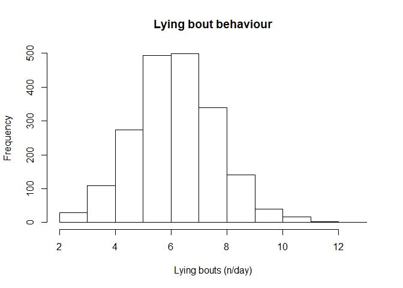
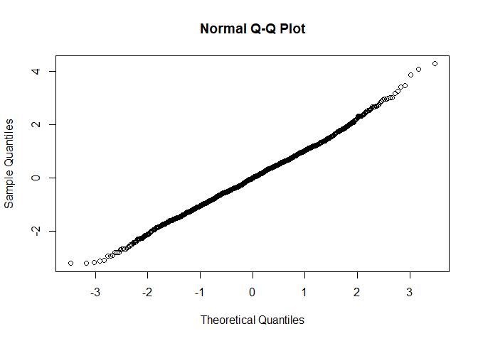
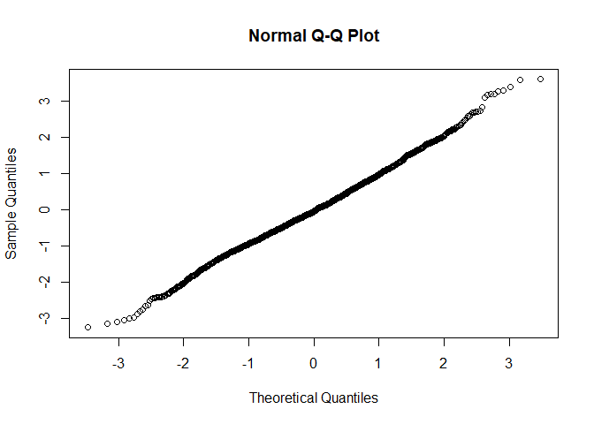
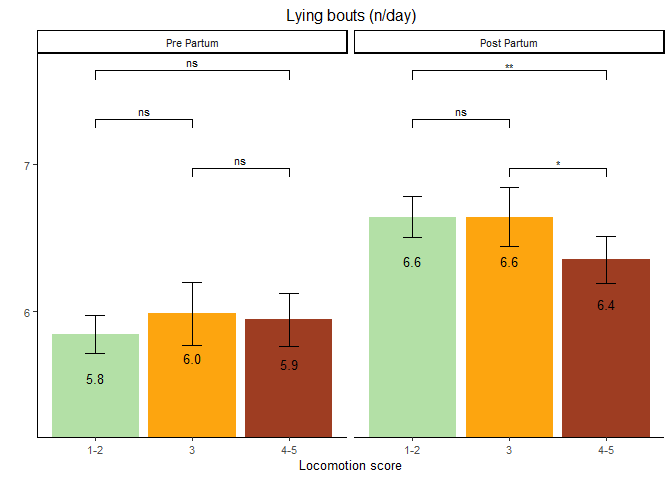

Lying bouts
================

  - [Read the data](#read-the-data)
  - [Data preparation](#data-preparation)
  - [Model building](#model-building)
      - [Baseline model without any
        variable](#baseline-model-without-any-variable)
      - [Full model using the nested repeated measures
        GLMM](#full-model-using-the-nested-repeated-measures-glmm)
      - [Comparison of baseline and nested
        model](#comparison-of-baseline-and-nested-model)
      - [Full model](#full-model)
      - [Model fit 2-way interactions](#model-fit-2-way-interactions)
  - [Final model](#final-model)
      - [Model fit](#model-fit)
      - [Type 3 Analysis of Variance](#type-3-analysis-of-variance)
      - [Summary](#summary)
      - [Parameter estimate confidence
        intervals](#parameter-estimate-confidence-intervals)
      - [Least square means](#least-square-means)
      - [Interaction term contrasts](#interaction-term-contrasts)
      - [Specific contrasts](#specific-contrasts)
  - [Interaction plots](#interaction-plots)
      - [Data preparation](#data-preparation-1)
      - [Plot](#plot)

# Read the data

  - Filter only the locomotion scores
  - Refactor the scores to only 3 classes (1-2 vs 3 vs 4-5)
  - Refactor the observation moments

<!-- end list -->

``` r
load("../Data/AllData.RData")
```

# Data preparation

``` r
AnalysisData <- AllData %>% filter(
    SensorType %like% "lyingBoutSummary_Nr_of_bouts"
    ) %>%
    dplyr::mutate(
                  CalvingTime = as.Date(CalvingTime,format = "%Y-%m-%dT%H:%M:%OSZ"),
                  CalvingSeason = case_when(
                    between(month(CalvingTime), 1, 3) ~ "Winter",
                    between(month(CalvingTime), 4, 6) ~ "Spring",
                    between(month(CalvingTime), 7, 9) ~ "Summer",
                    between(month(CalvingTime), 10, 12) ~ "Autumn")
                  ) %>% 
  dplyr::group_by(
    AnimalNumber,
    HerdIdentifier,
    ObservationMoment,
    LocomotionScore,
    ObservationPeriod,
    LactationNumber,
    Parity,
    CalvingSeason
    ) %>% 
  dplyr::summarise(
    SensorValue = mean(SensorValue,na.rm = TRUE),
    SensorValues = n()
    )  %>%  
  dplyr::filter(
    SensorValues == 4
  ) %>% 
  dplyr::arrange(AnimalNumber,HerdIdentifier) %>%
  dplyr::group_by(AnimalNumber, HerdIdentifier) %>%
  dplyr::mutate(LocomotionMoments = length(LocomotionScore)) %>%
  filter(LocomotionMoments == 4) %>%    #4 locomotionscores minimum
  drop_na()

AnalysisData %>% select("HerdIdentifier", "AnimalNumber", "LactationNumber") %>% n_distinct()
```

    ## [1] 500

``` r
hist(AnalysisData$SensorValue,
     main = "Lying bout behaviour",
     xlab = "Lying bouts (n/day)")
```

<!-- -->

# Model building

## Baseline model without any variable

``` r
baselineLMM <- lmer(
                  SensorValue ~ 1 + (1| AnimalNumber), 
                  REML = F,
                  data = AnalysisData
                  )
qqnorm(residuals(baselineLMM, type = 'pearson'))
```

<!-- -->

## Full model using the nested repeated measures GLMM

``` r
LMM <- lmer(
                  SensorValue ~ 
                    LocomotionScore + ObservationPeriod + ObservationMoment + CalvingSeason +
                    ObservationPeriod:ObservationMoment +
                    ObservationPeriod:LocomotionScore +
                    ObservationMoment:LocomotionScore + 
                    ObservationPeriod:LocomotionScore:ObservationMoment + 
                    HerdIdentifier + 
                    Parity +  (1 | AnimalNumber),
                  REML = FALSE,
                  data = AnalysisData
                  )
qqnorm(residuals(LMM))
```

<!-- -->

## Comparison of baseline and nested model

``` r
anova(LMM,baselineLMM, test="Chisq")
```

    ## Data: AnalysisData
    ## Models:
    ## baselineLMM: SensorValue ~ 1 + (1 | AnimalNumber)
    ## LMM: SensorValue ~ LocomotionScore + ObservationPeriod + ObservationMoment + 
    ## LMM:     CalvingSeason + ObservationPeriod:ObservationMoment + ObservationPeriod:LocomotionScore + 
    ## LMM:     ObservationMoment:LocomotionScore + ObservationPeriod:LocomotionScore:ObservationMoment + 
    ## LMM:     HerdIdentifier + Parity + (1 | AnimalNumber)
    ##             Df    AIC    BIC  logLik deviance  Chisq Chi Df Pr(>Chisq)    
    ## baselineLMM  3 6737.6 6754.3 -3365.8   6731.6                             
    ## LMM         26 6502.8 6647.7 -3225.4   6450.8 280.74     23  < 2.2e-16 ***
    ## ---
    ## Signif. codes:  0 '***' 0.001 '**' 0.01 '*' 0.05 '.' 0.1 ' ' 1

## Full model

``` r
LMMdrop <- drop1(LMM, test="Chisq")
if("Pr(>F)" %in% colnames(LMMdrop))
{
  Pvalues <- LMMdrop$`Pr(>F)`
} else 
{
  Pvalues <- LMMdrop$`Pr(Chi)`
}
LMMdrop
```

    ## Single term deletions
    ## 
    ## Model:
    ## SensorValue ~ LocomotionScore + ObservationPeriod + ObservationMoment + 
    ##     CalvingSeason + ObservationPeriod:ObservationMoment + ObservationPeriod:LocomotionScore + 
    ##     ObservationMoment:LocomotionScore + ObservationPeriod:LocomotionScore:ObservationMoment + 
    ##     HerdIdentifier + Parity + (1 | AnimalNumber)
    ##                                                     Df    AIC    LRT   Pr(Chi)    
    ## <none>                                                 6502.8                     
    ## CalvingSeason                                        3 6511.0 14.178  0.002672 ** 
    ## HerdIdentifier                                       7 6536.7 47.919 3.693e-08 ***
    ## Parity                                               2 6508.8  9.940  0.006943 ** 
    ## LocomotionScore:ObservationPeriod:ObservationMoment  2 6503.9  5.076  0.079029 .  
    ## ---
    ## Signif. codes:  0 '***' 0.001 '**' 0.01 '*' 0.05 '.' 0.1 ' ' 1

## Model fit 2-way interactions

``` r
LMMReduced = update(LMM, . ~ . - LocomotionScore:ObservationPeriod:ObservationMoment)
drop1(LMMReduced, test="Chisq")
```

    ## Single term deletions
    ## 
    ## Model:
    ## SensorValue ~ LocomotionScore + ObservationPeriod + ObservationMoment + 
    ##     CalvingSeason + HerdIdentifier + Parity + (1 | AnimalNumber) + 
    ##     ObservationPeriod:ObservationMoment + LocomotionScore:ObservationPeriod + 
    ##     LocomotionScore:ObservationMoment
    ##                                     Df    AIC    LRT   Pr(Chi)    
    ## <none>                                 6503.9                     
    ## CalvingSeason                        3 6511.8 13.876  0.003079 ** 
    ## HerdIdentifier                       7 6537.5 47.572 4.317e-08 ***
    ## Parity                               2 6510.0 10.095  0.006425 ** 
    ## ObservationPeriod:ObservationMoment  1 6520.3 18.353 1.835e-05 ***
    ## LocomotionScore:ObservationPeriod    2 6509.2  9.278  0.009667 ** 
    ## LocomotionScore:ObservationMoment    2 6502.6  2.695  0.259850    
    ## ---
    ## Signif. codes:  0 '***' 0.001 '**' 0.01 '*' 0.05 '.' 0.1 ' ' 1

# Final model

## Model fit

``` r
LMMReduced = update(LMMReduced, . ~ . - LocomotionScore:ObservationMoment)
drop1(LMMReduced, test="Chisq")
```

    ## Single term deletions
    ## 
    ## Model:
    ## SensorValue ~ LocomotionScore + ObservationPeriod + ObservationMoment + 
    ##     CalvingSeason + HerdIdentifier + Parity + (1 | AnimalNumber) + 
    ##     ObservationPeriod:ObservationMoment + LocomotionScore:ObservationPeriod
    ##                                     Df    AIC    LRT   Pr(Chi)    
    ## <none>                                 6502.6                     
    ## CalvingSeason                        3 6510.7 14.087  0.002789 ** 
    ## HerdIdentifier                       7 6536.2 47.653 4.162e-08 ***
    ## Parity                               2 6508.5  9.896  0.007096 ** 
    ## ObservationPeriod:ObservationMoment  1 6520.1 19.489 1.012e-05 ***
    ## LocomotionScore:ObservationPeriod    2 6508.0  9.419  0.009007 ** 
    ## ---
    ## Signif. codes:  0 '***' 0.001 '**' 0.01 '*' 0.05 '.' 0.1 ' ' 1

## Type 3 Analysis of Variance

``` r
anova(LMMReduced, ddf="Satterthwaite")
```

    ## Analysis of Variance Table
    ##                                     Df  Sum Sq Mean Sq  F value
    ## LocomotionScore                      2   4.995   2.498   2.0645
    ## ObservationPeriod                    1 212.400 212.400 175.5711
    ## ObservationMoment                    1   0.087   0.087   0.0715
    ## CalvingSeason                        3  24.639   8.213   6.7890
    ## HerdIdentifier                       7  63.404   9.058   7.4872
    ## Parity                               2  12.769   6.384   5.2773
    ## ObservationPeriod:ObservationMoment  1  25.340  25.340  20.9459
    ## LocomotionScore:ObservationPeriod    2  11.437   5.718   4.7268

## Summary

``` r
print(summary(LMMReduced, ddf="Satterthwaite"),correlation=FALSE)
```

    ## Warning in summary.merMod(LMMReduced, ddf = "Satterthwaite"): additional arguments ignored

    ## Linear mixed model fit by maximum likelihood  ['lmerMod']
    ## Formula: SensorValue ~ LocomotionScore + ObservationPeriod + ObservationMoment +  
    ##     CalvingSeason + HerdIdentifier + Parity + (1 | AnimalNumber) +  
    ##     ObservationPeriod:ObservationMoment + LocomotionScore:ObservationPeriod
    ##    Data: AnalysisData
    ## 
    ##      AIC      BIC   logLik deviance df.resid 
    ##   6502.6   6625.2  -3229.3   6458.6     1921 
    ## 
    ## Scaled residuals: 
    ##     Min      1Q  Median      3Q     Max 
    ## -2.9105 -0.6009 -0.0361  0.5830  3.3818 
    ## 
    ## Random effects:
    ##  Groups       Name        Variance Std.Dev.
    ##  AnimalNumber (Intercept) 0.6845   0.8273  
    ##  Residual                 1.2098   1.0999  
    ## Number of obs: 1943, groups:  AnimalNumber, 486
    ## 
    ## Fixed effects:
    ##                                                      Estimate Std. Error t value
    ## (Intercept)                                           5.72561    0.20453  27.993
    ## LocomotionScore3                                      0.13767    0.11477   1.200
    ## LocomotionScore4-5                                    0.09910    0.10131   0.978
    ## ObservationPeriodPost Partum                          1.01854    0.08569  11.886
    ## ObservationMomentSecond                               0.23006    0.07107   3.237
    ## CalvingSeasonSpring                                   0.31674    0.14180   2.234
    ## CalvingSeasonSummer                                   0.09817    0.12036   0.816
    ## CalvingSeasonWinter                                  -0.23013    0.13842  -1.663
    ## HerdIdentifier544                                    -0.16195    0.19811  -0.817
    ## HerdIdentifier2011                                    0.52575    0.19088   2.754
    ## HerdIdentifier2297                                    0.61507    0.20424   3.012
    ## HerdIdentifier2514                                    0.14802    0.20420   0.725
    ## HerdIdentifier2746                                   -0.31285    0.22653  -1.381
    ## HerdIdentifier3314                                   -0.14346    0.23233  -0.617
    ## HerdIdentifier5888                                    0.03529    0.21183   0.167
    ## Parity3                                              -0.06326    0.11590  -0.546
    ## Parity>3                                             -0.32368    0.10708  -3.023
    ## ObservationPeriodPost Partum:ObservationMomentSecond -0.44354    0.10016  -4.428
    ## LocomotionScore3:ObservationPeriodPost Partum        -0.13633    0.15604  -0.874
    ## LocomotionScore4-5:ObservationPeriodPost Partum      -0.38805    0.12621  -3.075

## Parameter estimate confidence intervals

``` r
confint(LMMReduced, parm="beta_")
```

    ## Computing profile confidence intervals ...

    ##                                                            2.5 %      97.5 %
    ## (Intercept)                                           5.32417247  6.12732750
    ## LocomotionScore3                                     -0.08749972  0.36273671
    ## LocomotionScore4-5                                   -0.10011358  0.29807746
    ## ObservationPeriodPost Partum                          0.85048042  1.18658605
    ## ObservationMomentSecond                               0.09068702  0.36947298
    ## CalvingSeasonSpring                                   0.03818243  0.59501481
    ## CalvingSeasonSummer                                  -0.13817096  0.33450516
    ## CalvingSeasonWinter                                  -0.50188236  0.04170855
    ## HerdIdentifier544                                    -0.55114772  0.22697067
    ## HerdIdentifier2011                                    0.15075617  0.90050260
    ## HerdIdentifier2297                                    0.21386589  1.01606121
    ## HerdIdentifier2514                                   -0.25318714  0.54885460
    ## HerdIdentifier2746                                   -0.75782924  0.13190253
    ## HerdIdentifier3314                                   -0.60011855  0.31245312
    ## HerdIdentifier5888                                   -0.38081575  0.45118199
    ## Parity3                                              -0.29141482  0.16404003
    ## Parity>3                                             -0.53412779 -0.11357200
    ## ObservationPeriodPost Partum:ObservationMomentSecond -0.64000120 -0.24711687
    ## LocomotionScore3:ObservationPeriodPost Partum        -0.44232203  0.16975566
    ## LocomotionScore4-5:ObservationPeriodPost Partum      -0.63554250 -0.14047325

## Least square means

``` r
multcomp::cld(marginalHerds <- lsmeans::lsmeans(LMMReduced, ~ HerdIdentifier), alpha=0.05, Letters=letters, adjust="tukey")
```

    ##  HerdIdentifier lsmean    SE  df lower.CL upper.CL .group
    ##  2746             5.83 0.160 516     5.40     6.27  a    
    ##  544              5.99 0.116 516     5.67     6.30  a    
    ##  3314             6.00 0.166 517     5.55     6.46  a    
    ##  3                6.15 0.166 517     5.69     6.60  abc  
    ##  5888             6.18 0.142 515     5.79     6.57  ab   
    ##  2514             6.30 0.129 507     5.94     6.65  abc  
    ##  2011             6.67 0.103 528     6.39     6.95   bc  
    ##  2297             6.76 0.128 515     6.41     7.11    c  
    ## 
    ## Results are averaged over the levels of: LocomotionScore, ObservationPeriod, ObservationMoment, CalvingSeason, Parity 
    ## Degrees-of-freedom method: kenward-roger 
    ## Confidence level used: 0.95 
    ## Conf-level adjustment: sidak method for 8 estimates 
    ## P value adjustment: tukey method for comparing a family of 8 estimates 
    ## significance level used: alpha = 0.05

``` r
multcomp::cld(marginalParity <- lsmeans::lsmeans(LMMReduced, ~ Parity), alpha=0.05, Letters=letters, adjust="tukey") 
```

    ##  Parity lsmean     SE  df lower.CL upper.CL .group
    ##  >3       6.04 0.0799 531     5.85     6.23  a    
    ##  3        6.30 0.0935 577     6.08     6.53  ab   
    ##  2        6.36 0.0798 599     6.17     6.56   b   
    ## 
    ## Results are averaged over the levels of: LocomotionScore, ObservationPeriod, ObservationMoment, CalvingSeason, HerdIdentifier 
    ## Degrees-of-freedom method: kenward-roger 
    ## Confidence level used: 0.95 
    ## Conf-level adjustment: sidak method for 3 estimates 
    ## P value adjustment: tukey method for comparing a family of 3 estimates 
    ## significance level used: alpha = 0.05

``` r
multcomp::cld(marginalLocomotionScore <- lsmeans::lsmeans(LMMReduced, ~ LocomotionScore), alpha=0.05, Letters=letters, adjust="tukey")
```

    ## NOTE: Results may be misleading due to involvement in interactions

    ##  LocomotionScore lsmean     SE   df lower.CL upper.CL .group
    ##  4-5               6.15 0.0711 1271     5.98     6.32  a    
    ##  1-2               6.24 0.0581  789     6.11     6.38  a    
    ##  3                 6.31 0.0818 1674     6.12     6.51  a    
    ## 
    ## Results are averaged over the levels of: ObservationPeriod, ObservationMoment, CalvingSeason, HerdIdentifier, Parity 
    ## Degrees-of-freedom method: kenward-roger 
    ## Confidence level used: 0.95 
    ## Conf-level adjustment: sidak method for 3 estimates 
    ## P value adjustment: tukey method for comparing a family of 3 estimates 
    ## significance level used: alpha = 0.05

``` r
multcomp::cld(marginalObservationMoment <- lsmeans::lsmeans(LMMReduced, ~ ObservationMoment), alpha=0.05, Letters=letters, adjust="tukey")
```

    ## NOTE: Results may be misleading due to involvement in interactions

    ##  ObservationMoment lsmean     SE  df lower.CL upper.CL .group
    ##  First               6.23 0.0584 873     6.10     6.36  a    
    ##  Second              6.24 0.0580 856     6.11     6.37  a    
    ## 
    ## Results are averaged over the levels of: LocomotionScore, ObservationPeriod, CalvingSeason, HerdIdentifier, Parity 
    ## Degrees-of-freedom method: kenward-roger 
    ## Confidence level used: 0.95 
    ## Conf-level adjustment: sidak method for 2 estimates 
    ## significance level used: alpha = 0.05

``` r
multcomp::cld(marginalObservationMoment <- lsmeans::lsmeans(LMMReduced, ~ CalvingSeason), alpha=0.05, Letters=letters, adjust="tukey")
```

    ##  CalvingSeason lsmean     SE  df lower.CL upper.CL .group
    ##  Winter          5.96 0.1050 553     5.70     6.22  a    
    ##  Autumn          6.19 0.0975 547     5.95     6.43  ab   
    ##  Summer          6.29 0.0811 539     6.09     6.49  ab   
    ##  Spring          6.51 0.1092 576     6.23     6.78   b   
    ## 
    ## Results are averaged over the levels of: LocomotionScore, ObservationPeriod, ObservationMoment, HerdIdentifier, Parity 
    ## Degrees-of-freedom method: kenward-roger 
    ## Confidence level used: 0.95 
    ## Conf-level adjustment: sidak method for 4 estimates 
    ## P value adjustment: tukey method for comparing a family of 4 estimates 
    ## significance level used: alpha = 0.05

``` r
multcomp::cld(marginalInteraction <- lsmeans::lsmeans(LMMReduced, ~ LocomotionScore|ObservationPeriod), alpha=0.05, Letters=letters, adjust="tukey")
```

    ## ObservationPeriod = Pre Partum:
    ##  LocomotionScore lsmean     SE   df lower.CL upper.CL .group
    ##  1-2               5.85 0.0655 1163     5.69     6.00  a    
    ##  4-5               5.95 0.0926 1828     5.72     6.17  a    
    ##  3                 5.98 0.1110 1961     5.72     6.25  a    
    ## 
    ## ObservationPeriod = Post Partum:
    ##  LocomotionScore lsmean     SE   df lower.CL upper.CL .group
    ##  4-5               6.35 0.0812 1672     6.16     6.55  a    
    ##  1-2               6.64 0.0706 1354     6.47     6.81   b   
    ##  3                 6.64 0.1010 1928     6.40     6.89   b   
    ## 
    ## Results are averaged over the levels of: ObservationMoment, CalvingSeason, HerdIdentifier, Parity 
    ## Degrees-of-freedom method: kenward-roger 
    ## Confidence level used: 0.95 
    ## Conf-level adjustment: sidak method for 3 estimates 
    ## P value adjustment: tukey method for comparing a family of 3 estimates 
    ## significance level used: alpha = 0.05

``` r
multcomp::cld(marginalInteraction <- lsmeans::lsmeans(LMMReduced, ~ ObservationMoment|ObservationPeriod), alpha=0.05, Letters=letters, adjust="tukey")
```

    ## ObservationPeriod = Pre Partum:
    ##  ObservationMoment lsmean     SE   df lower.CL upper.CL .group
    ##  First               5.81 0.0713 1483     5.65     5.97  a    
    ##  Second              6.04 0.0710 1473     5.88     6.20   b   
    ## 
    ## ObservationPeriod = Post Partum:
    ##  ObservationMoment lsmean     SE   df lower.CL upper.CL .group
    ##  Second              6.44 0.0678 1354     6.29     6.59  a    
    ##  First               6.65 0.0689 1392     6.50     6.81   b   
    ## 
    ## Results are averaged over the levels of: LocomotionScore, CalvingSeason, HerdIdentifier, Parity 
    ## Degrees-of-freedom method: kenward-roger 
    ## Confidence level used: 0.95 
    ## Conf-level adjustment: sidak method for 2 estimates 
    ## significance level used: alpha = 0.05

## Interaction term contrasts

``` r
summary(multcomp::glht(LMMReduced,  lsm(pairwise ~ LocomotionScore|ObservationPeriod, adjust="tukey")))
```

    ## Note: df set to 1770

    ## $`ObservationPeriod = Pre Partum`
    ## 
    ##   Simultaneous Tests for General Linear Hypotheses
    ## 
    ## Fit: lmer(formula = SensorValue ~ LocomotionScore + ObservationPeriod + 
    ##     ObservationMoment + CalvingSeason + HerdIdentifier + Parity + 
    ##     (1 | AnimalNumber) + ObservationPeriod:ObservationMoment + 
    ##     LocomotionScore:ObservationPeriod, data = AnalysisData, REML = FALSE)
    ## 
    ## Linear Hypotheses:
    ##                Estimate Std. Error t value Pr(>|t|)
    ## 1-2 - 3 == 0   -0.13767    0.11477  -1.200    0.449
    ## 1-2 - 4-5 == 0 -0.09910    0.10131  -0.978    0.587
    ## 3 - 4-5 == 0    0.03858    0.13304   0.290    0.954
    ## (Adjusted p values reported -- single-step method)
    ## 
    ## 
    ## $`ObservationPeriod = Post Partum`
    ## 
    ##   Simultaneous Tests for General Linear Hypotheses
    ## 
    ## Fit: lmer(formula = SensorValue ~ LocomotionScore + ObservationPeriod + 
    ##     ObservationMoment + CalvingSeason + HerdIdentifier + Parity + 
    ##     (1 | AnimalNumber) + ObservationPeriod:ObservationMoment + 
    ##     LocomotionScore:ObservationPeriod, data = AnalysisData, REML = FALSE)
    ## 
    ## Linear Hypotheses:
    ##                Estimate Std. Error t value Pr(>|t|)   
    ## 1-2 - 3 == 0   -0.00134    0.10949  -0.012  0.99992   
    ## 1-2 - 4-5 == 0  0.28896    0.09373   3.083  0.00595 **
    ## 3 - 4-5 == 0    0.29030    0.11608   2.501  0.03293 * 
    ## ---
    ## Signif. codes:  0 '***' 0.001 '**' 0.01 '*' 0.05 '.' 0.1 ' ' 1
    ## (Adjusted p values reported -- single-step method)

## Specific contrasts

``` r
marginalHerds
```

    ##  HerdIdentifier lsmean    SE  df lower.CL upper.CL
    ##  3                6.15 0.166 517     5.82     6.47
    ##  544              5.99 0.116 516     5.76     6.21
    ##  2011             6.67 0.103 528     6.47     6.88
    ##  2297             6.76 0.128 515     6.51     7.01
    ##  2514             6.30 0.129 507     6.04     6.55
    ##  2746             5.83 0.160 516     5.52     6.15
    ##  3314             6.00 0.166 517     5.68     6.33
    ##  5888             6.18 0.142 515     5.90     6.46
    ## 
    ## Results are averaged over the levels of: LocomotionScore, ObservationPeriod, ObservationMoment, CalvingSeason, Parity 
    ## Degrees-of-freedom method: kenward-roger 
    ## Confidence level used: 0.95

``` r
Best = c(1,1,0,0,0,0,0,1)
Worst = c(0,0,0,1,1,0,1,0)
contrast(marginalHerds, method = list(Best - Worst))
```

    ##  contrast                     estimate    SE  df t.ratio p.value
    ##  c(1, 1, 0, -1, -1, 0, -1, 1)   -0.746 0.345 515 -2.162  0.0310 
    ## 
    ## Results are averaged over the levels of: LocomotionScore, ObservationPeriod, ObservationMoment, CalvingSeason, Parity 
    ## Degrees-of-freedom method: kenward-roger

# Interaction plots

## Data preparation

``` r
# Contrast data for plotting
LSMs<-lsmeans::lsmeans(LMMReduced, pairwise ~ LocomotionScore|ObservationPeriod)
#print(LSMs)
dfPValues <- summary(LSMs)[[2]]
dfLMSs <- summary(LSMs)[[1]]
dfResults <- cbind(dfLMSs[,!(names(dfLMSs) %in% c("df", "ObservationPeriod", "SE"))], dfPValues)
dfPValuesSplit <- dfResults %>% 
                    tidyr::separate(contrast, c("group1", "group2"), " - ", remove=FALSE) %>%
                    dplyr::arrange(-lsmean) %>%
                    dplyr::mutate(
                                  p.value = round(p.value, 2),
                                  p.value.2 = cut(p.value, 
                                        breaks = c(-Inf,0.001,0.01,0.05,0.1,Inf),
                                        labels = c("***","**","*","†","ns")),
                                  y.position.2 = cummax(lsmean),
                                  y.position.3 = case_when(contrast == "1-2 - 4-5" ~ y.position.2*1.15, 
                                                           contrast == "1-2 - 3" ~ y.position.2*1.1,
                                                           TRUE ~ y.position.2*1.05)
                                  )
#Next lines do the same
#contrast <- multcomp::glht(LMMReducedTwoWay,  lsm(pairwise ~ LocomotionScore|ObservationPeriod, adjust="tukey"))
#summary(contrast)
```

## Plot

``` r
ggplot(
  data=transform(dfPValuesSplit, ObservationPeriod = factor(ObservationPeriod, levels= c("Pre Partum", "Post Partum"))), 
  aes(
    x=LocomotionScore, 
    y=lsmean,
    fill=LocomotionScore)) + 
  geom_bar(
    stat="identity"
    ) + 
  coord_cartesian(ylim = c(min(dfPValuesSplit$lsmean)*0.9, 
                           max(dfPValuesSplit$lsmean)*1.15),
                  expand = TRUE) +
  scale_fill_manual(
    values=c("#b3e0a6","#fda50f", "#9e3d22")
    ) +
  geom_text(
    aes(
      label=sprintf("%0.1f", round(lsmean, digits = 1))
      ),
    vjust=4.5, 
    size=3.5
    )+
  geom_errorbar(
    aes(
      ymin=lower.CL, 
      ymax=upper.CL), 
    width=.2,
    position=position_dodge(.9)
    ) +
  facet_wrap(~ObservationPeriod) + 
  labs(
    title = "Lying bouts (n/day)", 
    x= "Locomotion score", 
    y=""
    )  + 
  theme_classic() + 
  theme(text=element_text(size=10)) +
  theme(plot.title = element_text(hjust = 0.5)) + 
  stat_pvalue_manual(comparisons = list( c("1-2", "3"), c("3", "4-5"), c("1-2", "4-5")),
                     label.size = 3,
                     data = dfPValuesSplit,
                     y.position =  "y.position.3",
                     label = "p.value.2") + 
  theme(legend.position = "none")
```

<!-- -->
