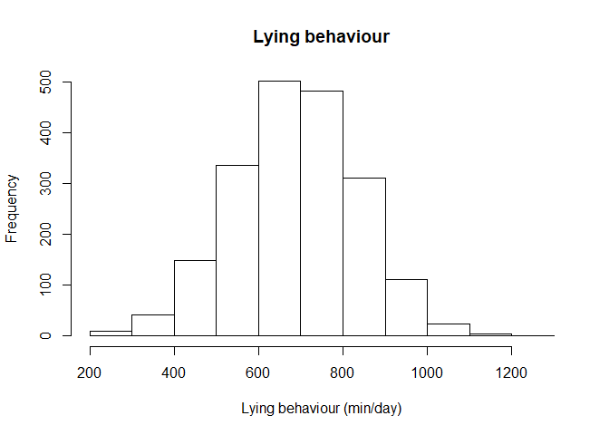
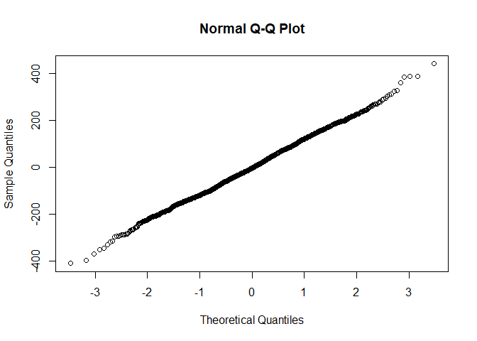
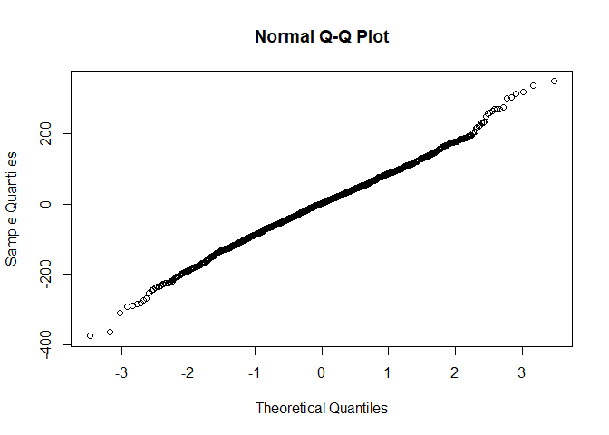
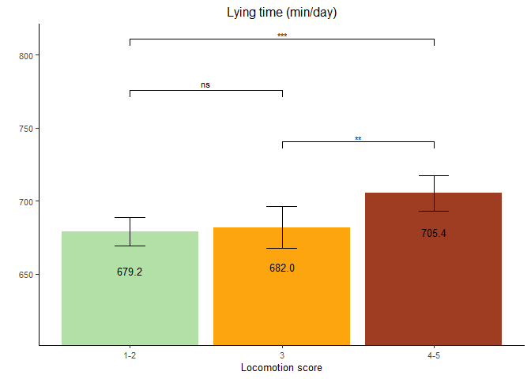

Lying Time
================

  - [Read the data](#read-the-data)
  - [Data preparation](#data-preparation)
  - [Model building](#model-building)
      - [Baseline model without any
        variable](#baseline-model-without-any-variable)
      - [Full model using the nested repeated measures
        GLMM](#full-model-using-the-nested-repeated-measures-glmm)
      - [Comparison of baseline and nested
        model](#comparison-of-baseline-and-nested-model)
      - [Full model](#full-model)
      - [Model fit 2-way interactions](#model-fit-2-way-interactions)
  - [Final model](#final-model)
      - [Model fit](#model-fit)
      - [Type 3 Analysis of Variance](#type-3-analysis-of-variance)
      - [Summary](#summary)
      - [Parameter estimate confidence
        intervals](#parameter-estimate-confidence-intervals)
      - [Least square means](#least-square-means)
  - [Interaction plots](#interaction-plots)
      - [Data preparation](#data-preparation-1)
      - [Plot](#plot)

# Read the data

  - Filter only the locomotion scores
  - Refactor the scores to only 3 classes (1-2 vs 3 vs 4-5)
  - Refactor the observation moments

<!-- end list -->

``` r
load("../Data/AllData.RData")
```

# Data preparation

``` r
AnalysisData <- AllData %>% filter(
                                SensorType  %like% "lyingSummary" &
                                SensorValue < 10000 # Values < 100 very unlikely
    ) %>%
  dplyr::mutate(
                  CalvingTime = as.Date(CalvingTime,format = "%Y-%m-%dT%H:%M:%OSZ"),
                  CalvingSeason = case_when(
                    between(month(CalvingTime), 1, 3) ~ "Winter",
                    between(month(CalvingTime), 4, 6) ~ "Spring",
                    between(month(CalvingTime), 7, 9) ~ "Summer",
                    between(month(CalvingTime), 10, 12) ~ "Autumn")
                  ) %>% 
  dplyr::group_by(
    AnimalNumber,
    HerdIdentifier,
    ObservationMoment,
    LocomotionScore,
    ObservationPeriod,
    LactationNumber,
    Parity,
    CalvingSeason
    ) %>% 
  dplyr::summarise(
    SensorValue = mean(SensorValue,na.rm = TRUE),
    SensorValues = n()
    )  %>%  
  dplyr::filter(
    SensorValues == 4
  ) %>%  
  dplyr::arrange(AnimalNumber,HerdIdentifier) %>%
  dplyr::group_by(AnimalNumber, HerdIdentifier) %>%
  dplyr::mutate(LocomotionMoments = length(LocomotionScore)) %>%
  filter(LocomotionMoments == 4) %>%    #4 locomotionscores minimum
  drop_na()

AnalysisData %>% select("HerdIdentifier", "AnimalNumber", "LactationNumber") %>% n_distinct()
```

    ## [1] 507

``` r
hist(AnalysisData$SensorValue,
     main = "Lying behaviour",
     xlab = "Lying behaviour (min/day)")
```

<!-- -->

# Model building

## Baseline model without any variable

``` r
baselineLMM <- lmer(
                  SensorValue ~ 1 + (1| AnimalNumber), 
                  REML = F,
                  data = AnalysisData
                  )
qqnorm(residuals(baselineLMM, type = 'pearson'))
```

<!-- -->

## Full model using the nested repeated measures GLMM

``` r
LMM <- lmer(
                  SensorValue ~ 
                    LocomotionScore + ObservationPeriod + ObservationMoment + CalvingSeason +
                    ObservationPeriod:ObservationMoment +
                    ObservationPeriod:LocomotionScore +
                    ObservationMoment:LocomotionScore + 
                    ObservationPeriod:LocomotionScore:ObservationMoment + 
                    HerdIdentifier + 
                    Parity +  (1 | AnimalNumber),
                  REML = FALSE,
                  data = AnalysisData
                  )
qqnorm(residuals(LMM))
```

<!-- -->

## Comparison of baseline and nested model

``` r
anova(LMM,baselineLMM, test="Chisq")
```

    ## Data: AnalysisData
    ## Models:
    ## baselineLMM: SensorValue ~ 1 + (1 | AnimalNumber)
    ## LMM: SensorValue ~ LocomotionScore + ObservationPeriod + ObservationMoment + 
    ## LMM:     CalvingSeason + ObservationPeriod:ObservationMoment + ObservationPeriod:LocomotionScore + 
    ## LMM:     ObservationMoment:LocomotionScore + ObservationPeriod:LocomotionScore:ObservationMoment + 
    ## LMM:     HerdIdentifier + Parity + (1 | AnimalNumber)
    ##             Df   AIC   BIC logLik deviance Chisq Chi Df Pr(>Chisq)    
    ## baselineLMM  3 25095 25112 -12544    25089                            
    ## LMM         26 24309 24454 -12128    24257 832.3     23  < 2.2e-16 ***
    ## ---
    ## Signif. codes:  0 '***' 0.001 '**' 0.01 '*' 0.05 '.' 0.1 ' ' 1

## Full model

``` r
LMMdrop <- drop1(LMM, test="Chisq")
if("Pr(>F)" %in% colnames(LMMdrop))
{
  Pvalues <- LMMdrop$`Pr(>F)`
} else 
{
  Pvalues <- LMMdrop$`Pr(Chi)`
}
LMMdrop
```

    ## Single term deletions
    ## 
    ## Model:
    ## SensorValue ~ LocomotionScore + ObservationPeriod + ObservationMoment + 
    ##     CalvingSeason + ObservationPeriod:ObservationMoment + ObservationPeriod:LocomotionScore + 
    ##     ObservationMoment:LocomotionScore + ObservationPeriod:LocomotionScore:ObservationMoment + 
    ##     HerdIdentifier + Parity + (1 | AnimalNumber)
    ##                                                     Df   AIC     LRT   Pr(Chi)    
    ## <none>                                                 24309                      
    ## CalvingSeason                                        3 24316  12.924  0.004803 ** 
    ## HerdIdentifier                                       7 24404 109.300 < 2.2e-16 ***
    ## Parity                                               2 24317  12.556  0.001877 ** 
    ## LocomotionScore:ObservationPeriod:ObservationMoment  2 24306   0.794  0.672177    
    ## ---
    ## Signif. codes:  0 '***' 0.001 '**' 0.01 '*' 0.05 '.' 0.1 ' ' 1

## Model fit 2-way interactions

``` r
LMMReduced = update(LMM, . ~ . - LocomotionScore:ObservationPeriod:ObservationMoment)
drop1(LMMReduced, test="Chisq")
```

    ## Single term deletions
    ## 
    ## Model:
    ## SensorValue ~ LocomotionScore + ObservationPeriod + ObservationMoment + 
    ##     CalvingSeason + HerdIdentifier + Parity + (1 | AnimalNumber) + 
    ##     ObservationPeriod:ObservationMoment + LocomotionScore:ObservationPeriod + 
    ##     LocomotionScore:ObservationMoment
    ##                                     Df   AIC     LRT   Pr(Chi)    
    ## <none>                                 24306                      
    ## CalvingSeason                        3 24312  12.836  0.005005 ** 
    ## HerdIdentifier                       7 24401 109.105 < 2.2e-16 ***
    ## Parity                               2 24314  12.589  0.001846 ** 
    ## ObservationPeriod:ObservationMoment  1 24305   1.208  0.271766    
    ## LocomotionScore:ObservationPeriod    2 24303   1.359  0.506780    
    ## LocomotionScore:ObservationMoment    2 24302   0.029  0.985746    
    ## ---
    ## Signif. codes:  0 '***' 0.001 '**' 0.01 '*' 0.05 '.' 0.1 ' ' 1

# Final model

## Model fit

``` r
LMMReduced = update(LMMReduced, . ~ . - LocomotionScore:ObservationMoment - ObservationPeriod:ObservationMoment - LocomotionScore:ObservationPeriod)
drop1(LMMReduced, test="Chisq")
```

    ## Single term deletions
    ## 
    ## Model:
    ## SensorValue ~ LocomotionScore + ObservationPeriod + ObservationMoment + 
    ##     CalvingSeason + HerdIdentifier + Parity + (1 | AnimalNumber)
    ##                   Df   AIC    LRT   Pr(Chi)    
    ## <none>               24298                     
    ## LocomotionScore    2 24311  16.64 0.0002433 ***
    ## ObservationPeriod  1 24996 699.86 < 2.2e-16 ***
    ## ObservationMoment  1 24303   6.68 0.0097252 ** 
    ## CalvingSeason      3 24304  12.40 0.0061329 ** 
    ## HerdIdentifier     7 24393 108.97 < 2.2e-16 ***
    ## Parity             2 24307  12.57 0.0018625 ** 
    ## ---
    ## Signif. codes:  0 '***' 0.001 '**' 0.01 '*' 0.05 '.' 0.1 ' ' 1

## Type 3 Analysis of Variance

``` r
anova(LMMReduced, ddf="Satterthwaite")
```

    ## Analysis of Variance Table
    ##                   Df  Sum Sq Mean Sq  F value
    ## LocomotionScore    2   58068   29034   2.9448
    ## ObservationPeriod  1 8784448 8784448 890.9859
    ## ObservationMoment  1   66004   66004   6.6946
    ## CalvingSeason      3  122110   40703   4.1284
    ## HerdIdentifier     7 1136738  162391  16.4710
    ## Parity             2  125105   62552   6.3445

## Summary

``` r
print(summary(LMMReduced, ddf="Satterthwaite"),correlation=FALSE)
```

    ## Warning in summary.merMod(LMMReduced, ddf = "Satterthwaite"): additional arguments ignored

    ## Linear mixed model fit by maximum likelihood  ['lmerMod']
    ## Formula: SensorValue ~ LocomotionScore + ObservationPeriod + ObservationMoment +  
    ##     CalvingSeason + HerdIdentifier + Parity + (1 | AnimalNumber)
    ##    Data: AnalysisData
    ## 
    ##      AIC      BIC   logLik deviance df.resid 
    ##  24298.0  24404.2 -12130.0  24260.0     1951 
    ## 
    ## Scaled residuals: 
    ##     Min      1Q  Median      3Q     Max 
    ## -3.7556 -0.5777  0.0169  0.5893  3.4738 
    ## 
    ## Random effects:
    ##  Groups       Name        Variance Std.Dev.
    ##  AnimalNumber (Intercept) 5107     71.47   
    ##  Residual                 9859     99.29   
    ## Number of obs: 1970, groups:  AnimalNumber, 493
    ## 
    ## Fixed effects:
    ##                              Estimate Std. Error t value
    ## (Intercept)                   714.932     17.578  40.671
    ## LocomotionScore3                2.864      7.215   0.397
    ## LocomotionScore4-5             26.240      6.590   3.982
    ## ObservationPeriodPost Partum -135.205      4.530 -29.844
    ## ObservationMomentSecond        11.599      4.481   2.588
    ## CalvingSeasonSpring            21.620     12.321   1.755
    ## CalvingSeasonSummer            -1.729     10.439  -0.166
    ## CalvingSeasonWinter            32.859     11.913   2.758
    ## HerdIdentifier544              55.306     17.560   3.150
    ## HerdIdentifier2011             48.261     16.677   2.894
    ## HerdIdentifier2297              5.790     17.882   0.324
    ## HerdIdentifier2514             26.151     17.809   1.468
    ## HerdIdentifier2746            -99.404     19.317  -5.146
    ## HerdIdentifier3314             36.851     20.239   1.821
    ## HerdIdentifier5888            -10.121     18.399  -0.550
    ## Parity3                        25.480     10.119   2.518
    ## Parity>3                      -10.438      9.334  -1.118

## Parameter estimate confidence intervals

``` r
confint(LMMReduced, parm="beta_")
```

    ## Computing profile confidence intervals ...

    ##                                    2.5 %      97.5 %
    ## (Intercept)                   680.435016  749.466645
    ## LocomotionScore3              -11.289813   17.029004
    ## LocomotionScore4-5             13.313957   39.164028
    ## ObservationPeriodPost Partum -144.090256 -126.320108
    ## ObservationMomentSecond         2.810163   20.388516
    ## CalvingSeasonSpring            -2.586990   45.796128
    ## CalvingSeasonSummer           -22.235056   18.760654
    ## CalvingSeasonWinter             9.444432   56.234135
    ## HerdIdentifier544              20.813155   89.782064
    ## HerdIdentifier2011             15.497737   80.999675
    ## HerdIdentifier2297            -29.336728   40.898225
    ## HerdIdentifier2514             -8.828667   61.115562
    ## HerdIdentifier2746           -137.352762  -61.483495
    ## HerdIdentifier3314             -2.910647   76.578293
    ## HerdIdentifier5888            -46.258635   26.004696
    ## Parity3                         5.619708   45.355046
    ## Parity>3                      -28.771846    7.884232

## Least square means

``` r
multcomp::cld(marginalHerds <- lsmeans::lsmeans(LMMReduced, ~ HerdIdentifier), alpha=0.05, Letters=letters, adjust="tukey")
```

    ##  HerdIdentifier lsmean    SE  df lower.CL upper.CL .group
    ##  2746              582 13.11 519      546      618  a    
    ##  5888              671 12.19 523      638      704   b   
    ##  3                 681 14.48 522      641      721   bc  
    ##  2297              687 11.19 519      656      717   bc  
    ##  2514              707 11.22 515      676      738   bcd 
    ##  3314              718 14.33 525      679      757   bcd 
    ##  2011              729  8.88 537      705      754    cd 
    ##  544               736 10.53 523      708      765     d 
    ## 
    ## Results are averaged over the levels of: LocomotionScore, ObservationPeriod, ObservationMoment, CalvingSeason, Parity 
    ## Degrees-of-freedom method: kenward-roger 
    ## Confidence level used: 0.95 
    ## Conf-level adjustment: sidak method for 8 estimates 
    ## P value adjustment: tukey method for comparing a family of 8 estimates 
    ## significance level used: alpha = 0.05

``` r
multcomp::cld(marginalParity <- lsmeans::lsmeans(LMMReduced, ~ Parity), alpha=0.05, Letters=letters, adjust="tukey") 
```

    ##  Parity lsmean   SE  df lower.CL upper.CL .group
    ##  >3        673 6.91 536      657      690  a    
    ##  2         684 6.91 607      667      700  a    
    ##  3         709 8.18 582      690      729   b   
    ## 
    ## Results are averaged over the levels of: LocomotionScore, ObservationPeriod, ObservationMoment, CalvingSeason, HerdIdentifier 
    ## Degrees-of-freedom method: kenward-roger 
    ## Confidence level used: 0.95 
    ## Conf-level adjustment: sidak method for 3 estimates 
    ## P value adjustment: tukey method for comparing a family of 3 estimates 
    ## significance level used: alpha = 0.05

``` r
multcomp::cld(marginalLocomotionScore <- lsmeans::lsmeans(LMMReduced, ~ LocomotionScore), alpha=0.05, Letters=letters, adjust="tukey")
```

    ##  LocomotionScore lsmean   SE   df lower.CL upper.CL .group
    ##  1-2                679 5.05  816      667      691  a    
    ##  3                  682 7.20 1717      665      699  a    
    ##  4-5                705 6.18 1290      691      720   b   
    ## 
    ## Results are averaged over the levels of: ObservationPeriod, ObservationMoment, CalvingSeason, HerdIdentifier, Parity 
    ## Degrees-of-freedom method: kenward-roger 
    ## Confidence level used: 0.95 
    ## Conf-level adjustment: sidak method for 3 estimates 
    ## P value adjustment: tukey method for comparing a family of 3 estimates 
    ## significance level used: alpha = 0.05

``` r
multcomp::cld(marginalObservationMoment <- lsmeans::lsmeans(LMMReduced, ~ ObservationMoment), alpha=0.05, Letters=letters, adjust="tukey")
```

    ##  ObservationMoment lsmean   SE  df lower.CL upper.CL .group
    ##  First                683 5.08 905      672      694  a    
    ##  Second               695 5.05 890      683      706   b   
    ## 
    ## Results are averaged over the levels of: LocomotionScore, ObservationPeriod, CalvingSeason, HerdIdentifier, Parity 
    ## Degrees-of-freedom method: kenward-roger 
    ## Confidence level used: 0.95 
    ## Conf-level adjustment: sidak method for 2 estimates 
    ## significance level used: alpha = 0.05

``` r
multcomp::cld(marginalInteraction <- lsmeans::lsmeans(LMMReduced, ~ ObservationPeriod), alpha=0.05, Letters=letters)
```

    ##  ObservationPeriod lsmean   SE  df lower.CL upper.CL .group
    ##  Post Partum          621 5.01 867      611      631  a    
    ##  Pre Partum           756 5.14 937      746      767   b   
    ## 
    ## Results are averaged over the levels of: LocomotionScore, ObservationMoment, CalvingSeason, HerdIdentifier, Parity 
    ## Degrees-of-freedom method: kenward-roger 
    ## Confidence level used: 0.95 
    ## significance level used: alpha = 0.05

``` r
multcomp::cld(marginalInteraction <- lsmeans::lsmeans(LMMReduced, ~ CalvingSeason), alpha=0.05, Letters=letters)
```

    ##  CalvingSeason lsmean   SE  df lower.CL upper.CL .group
    ##  Summer           674 7.16 540      660      688  a    
    ##  Autumn           676 8.30 553      659      692  a    
    ##  Spring           697 9.48 584      679      716  ab   
    ##  Winter           709 9.14 556      691      727   b   
    ## 
    ## Results are averaged over the levels of: LocomotionScore, ObservationPeriod, ObservationMoment, HerdIdentifier, Parity 
    ## Degrees-of-freedom method: kenward-roger 
    ## Confidence level used: 0.95 
    ## P value adjustment: tukey method for comparing a family of 4 estimates 
    ## significance level used: alpha = 0.05

# Interaction plots

## Data preparation

``` r
LSMs<-lsmeans::lsmeans(LMMReduced, pairwise ~ LocomotionScore, glhargs=list())
dfPValues <- summary(LSMs)[[2]]
dfLMSs <- summary(LSMs)[[1]]
dfResults <- cbind(dfLMSs[,!(names(dfLMSs) %in% c("df", "ObservationPeriod", "SE"))], dfPValues)
dfPValuesSplit <- dfResults %>% 
                    tidyr::separate(contrast, c("group1", "group2"), " - ", remove=FALSE) %>%
                    dplyr::arrange(-lsmean) %>%
                    dplyr::mutate(
                                  p.value = round(p.value, 2),
                                  p.value.2 = cut(p.value, 
                                        breaks = c(-Inf,0.001,0.01,0.05,0.1,Inf),
                                        labels = c("***","**","*","†","ns")),
                                  y.position.2 = cummax(lsmean),
                                  y.position.3 = case_when(contrast == "1-2 - 4-5" ~ y.position.2*1.15, 
                                                           contrast == "1-2 - 3" ~ y.position.2*1.1,
                                                           TRUE ~ y.position.2*1.05)
                    )
```

## Plot

``` r
ggplot(
  data=dfPValuesSplit, 
  aes(
    x=LocomotionScore, 
    y=lsmean,
    fill=LocomotionScore)) + 
  geom_bar(
    stat="identity"
    ) + 
  coord_cartesian(ylim = c(min(dfPValuesSplit$lsmean)*0.9, 
                           max(dfPValuesSplit$lsmean)*1.15),
                  expand = TRUE) +
  scale_fill_manual(
    values=c("#b3e0a6","#fda50f", "#9e3d22")
    ) +
  geom_text(
    aes(
      label=sprintf("%0.1f", round(lsmean, digits = 1))
      ),
    vjust=5, 
    size=3.5
    )+
  geom_errorbar(
    aes(
      ymin=lower.CL, 
      ymax=upper.CL), 
    width=.2,
    position=position_dodge(.9)
    ) +
  labs(
    title = "Lying time (min/day)", 
    x= "Locomotion score", 
    y=""
    )  + 
  theme_classic() + 
  theme(text=element_text(size=10)) +
  theme(plot.title = element_text(hjust = 0.5)) + 
  stat_pvalue_manual(comparisons = list( c("1-2", "3"), c("3", "4-5"), c("1-2", "4-5")),
                     label.size = 3,
                     data = dfPValuesSplit,
                     y.position =  "y.position.3",
                     label = "p.value.2") + 
  theme(legend.position = "none")
```

<!-- -->
