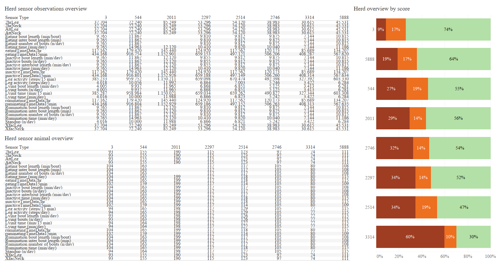
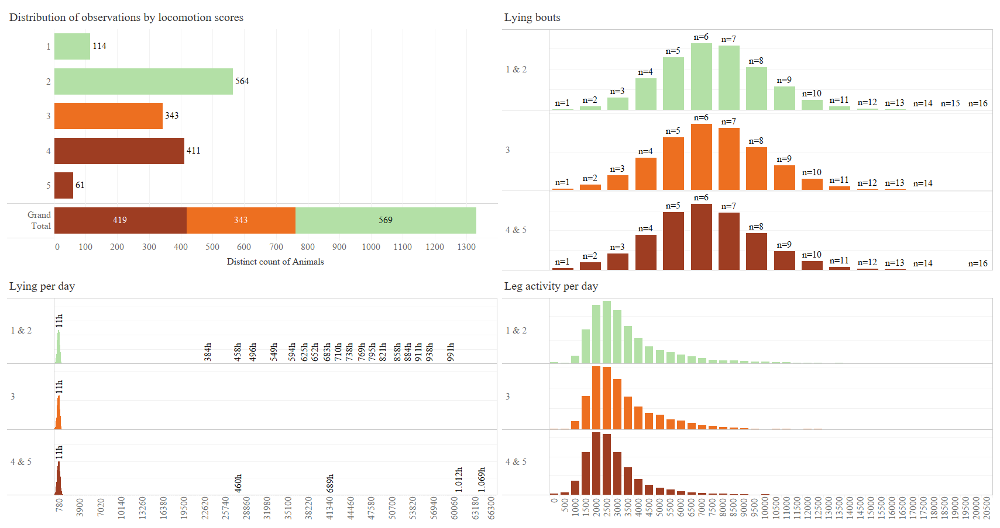
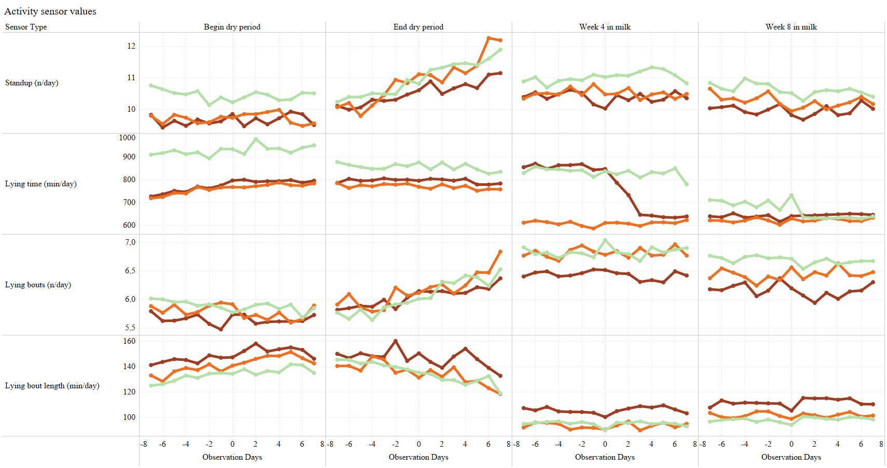
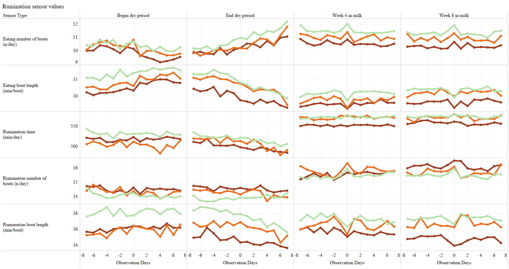
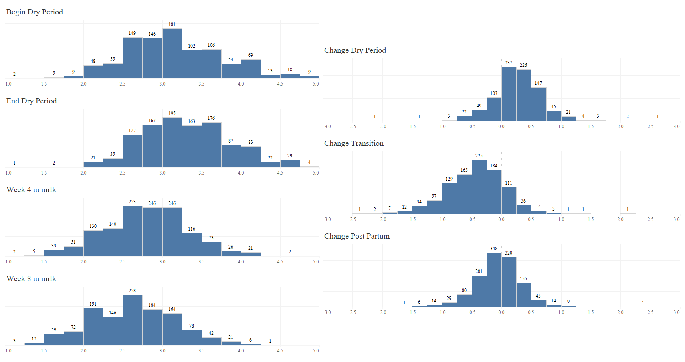

[](https://github.com/Bovi-analytics/Hut-et-al-2020)

# Getting the data from the bovi-analytics blob storage 

You will need to get access key via Miel Hostens (m.m.hostens@uu.nl)

```{r eval=FALSE, message=F, warning=F, ,echo=T, include=FALSE, results='hide'}
if (!require("AzureStor")) {
  install.packages("AzureStor", dependencies = TRUE)
  library(AzureStor)
}
if (!require("rstudioapi")) {
  install.packages("rstudioapi", dependencies = TRUE)
  library(rstudioapi)
}
AccesKey <- rstudioapi::askForPassword("Enter your access key")

BlobEndpointKey <- storage_endpoint("https://dceuw.blob.core.windows.net", key=AccesKey)

Container <- storage_container(BlobEndpointKey, "gpluse-cluster-2")

storage_download(Container, 
                 "Projects/SenseOfSensors/CsvData/LocomotionAndSensorData24032019/part-00000-5dc92cbe-d676-44ce-8c55-e2ccbb814c98-c000.csv", 
                 "./LocomotionAndSensorData24032019.csv")

```

The data contains data from 8 farms using NEDAP sensors. An observation from the NEDAP sensores was collected together with locomotion scores from the animals.

* HerdIdentifier - Identifier for the herd
* Animalidentifier : Identifier for the animal (her eartag)
* AnimalNumber : Secondary identifier for the animal
* CalvingTime : Date of calving
* SensorDaysInMilk : Days in milk at sensor observation
* SensorDate : Date at sensor observation
* SensorType: Multiple sensor observations were obtained, the type identifies which ones are usefull
* SensorValue: Sensor value
* ObservationDate: Date at which the locomotion or bcs scores were observed
* ScoreDaysInMilk : Days in milk at which the locomotion or bcs scores were observed
* ScoreType : Locomotion or BCS score
* ScoreValue : Score value
* ObservationDays : Days from sensor to score observation moment

# Data exploration

The underlying images can be seen in the [](https://public.tableau.com/profile/bovianalytics#!/vizhome/Hutetal_2020/TransitionBodyConditionScore):

* Make sure to have the data downloaded on disk
* Make sure to have the data referenced correctly in the workbook

## Overview of all sensors and locomotion scores



## Overview of sensors value distributions



## Overview of activity sensors values



## Overview of eating sensors values



## Overview of BCS data and changes



# Models

## Activity

* [Link to model Standups](StandUps/StandUps.md)
* [Link to model Leg Activity](LegActivity/LegActivity.md)
* [Link to model Lying Time](LyingTime/LyingTime.md)
* [Link to model Lying Bouts](LyingBouts/LyingBouts.md)
* [Link to model Lying Bout Length](LyingBoutLength/LyingBoutLength.md)

## Eating behaviour

* [Link to model Eating Time](EatingTime/EatingTime.md)
* [Link to model Eating Bouts](EatingBouts/EatingBouts.md)
* [Link to model Eating Bout Length](EatingBoutLength/EatingBoutLength.md)

## Rumination behaviour

* [Link to model Rumination Time](RuminationTime/RuminationTime.md)
* [Link to model Rumination Bouts](RuminationBouts/RuminationBouts.md)
* [Link to model Rumination Bout Length](RuminationBoutLength/RuminationBoutLength.md)


## Association models BCS vs LocomotionScores

* [Link to model Week 4 locomotion](AssociationModels/AssociationLoco1-2Week4.md)
* [Link to model Week 8 locomotion](AssociationModels/AssociationLoco1-2Week8.md)

# Remarks and meeting notes 

## Meeting Mirjam Nielen 

* error bar -> CI DONE
* -1 tot +1 DONE
* referentie tijdstip naar 4w DONE
* lying bouts contains DataType DONE

## Meeting Mirjam, Jan, Miel & Peter (23-04-2019)

* Add fixed effect pre and post partum DONE
* heifers separate analysis --> parity 2, 3 and 4+ depending on group size DONE
* grouping loco scores: 1&2, 3, 4&5 DONE
* loco score 3 as reference, 1&2 as reference as well. check both for contrast (relevel) DONE
* QQ plot log link DONE
* partum x ls x moment DONE BUT UNABLE TO FIT
* types of behavior for analysis: eating time/day, rumination time/day, eating+rumination time per day, lying time per day, number of steps per day (legactivity)
* discussion: correlation between behavior of residuals in neck & leg sensor data output
* discussion: visualisation
* after definitive results: involve Klaas Frankena

## Meeting Jan
* Wald -> profile likelihood
* Force model to be fact1*fact2 -> fact1:fact2 + fact2 (this is factor one nested within factor 2)

## Meeting Mirjam, Jan, Miel, Peter & Klaas (27-05-2019)
* Short values of lyingboutlength can be the cutoff on 24h DONE
* cutoff to 1440 DONE
* Use log of lyingboutlength DONE
* LyingBout only -1 ??? - if no diff leave, if yes diff keep that model DONE (See [Lying Bouts folder](LyingBouts/)
* At model scale, a difference was detected ... is good way of writing the article
* When comparing models, keep ALL main effects in, when CONFINT then drop DONE

## Major update with NEW DATA
* Request lying bout and lying bout length

## Figure update
* Check LSM and Figure LSM output (DONE)
* Check CI instead of SE (DONE)
* Percentage calculations tableau

# Review 1

* Changed trend symbol in figure
* Increase from -1 and 1 to -2 and 2 window around scoring
* Added need for 4 sensorvalues per average
* Add dplyr for distinct numbers

# Review 2

* Added calving season