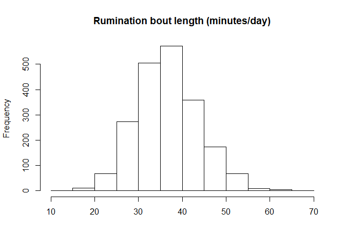
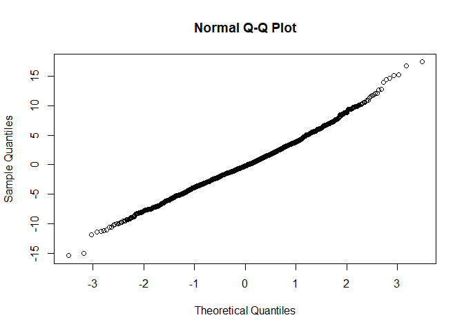
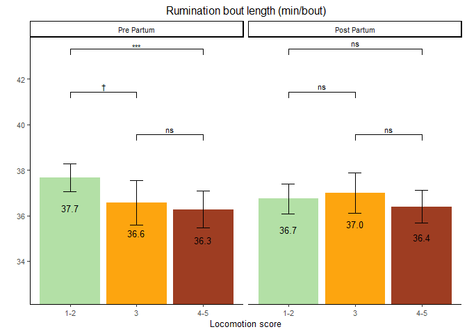

Rumination Bout Length
================

  - [Read the data](#read-the-data)
  - [Data preparation](#data-preparation)
  - [Model building](#model-building)
      - [Baseline model without any
        variable](#baseline-model-without-any-variable)
      - [Full model using the nested repeated measures
        GLMM](#full-model-using-the-nested-repeated-measures-glmm)
      - [Comparison of baseline and nested
        model](#comparison-of-baseline-and-nested-model)
      - [Full model](#full-model)
      - [Full model](#full-model-1)
      - [Model fit 2-way interactions](#model-fit-2-way-interactions)
  - [Final model](#final-model)
      - [Model fit](#model-fit)
      - [Type 3 Analysis of Variance](#type-3-analysis-of-variance)
      - [Summary](#summary)
      - [Parameter estimate confidence
        intervals](#parameter-estimate-confidence-intervals)
      - [Least square means](#least-square-means)
      - [Interaction term contrasts](#interaction-term-contrasts)
  - [Interaction plots](#interaction-plots)
      - [Data preparation](#data-preparation-1)
      - [Plot](#plot)

# Read the data

  - Filter only the locomotion scores
  - Refactor the scores to only 3 classes (1-2 vs 3 vs 4-5)
  - Refactor the observation moments

<!-- end list -->

``` r
load("../Data/AllData.RData")
```

# Data preparation

``` r
AnalysisData <- AllData %>% filter(
                                SensorType %like% "ruminatingBoutsTimeDataDay_avgBoutLength" & 
                                SensorValue < 100   #Has been added because of outliers
    ) %>%
   plyr::mutate(
                  CalvingTime = as.Date(CalvingTime,format = "%Y-%m-%dT%H:%M:%OSZ"),
                  CalvingSeason = case_when(
                    between(month(CalvingTime), 1, 3) ~ "Winter",
                    between(month(CalvingTime), 4, 6) ~ "Spring",
                    between(month(CalvingTime), 7, 9) ~ "Summer",
                    between(month(CalvingTime), 10, 12) ~ "Autumn")
                  ) %>% 
  dplyr::group_by(
    AnimalNumber,
    HerdIdentifier,
    ObservationMoment,
    LocomotionScore,
    ObservationPeriod,
    LactationNumber,
    Parity,
    CalvingSeason
    ) %>% 
  dplyr::summarise(
    SensorValue = mean(SensorValue,na.rm = TRUE),
    SensorValues = n()
    )  %>%  
  dplyr::filter(
    SensorValues == 4
  ) %>%   
  dplyr::arrange(AnimalNumber,HerdIdentifier) %>%
  dplyr::group_by(AnimalNumber, HerdIdentifier) %>%
  dplyr::mutate(LocomotionMoments = length(LocomotionScore)) %>%
  filter(LocomotionMoments == 4) %>%    #4 locomotionscores minimum
  drop_na()

AnalysisData %>% select("HerdIdentifier", "AnimalNumber", "LactationNumber") %>% n_distinct()
```

    ## [1] 526

``` r
hist(AnalysisData$SensorValue,
     main = "Rumination bout length (minutes/day)",
     xlab = "")
```

<!-- -->

# Model building

## Baseline model without any variable

``` r
baselineLMM <- lmer(
                  SensorValue ~ 1 + (1| AnimalNumber), 
                  data = AnalysisData
                  )
qqnorm(residuals(baselineLMM))
```

<!-- -->

## Full model using the nested repeated measures GLMM

``` r
LMM <- lmer(
                  SensorValue ~ 
                    LocomotionScore + ObservationPeriod + ObservationMoment + CalvingSeason +
                    ObservationPeriod:ObservationMoment +
                    ObservationPeriod:LocomotionScore +
                    ObservationMoment:LocomotionScore + 
                    ObservationPeriod:LocomotionScore:ObservationMoment + 
                    HerdIdentifier + 
                    Parity +  (1 | AnimalNumber),
                  REML = FALSE,
                  data = AnalysisData
                  )
qqnorm(residuals(LMM))
```

<!-- -->

## Comparison of baseline and nested model

``` r
anova(LMM,baselineLMM, test="Chisq")
```

    ## refitting model(s) with ML (instead of REML)

    ## Data: AnalysisData
    ## Models:
    ## baselineLMM: SensorValue ~ 1 + (1 | AnimalNumber)
    ## LMM: SensorValue ~ LocomotionScore + ObservationPeriod + ObservationMoment + 
    ## LMM:     CalvingSeason + ObservationPeriod:ObservationMoment + ObservationPeriod:LocomotionScore + 
    ## LMM:     ObservationMoment:LocomotionScore + ObservationPeriod:LocomotionScore:ObservationMoment + 
    ## LMM:     HerdIdentifier + Parity + (1 | AnimalNumber)
    ##             Df   AIC   BIC  logLik deviance  Chisq Chi Df Pr(>Chisq)    
    ## baselineLMM  3 13031 13048 -6512.6    13025                             
    ## LMM         26 12962 13108 -6454.8    12910 115.53     23  2.631e-14 ***
    ## ---
    ## Signif. codes:  0 '***' 0.001 '**' 0.01 '*' 0.05 '.' 0.1 ' ' 1

## Full model

``` r
LMMdrop <- drop1(LMM, test="Chisq")
if("Pr(>F)" %in% colnames(LMMdrop))
{
  Pvalues <- LMMdrop$`Pr(>F)`
} else 
{
  Pvalues <- LMMdrop$`Pr(Chi)`
}
LMMdrop
```

    ## Single term deletions using Satterthwaite's method:
    ## 
    ## Model:
    ## SensorValue ~ LocomotionScore + ObservationPeriod + ObservationMoment + 
    ##     CalvingSeason + ObservationPeriod:ObservationMoment + ObservationPeriod:LocomotionScore + 
    ##     ObservationMoment:LocomotionScore + ObservationPeriod:LocomotionScore:ObservationMoment + 
    ##     HerdIdentifier + Parity + (1 | AnimalNumber)
    ##                                                      Sum Sq Mean Sq NumDF   DenDF F value    Pr(>F)    
    ## CalvingSeason                                        351.22 117.073     3  557.55  5.5095 0.0009828 ***
    ## HerdIdentifier                                      1301.22 185.888     7  512.19  8.7480 3.574e-10 ***
    ## Parity                                               201.81 100.904     2  591.04  4.7486 0.0089968 ** 
    ## LocomotionScore:ObservationPeriod:ObservationMoment   14.45   7.225     2 1653.21  0.3400 0.7118173    
    ## ---
    ## Signif. codes:  0 '***' 0.001 '**' 0.01 '*' 0.05 '.' 0.1 ' ' 1

## Full model

``` r
LMMReduced = update(LMM, . ~ . - LocomotionScore:ObservationPeriod:ObservationMoment)
drop1(LMMReduced, test="Chisq")
```

    ## Single term deletions using Satterthwaite's method:
    ## 
    ## Model:
    ## SensorValue ~ LocomotionScore + ObservationPeriod + ObservationMoment + 
    ##     CalvingSeason + HerdIdentifier + Parity + (1 | AnimalNumber) + 
    ##     ObservationPeriod:ObservationMoment + LocomotionScore:ObservationPeriod + 
    ##     LocomotionScore:ObservationMoment
    ##                                      Sum Sq Mean Sq NumDF   DenDF F value    Pr(>F)    
    ## CalvingSeason                        353.17 117.723     3  557.46  5.5369 0.0009465 ***
    ## HerdIdentifier                      1301.67 185.953     7  512.13  8.7460 3.596e-10 ***
    ## Parity                               201.55 100.776     2  591.10  4.7398 0.0090749 ** 
    ## ObservationPeriod:ObservationMoment   18.39  18.388     1 1533.46  0.8649 0.3525311    
    ## LocomotionScore:ObservationPeriod    130.85  65.426     2 1674.39  3.0772 0.0463490 *  
    ## LocomotionScore:ObservationMoment     10.77   5.384     2 1648.08  0.2532 0.7763108    
    ## ---
    ## Signif. codes:  0 '***' 0.001 '**' 0.01 '*' 0.05 '.' 0.1 ' ' 1

## Model fit 2-way interactions

``` r
LMMReduced = update(LMMReduced, . ~ . - ObservationPeriod:ObservationMoment - LocomotionScore:ObservationMoment) 
drop1(LMMReduced, test="Chisq")
```

    ## Single term deletions using Satterthwaite's method:
    ## 
    ## Model:
    ## SensorValue ~ LocomotionScore + ObservationPeriod + ObservationMoment + 
    ##     CalvingSeason + HerdIdentifier + Parity + (1 | AnimalNumber) + 
    ##     LocomotionScore:ObservationPeriod
    ##                                    Sum Sq Mean Sq NumDF   DenDF F value    Pr(>F)    
    ## ObservationMoment                  140.24 140.242     1 1531.21  6.5911 0.0103432 *  
    ## CalvingSeason                      357.75 119.250     3  557.21  5.6045 0.0008623 ***
    ## HerdIdentifier                    1302.88 186.126     7  512.08  8.7476  3.58e-10 ***
    ## Parity                             200.23 100.114     2  590.89  4.7052 0.0093903 ** 
    ## LocomotionScore:ObservationPeriod  137.17  68.584     2 1673.99  3.2233 0.0400706 *  
    ## ---
    ## Signif. codes:  0 '***' 0.001 '**' 0.01 '*' 0.05 '.' 0.1 ' ' 1

# Final model

## Model fit

``` r
drop1(LMMReduced, test="Chisq")
```

    ## Single term deletions using Satterthwaite's method:
    ## 
    ## Model:
    ## SensorValue ~ LocomotionScore + ObservationPeriod + ObservationMoment + 
    ##     CalvingSeason + HerdIdentifier + Parity + (1 | AnimalNumber) + 
    ##     LocomotionScore:ObservationPeriod
    ##                                    Sum Sq Mean Sq NumDF   DenDF F value    Pr(>F)    
    ## ObservationMoment                  140.24 140.242     1 1531.21  6.5911 0.0103432 *  
    ## CalvingSeason                      357.75 119.250     3  557.21  5.6045 0.0008623 ***
    ## HerdIdentifier                    1302.88 186.126     7  512.08  8.7476  3.58e-10 ***
    ## Parity                             200.23 100.114     2  590.89  4.7052 0.0093903 ** 
    ## LocomotionScore:ObservationPeriod  137.17  68.584     2 1673.99  3.2233 0.0400706 *  
    ## ---
    ## Signif. codes:  0 '***' 0.001 '**' 0.01 '*' 0.05 '.' 0.1 ' ' 1

## Type 3 Analysis of Variance

``` r
anova(LMMReduced, ddf="Satterthwaite")
```

    ## Type III Analysis of Variance Table with Satterthwaite's method
    ##                                    Sum Sq Mean Sq NumDF   DenDF F value    Pr(>F)    
    ## LocomotionScore                    169.27  84.635     2 1791.69  3.9777 0.0188942 *  
    ## ObservationPeriod                    6.15   6.149     1 1581.35  0.2890 0.5909483    
    ## ObservationMoment                  140.24 140.242     1 1531.21  6.5911 0.0103432 *  
    ## CalvingSeason                      357.75 119.250     3  557.21  5.6045 0.0008623 ***
    ## HerdIdentifier                    1302.88 186.126     7  512.08  8.7476  3.58e-10 ***
    ## Parity                             200.23 100.114     2  590.89  4.7052 0.0093903 ** 
    ## LocomotionScore:ObservationPeriod  137.17  68.584     2 1673.99  3.2233 0.0400706 *  
    ## ---
    ## Signif. codes:  0 '***' 0.001 '**' 0.01 '*' 0.05 '.' 0.1 ' ' 1

## Summary

``` r
print(summary(LMMReduced, ddf="Satterthwaite"),correlation=FALSE)
```

    ## Linear mixed model fit by maximum likelihood . t-tests use Satterthwaite's method ['lmerModLmerTest']
    ## Formula: SensorValue ~ LocomotionScore + ObservationPeriod + ObservationMoment +  
    ##     CalvingSeason + HerdIdentifier + Parity + (1 | AnimalNumber) +      LocomotionScore:ObservationPeriod
    ##    Data: AnalysisData
    ## 
    ##      AIC      BIC   logLik deviance df.resid 
    ##  12953.5  13071.5  -6455.7  12911.5     2022 
    ## 
    ## Scaled residuals: 
    ##     Min      1Q  Median      3Q     Max 
    ## -3.3152 -0.5704 -0.0540  0.5547  3.7927 
    ## 
    ## Random effects:
    ##  Groups       Name        Variance Std.Dev.
    ##  AnimalNumber (Intercept) 23.71    4.869   
    ##  Residual                 21.28    4.613   
    ## Number of obs: 2043, groups:  AnimalNumber, 511
    ## 
    ## Fixed effects:
    ##                                                  Estimate Std. Error        df t value Pr(>|t|)    
    ## (Intercept)                                       37.3279     1.0045  565.7913  37.159  < 2e-16 ***
    ## LocomotionScore3                                  -1.0954     0.4891 1715.7913  -2.240 0.025248 *  
    ## LocomotionScore4-5                                -1.4071     0.4227 1780.9630  -3.329 0.000891 ***
    ## ObservationPeriodPost Partum                      -0.9257     0.2976 1604.0602  -3.111 0.001899 ** 
    ## ObservationMomentSecond                           -0.5256     0.2047 1531.2075  -2.567 0.010343 *  
    ## CalvingSeasonSpring                                0.9134     0.7606  577.7226   1.201 0.230306    
    ## CalvingSeasonSummer                               -0.8155     0.6137  535.7040  -1.329 0.184479    
    ## CalvingSeasonWinter                                1.8783     0.7213  576.0561   2.604 0.009451 ** 
    ## HerdIdentifier544                                  3.7620     1.0276  511.8228   3.661 0.000278 ***
    ## HerdIdentifier2011                                 1.2350     0.9673  512.6073   1.277 0.202239    
    ## HerdIdentifier2297                                 0.7035     1.0394  511.1711   0.677 0.498812    
    ## HerdIdentifier2514                                -0.2071     1.1300  515.2700  -0.183 0.854676    
    ## HerdIdentifier2746                                 1.1509     1.0893  512.5358   1.056 0.291239    
    ## HerdIdentifier3314                                -2.1225     1.0998  520.4670  -1.930 0.054156 .  
    ## HerdIdentifier5888                                 4.3937     1.0916  510.2183   4.025 6.56e-05 ***
    ## Parity3                                           -1.6267     0.5878  631.6533  -2.767 0.005815 ** 
    ## Parity>3                                          -1.3806     0.5654  564.0621  -2.442 0.014924 *  
    ## LocomotionScore3:ObservationPeriodPost Partum      1.3389     0.6582 1695.7707   2.034 0.042096 *  
    ## LocomotionScore4-5:ObservationPeriodPost Partum    1.0523     0.5156 1648.2520   2.041 0.041440 *  
    ## ---
    ## Signif. codes:  0 '***' 0.001 '**' 0.01 '*' 0.05 '.' 0.1 ' ' 1

## Parameter estimate confidence intervals

``` r
confint(LMMReduced, parm="beta_")
```

    ## Computing profile confidence intervals ...

    ##                                                       2.5 %      97.5 %
    ## (Intercept)                                     35.35786085 39.30454057
    ## LocomotionScore3                                -2.05525961 -0.13619703
    ## LocomotionScore4-5                              -2.23700568 -0.57794926
    ## ObservationPeriodPost Partum                    -1.50932256 -0.34201837
    ## ObservationMomentSecond                         -0.92703834 -0.12404364
    ## CalvingSeasonSpring                             -0.58500418  2.40483217
    ## CalvingSeasonSummer                             -2.02194167  0.38848034
    ## CalvingSeasonWinter                              0.45977180  3.29295162
    ## HerdIdentifier544                                1.74295948  5.77894945
    ## HerdIdentifier2011                              -0.66585978  3.13322168
    ## HerdIdentifier2297                              -1.33841790  2.74370006
    ## HerdIdentifier2514                              -2.42793058  2.01024134
    ## HerdIdentifier2746                              -0.99001400  3.28846551
    ## HerdIdentifier3314                              -4.28406760  0.03542685
    ## HerdIdentifier5888                               2.24907448  6.53613539
    ## Parity3                                         -2.78290969 -0.47400139
    ## Parity>3                                        -2.49334995 -0.27175845
    ## LocomotionScore3:ObservationPeriodPost Partum    0.04818777  2.63001240
    ## LocomotionScore4-5:ObservationPeriodPost Partum  0.04090382  2.06343125

## Least square means

``` r
multcomp::cld(marginalHerds <- lsmeans::lsmeans(LMMReduced, ~ HerdIdentifier), alpha=0.05, Letters=letters, adjust="tukey")
```

    ##  HerdIdentifier lsmean    SE  df lower.CL upper.CL .group
    ##  3314             33.5 0.744 537     31.5     35.6  a    
    ##  2514             35.5 0.807 530     33.2     37.7  ab   
    ##  3                35.7 0.811 540     33.4     37.9  ab   
    ##  2297             36.4 0.691 535     34.5     38.3  ab   
    ##  2746             36.8 0.733 541     34.8     38.8   bc  
    ##  2011             36.9 0.544 545     35.4     38.4   bc  
    ##  544              39.4 0.649 534     37.6     41.2    cd 
    ##  5888             40.1 0.773 536     37.9     42.2     d 
    ## 
    ## Results are averaged over the levels of: LocomotionScore, ObservationPeriod, ObservationMoment, CalvingSeason, Parity 
    ## Degrees-of-freedom method: kenward-roger 
    ## Confidence level used: 0.95 
    ## Conf-level adjustment: sidak method for 8 estimates 
    ## P value adjustment: tukey method for comparing a family of 8 estimates 
    ## significance level used: alpha = 0.05

``` r
multcomp::cld(marginalParity <- lsmeans::lsmeans(LMMReduced, ~ Parity), alpha=0.05, Letters=letters, adjust="tukey") 
```

    ##  Parity lsmean    SE  df lower.CL upper.CL .group
    ##  3        36.1 0.469 629     35.0     37.3  a    
    ##  >3       36.4 0.424 555     35.4     37.4  a    
    ##  2        37.8 0.411 624     36.8     38.8   b   
    ## 
    ## Results are averaged over the levels of: LocomotionScore, ObservationPeriod, ObservationMoment, CalvingSeason, HerdIdentifier 
    ## Degrees-of-freedom method: kenward-roger 
    ## Confidence level used: 0.95 
    ## Conf-level adjustment: sidak method for 3 estimates 
    ## P value adjustment: tukey method for comparing a family of 3 estimates 
    ## significance level used: alpha = 0.05

``` r
multcomp::cld(marginalLocomotionScore <- lsmeans::lsmeans(LMMReduced, ~ LocomotionScore), alpha=0.05, Letters=letters, adjust="tukey")
```

    ##  LocomotionScore lsmean    SE   df lower.CL upper.CL .group
    ##  4-5               36.3 0.335 1146     35.5     37.1  a    
    ##  3                 36.8 0.378 1544     35.9     37.7  ab   
    ##  1-2               37.2 0.290  752     36.5     37.9   b   
    ## 
    ## Results are averaged over the levels of: ObservationPeriod, ObservationMoment, CalvingSeason, HerdIdentifier, Parity 
    ## Degrees-of-freedom method: kenward-roger 
    ## Confidence level used: 0.95 
    ## Conf-level adjustment: sidak method for 3 estimates 
    ## P value adjustment: tukey method for comparing a family of 3 estimates 
    ## significance level used: alpha = 0.05

``` r
multcomp::cld(marginalObservationMoment <- lsmeans::lsmeans(LMMReduced, ~ ObservationMoment), alpha=0.05, Letters=letters, adjust="tukey")
```

    ##  ObservationMoment lsmean    SE  df lower.CL upper.CL .group
    ##  Second              36.5 0.288 762     35.9     37.2  a    
    ##  First               37.0 0.289 772     36.4     37.7   b   
    ## 
    ## Results are averaged over the levels of: LocomotionScore, ObservationPeriod, CalvingSeason, HerdIdentifier, Parity 
    ## Degrees-of-freedom method: kenward-roger 
    ## Confidence level used: 0.95 
    ## Conf-level adjustment: sidak method for 2 estimates 
    ## significance level used: alpha = 0.05

``` r
multcomp::cld(marginalObservationMoment <- lsmeans::lsmeans(LMMReduced, ~ CalvingSeason), alpha=0.05, Letters=letters, adjust="tukey")
```

    ##  CalvingSeason lsmean    SE  df lower.CL upper.CL .group
    ##  Summer          35.5 0.416 554     34.4     36.5  a    
    ##  Autumn          36.3 0.488 571     35.1     37.5  ab   
    ##  Spring          37.2 0.592 602     35.7     38.7  ab   
    ##  Winter          38.2 0.565 593     36.7     39.6   b   
    ## 
    ## Results are averaged over the levels of: LocomotionScore, ObservationPeriod, ObservationMoment, HerdIdentifier, Parity 
    ## Degrees-of-freedom method: kenward-roger 
    ## Confidence level used: 0.95 
    ## Conf-level adjustment: sidak method for 4 estimates 
    ## P value adjustment: tukey method for comparing a family of 4 estimates 
    ## significance level used: alpha = 0.05

``` r
multcomp::cld(marginalInteraction <- lsmeans::lsmeans(LMMReduced, ~ LocomotionScore|ObservationPeriod), alpha=0.05, Letters=letters, adjust="tukey")
```

    ## ObservationPeriod = Pre Partum:
    ##  LocomotionScore lsmean    SE   df lower.CL upper.CL .group
    ##  4-5               36.3 0.413 1746     35.3     37.3  a    
    ##  3                 36.6 0.495 2026     35.4     37.8  ab   
    ##  1-2               37.7 0.316 1015     36.9     38.4   b   
    ## 
    ## ObservationPeriod = Post Partum:
    ##  LocomotionScore lsmean    SE   df lower.CL upper.CL .group
    ##  4-5               36.4 0.368 1472     35.5     37.3  a    
    ##  1-2               36.7 0.337 1195     35.9     37.6  a    
    ##  3                 37.0 0.450 1922     35.9     38.1  a    
    ## 
    ## Results are averaged over the levels of: ObservationMoment, CalvingSeason, HerdIdentifier, Parity 
    ## Degrees-of-freedom method: kenward-roger 
    ## Confidence level used: 0.95 
    ## Conf-level adjustment: sidak method for 3 estimates 
    ## P value adjustment: tukey method for comparing a family of 3 estimates 
    ## significance level used: alpha = 0.05

## Interaction term contrasts

``` r
summary(multcomp::glht(LMMReduced,  lsm(pairwise ~ LocomotionScore|ObservationPeriod, adjust="tukey")))
```

    ## Note: df set to 1750

    ## $`ObservationPeriod = Pre Partum`
    ## 
    ##   Simultaneous Tests for General Linear Hypotheses
    ## 
    ## Fit: lmer(formula = SensorValue ~ LocomotionScore + ObservationPeriod + 
    ##     ObservationMoment + CalvingSeason + HerdIdentifier + Parity + 
    ##     (1 | AnimalNumber) + LocomotionScore:ObservationPeriod, data = AnalysisData, 
    ##     REML = FALSE)
    ## 
    ## Linear Hypotheses:
    ##                Estimate Std. Error t value Pr(>|t|)   
    ## 1-2 - 3 == 0     1.0954     0.4891   2.240  0.06369 . 
    ## 1-2 - 4-5 == 0   1.4071     0.4227   3.329  0.00254 **
    ## 3 - 4-5 == 0     0.3118     0.5576   0.559  0.83983   
    ## ---
    ## Signif. codes:  0 '***' 0.001 '**' 0.01 '*' 0.05 '.' 0.1 ' ' 1
    ## (Adjusted p values reported -- single-step method)
    ## 
    ## 
    ## $`ObservationPeriod = Post Partum`
    ## 
    ##   Simultaneous Tests for General Linear Hypotheses
    ## 
    ## Fit: lmer(formula = SensorValue ~ LocomotionScore + ObservationPeriod + 
    ##     ObservationMoment + CalvingSeason + HerdIdentifier + Parity + 
    ##     (1 | AnimalNumber) + LocomotionScore:ObservationPeriod, data = AnalysisData, 
    ##     REML = FALSE)
    ## 
    ## Linear Hypotheses:
    ##                Estimate Std. Error t value Pr(>|t|)
    ## 1-2 - 3 == 0    -0.2435     0.4602  -0.529    0.856
    ## 1-2 - 4-5 == 0   0.3548     0.3902   0.909    0.633
    ## 3 - 4-5 == 0     0.5984     0.4808   1.245    0.425
    ## (Adjusted p values reported -- single-step method)

# Interaction plots

## Data preparation

``` r
# Contrast data for plotting
LSMs<-lsmeans::lsmeans(LMMReduced, pairwise ~ LocomotionScore|ObservationPeriod, glhargs=list())
#print(LSMs)
dfPValues <- summary(LSMs)[[2]]
dfLMSs <- summary(LSMs)[[1]]
dfResults <- cbind(dfLMSs[,!(names(dfLMSs) %in% c("df", "ObservationPeriod", "SE"))], dfPValues)
dfPValuesSplit <- dfResults %>% 
                    tidyr::separate(contrast, c("group1", "group2"), " - ", remove=FALSE) %>%
                    dplyr::arrange(-lsmean) %>%
                    dplyr::mutate(
                                  p.value = round(p.value, 2),
                                  p.value.2 = cut(p.value, 
                                        breaks = c(-Inf,0.001,0.01,0.05,0.1,Inf),
                                        labels = c("***","**","*","†","ns")),
                                  y.position.2 = cummax(lsmean),
                                  y.position.3 = case_when(contrast == "1-2 - 4-5" ~ y.position.2*1.15, 
                                                           contrast == "1-2 - 3" ~ y.position.2*1.1,
                                                           TRUE ~ y.position.2*1.05)
                                  )
#Next lines do the same
#contrast <- multcomp::glht(LMMReducedTwoWay,  lsm(pairwise ~ LocomotionScore|ObservationPeriod, adjust="tukey"))
#summary(contrast)
```

## Plot

``` r
ggplot(
  data=transform(dfPValuesSplit, ObservationPeriod = factor(ObservationPeriod, levels= c("Pre Partum", "Post Partum"))), 
  aes(
    x=LocomotionScore, 
    y=lsmean,
    fill=LocomotionScore)) + 
  geom_bar(
    stat="identity"
    ) + 
  coord_cartesian(ylim = c(min(dfPValuesSplit$lsmean)*0.9, 
                           max(dfPValuesSplit$lsmean)*1.15),
                  expand = TRUE) +
  scale_fill_manual(
    values=c("#b3e0a6","#fda50f", "#9e3d22")
    ) +
  geom_text(
    aes(
      label=sprintf("%0.1f", round(lsmean, digits = 1))
      ),
    vjust=4.5, 
    size=3.5
    )+
  geom_errorbar(
    aes(
      ymin=lower.CL, 
      ymax=upper.CL), 
    width=.2,
    position=position_dodge(.9)
    ) +
  facet_wrap(~ObservationPeriod) + 
  labs(
    title = "Rumination bout length (min/bout)", 
    x= "Locomotion score", 
    y=""
    )  + 
  theme_classic() + 
  theme(text=element_text(size=10)) +
  theme(plot.title = element_text(hjust = 0.5)) + 
  stat_pvalue_manual(comparisons = list( c("1-2", "3"), c("3", "4-5"), c("1-2", "4-5")),
                     label.size = 3,
                     data = dfPValuesSplit,
                     y.position =  "y.position.3",
                     label = "p.value.2") + 
  theme(legend.position = "none")
```

<!-- -->
