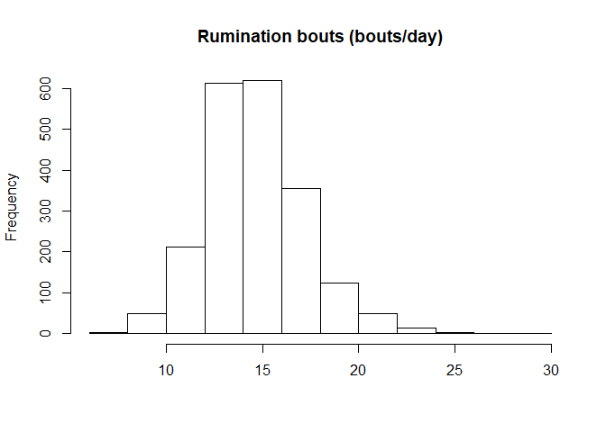
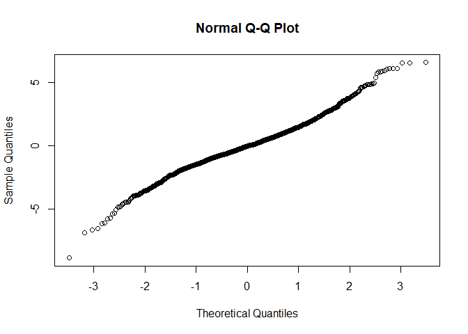
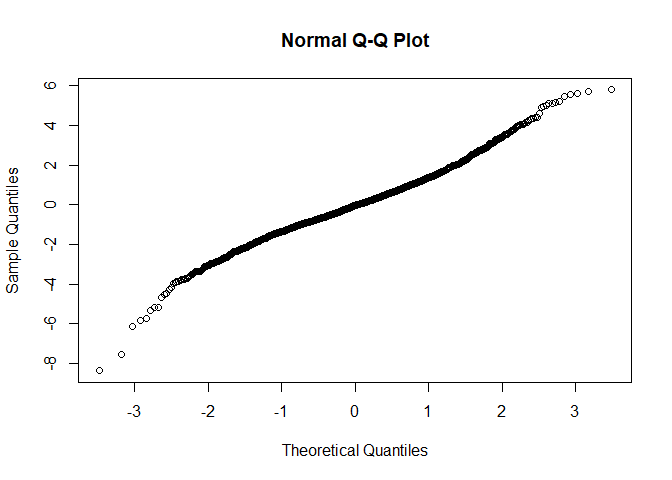

Rumination Bouts
================

  - [Read the data](#read-the-data)
  - [Data preparation](#data-preparation)
  - [Model building](#model-building)
      - [Baseline model without any
        variable](#baseline-model-without-any-variable)
      - [Full model using the nested repeated measures
        GLMM](#full-model-using-the-nested-repeated-measures-glmm)
      - [Comparison of baseline and nested
        model](#comparison-of-baseline-and-nested-model)
      - [Full model](#full-model)
      - [Model fit 3-way interactions](#model-fit-3-way-interactions)
  - [Final model fit](#final-model-fit)
      - [Type 3 Analysis of Variance](#type-3-analysis-of-variance)
      - [Summary](#summary)
      - [Parameter estimate confidence
        intervals](#parameter-estimate-confidence-intervals)
      - [Least square means](#least-square-means)
      - [Interaction term contrasts](#interaction-term-contrasts)

# Read the data

  - Filter only the locomotion scores
  - Refactor the scores to only 3 classes (1-2 vs 3 vs 4-5)
  - Refactor the observation moments

<!-- end list -->

``` r
load("../Data/AllData.RData")
```

# Data preparation

``` r
AnalysisData <- AllData %>% filter(
                                SensorType %like% "ruminatingBoutsTimeDataDay_numberOfBouts"
    ) %>%
   plyr::mutate(
                  CalvingTime = as.Date(CalvingTime,format = "%Y-%m-%dT%H:%M:%OSZ"),
                  CalvingSeason = case_when(
                    between(month(CalvingTime), 1, 3) ~ "Winter",
                    between(month(CalvingTime), 4, 6) ~ "Spring",
                    between(month(CalvingTime), 7, 9) ~ "Summer",
                    between(month(CalvingTime), 10, 12) ~ "Autumn")
                  ) %>% 
  dplyr::group_by(
    AnimalNumber,
    HerdIdentifier,
    ObservationMoment,
    LocomotionScore,
    ObservationPeriod,
    LactationNumber,
    Parity,
    CalvingSeason
    ) %>% 
  dplyr::summarise(
    SensorValue = mean(SensorValue,na.rm = TRUE),
    SensorValues = n()
    )  %>%  
  dplyr::filter(
    SensorValues == 4
  ) %>%  
  dplyr::arrange(AnimalNumber,HerdIdentifier) %>%
  dplyr::group_by(AnimalNumber, HerdIdentifier) %>%
  dplyr::mutate(LocomotionMoments = length(LocomotionScore)) %>%
  filter(LocomotionMoments == 4) %>%    #4 locomotionscores minimum
  drop_na()

AnalysisData %>% select("HerdIdentifier", "AnimalNumber", "LactationNumber") %>% n_distinct()
```

    ## [1] 526

``` r
hist(AnalysisData$SensorValue,
     main = "Rumination bouts (bouts/day)",
     xlab = "")
```

<!-- -->

# Model building

## Baseline model without any variable

``` r
baselineLMM <- lmer(
                  SensorValue ~ 1 + (1| AnimalNumber), 
                  REML = F,
                  data = AnalysisData
                  )
qqnorm(residuals(baselineLMM))
```

<!-- -->

## Full model using the nested repeated measures GLMM

``` r
LMM <- lmer(
                  SensorValue ~ 
                    LocomotionScore + ObservationPeriod + ObservationMoment + CalvingSeason + 
                    ObservationPeriod:ObservationMoment +
                    ObservationPeriod:LocomotionScore +
                    ObservationMoment:LocomotionScore + 
                    ObservationPeriod:LocomotionScore:ObservationMoment + 
                    HerdIdentifier + 
                    Parity +  (1 | AnimalNumber),
                  REML = FALSE,
                  data = AnalysisData
                  )
qqnorm(residuals(LMM))
```

<!-- -->

## Comparison of baseline and nested model

``` r
anova(LMM,baselineLMM, test="Chisq")
```

    ## Data: AnalysisData
    ## Models:
    ## baselineLMM: SensorValue ~ 1 + (1 | AnimalNumber)
    ## LMM: SensorValue ~ LocomotionScore + ObservationPeriod + ObservationMoment + 
    ## LMM:     CalvingSeason + ObservationPeriod:ObservationMoment + ObservationPeriod:LocomotionScore + 
    ## LMM:     ObservationMoment:LocomotionScore + ObservationPeriod:LocomotionScore:ObservationMoment + 
    ## LMM:     HerdIdentifier + Parity + (1 | AnimalNumber)
    ##             Df    AIC    BIC  logLik deviance  Chisq Chi Df Pr(>Chisq)    
    ## baselineLMM  3 9161.6 9178.5 -4577.8   9155.6                             
    ## LMM         26 8808.4 8954.6 -4378.2   8756.4 399.21     23  < 2.2e-16 ***
    ## ---
    ## Signif. codes:  0 '***' 0.001 '**' 0.01 '*' 0.05 '.' 0.1 ' ' 1

## Full model

``` r
LMMdrop <- drop1(LMM, test="Chisq")
if("Pr(>F)" %in% colnames(LMMdrop))
{
  Pvalues <- LMMdrop$`Pr(>F)`
} else 
{
  Pvalues <- LMMdrop$`Pr(Chi)`
}
LMMdrop
```

    ## Single term deletions using Satterthwaite's method:
    ## 
    ## Model:
    ## SensorValue ~ LocomotionScore + ObservationPeriod + ObservationMoment + 
    ##     CalvingSeason + ObservationPeriod:ObservationMoment + ObservationPeriod:LocomotionScore + 
    ##     ObservationMoment:LocomotionScore + ObservationPeriod:LocomotionScore:ObservationMoment + 
    ##     HerdIdentifier + Parity + (1 | AnimalNumber)
    ##                                                      Sum Sq Mean Sq NumDF   DenDF F value    Pr(>F)    
    ## CalvingSeason                                        18.740  6.2468     3  554.05   2.132   0.09513 .  
    ## HerdIdentifier                                      206.078 29.4397     7  514.83  10.048 8.457e-12 ***
    ## Parity                                               12.341  6.1705     2  581.66   2.106   0.12265    
    ## LocomotionScore:ObservationPeriod:ObservationMoment   8.849  4.4244     2 1680.91   1.510   0.22120    
    ## ---
    ## Signif. codes:  0 '***' 0.001 '**' 0.01 '*' 0.05 '.' 0.1 ' ' 1

## Model fit 3-way interactions

``` r
LMMReduced = update(LMM, . ~ . - LocomotionScore:ObservationPeriod:ObservationMoment)
drop1(LMMReduced, test="Chisq")
```

    ## Single term deletions using Satterthwaite's method:
    ## 
    ## Model:
    ## SensorValue ~ LocomotionScore + ObservationPeriod + ObservationMoment + 
    ##     CalvingSeason + HerdIdentifier + Parity + (1 | AnimalNumber) + 
    ##     ObservationPeriod:ObservationMoment + LocomotionScore:ObservationPeriod + 
    ##     LocomotionScore:ObservationMoment
    ##                                      Sum Sq Mean Sq NumDF   DenDF F value    Pr(>F)    
    ## CalvingSeason                        18.666  6.2221     3  553.96  2.1184   0.09684 .  
    ## HerdIdentifier                      208.078 29.7254     7  514.86 10.1203 6.867e-12 ***
    ## Parity                               12.308  6.1541     2  581.67  2.0952   0.12397    
    ## ObservationPeriod:ObservationMoment  14.292 14.2915     1 1536.68  4.8657   0.02754 *  
    ## LocomotionScore:ObservationPeriod     4.302  2.1508     2 1706.77  0.7323   0.48098    
    ## LocomotionScore:ObservationMoment     5.588  2.7941     2 1675.55  0.9513   0.38646    
    ## ---
    ## Signif. codes:  0 '***' 0.001 '**' 0.01 '*' 0.05 '.' 0.1 ' ' 1

# Final model fit

``` r
LMMReduced = update(LMMReduced, . ~ . - LocomotionScore:ObservationPeriod - LocomotionScore:ObservationMoment - Parity - CalvingSeason)
drop1(LMMReduced, test="Chisq")
```

    ## Single term deletions using Satterthwaite's method:
    ## 
    ## Model:
    ## SensorValue ~ LocomotionScore + ObservationPeriod + ObservationMoment + 
    ##     HerdIdentifier + (1 | AnimalNumber) + ObservationPeriod:ObservationMoment
    ##                                      Sum Sq Mean Sq NumDF   DenDF F value    Pr(>F)    
    ## LocomotionScore                      13.469  6.7346     2 1880.27  2.2879    0.1018    
    ## HerdIdentifier                      199.287 28.4696     7  514.27  9.6715 2.494e-11 ***
    ## ObservationPeriod:ObservationMoment  16.990 16.9904     1 1533.53  5.7719    0.0164 *  
    ## ---
    ## Signif. codes:  0 '***' 0.001 '**' 0.01 '*' 0.05 '.' 0.1 ' ' 1

## Type 3 Analysis of Variance

``` r
Anova(LMMReduced, ddf="Satterthwaite")
```

    ## Analysis of Deviance Table (Type II Wald chisquare tests)
    ## 
    ## Response: SensorValue
    ##                                        Chisq Df Pr(>Chisq)    
    ## LocomotionScore                       4.5757  2    0.10148    
    ## ObservationPeriod                   317.0407  1  < 2.2e-16 ***
    ## ObservationMoment                     1.9622  1    0.16128    
    ## HerdIdentifier                       67.7008  7  4.301e-12 ***
    ## ObservationPeriod:ObservationMoment   5.7719  1    0.01628 *  
    ## ---
    ## Signif. codes:  0 '***' 0.001 '**' 0.01 '*' 0.05 '.' 0.1 ' ' 1

## Summary

``` r
print(summary(LMMReduced, ddf="Satterthwaite"),correlation=FALSE)
```

    ## Linear mixed model fit by maximum likelihood . t-tests use Satterthwaite's method ['lmerModLmerTest']
    ## Formula: SensorValue ~ LocomotionScore + ObservationPeriod + ObservationMoment +  
    ##     HerdIdentifier + (1 | AnimalNumber) + ObservationPeriod:ObservationMoment
    ##    Data: AnalysisData
    ## 
    ##      AIC      BIC   logLik deviance df.resid 
    ##   8802.9   8887.3  -4386.5   8772.9     2028 
    ## 
    ## Scaled residuals: 
    ##     Min      1Q  Median      3Q     Max 
    ## -4.8125 -0.5413 -0.0225  0.5098  3.3500 
    ## 
    ## Random effects:
    ##  Groups       Name        Variance Std.Dev.
    ##  AnimalNumber (Intercept) 2.583    1.607   
    ##  Residual                 2.944    1.716   
    ## Number of obs: 2043, groups:  AnimalNumber, 511
    ## 
    ## Fixed effects:
    ##                                                        Estimate Std. Error         df t value Pr(>|t|)    
    ## (Intercept)                                            14.66099    0.27180  581.58938  53.940  < 2e-16 ***
    ## LocomotionScore3                                        0.17955    0.12511 1804.63571   1.435   0.1514    
    ## LocomotionScore4-5                                      0.22251    0.11291 1961.87658   1.971   0.0489 *  
    ## ObservationPeriodPost Partum                            1.19222    0.10843 1543.36186  10.996  < 2e-16 ***
    ## ObservationMomentSecond                                -0.07722    0.10787 1534.69630  -0.716   0.4742    
    ## HerdIdentifier544                                      -0.60009    0.33962  516.32442  -1.767   0.0778 .  
    ## HerdIdentifier2011                                     -1.37104    0.31602  515.58681  -4.339 1.73e-05 ***
    ## HerdIdentifier2297                                      0.29788    0.34864  514.74096   0.854   0.3933    
    ## HerdIdentifier2514                                     -0.43715    0.37361  518.88810  -1.170   0.2425    
    ## HerdIdentifier2746                                     -0.48315    0.35361  514.86455  -1.366   0.1724    
    ## HerdIdentifier3314                                      0.06654    0.36239  530.37697   0.184   0.8544    
    ## HerdIdentifier5888                                     -1.70808    0.36487  511.88171  -4.681 3.65e-06 ***
    ## ObservationPeriodPost Partum:ObservationMomentSecond    0.36536    0.15208 1533.53409   2.402   0.0164 *  
    ## ---
    ## Signif. codes:  0 '***' 0.001 '**' 0.01 '*' 0.05 '.' 0.1 ' ' 1

## Parameter estimate confidence intervals

``` r
confint(LMMReduced, parm="beta_")
```

    ## Computing profile confidence intervals ...

    ##                                                             2.5 %     97.5 %
    ## (Intercept)                                          14.127407934 15.1946095
    ## LocomotionScore3                                     -0.065775793  0.4249652
    ## LocomotionScore4-5                                    0.001065956  0.4440340
    ## ObservationPeriodPost Partum                          0.979556094  1.4048488
    ## ObservationMomentSecond                              -0.288777609  0.1343122
    ## HerdIdentifier544                                    -1.266899465  0.0668506
    ## HerdIdentifier2011                                   -1.991510777 -0.7504412
    ## HerdIdentifier2297                                   -0.386664953  0.9825487
    ## HerdIdentifier2514                                   -1.170680252  0.2965760
    ## HerdIdentifier2746                                   -1.177459418  0.2112730
    ## HerdIdentifier3314                                   -0.644891228  0.7782424
    ## HerdIdentifier5888                                   -2.424526638 -0.9915679
    ## ObservationPeriodPost Partum:ObservationMomentSecond  0.067115694  0.6636150

## Least square means

``` r
multcomp::cld(lsmeans::lsmeans(LMMReduced, ~ HerdIdentifier), alpha=0.05, Letters=letters, adjust="tukey")
```

    ##  HerdIdentifier lsmean    SE  df lower.CL upper.CL .group
    ##  5888             13.7 0.256 531     13.0     14.4  a    
    ##  2011             14.1 0.177 538     13.6     14.6  ab   
    ##  544              14.8 0.216 526     14.3     15.4   bc  
    ##  2746             15.0 0.238 530     14.3     15.6   bc  
    ##  2514             15.0 0.266 523     14.3     15.7   bc  
    ##  3                15.4 0.268 540     14.7     16.2    c  
    ##  3314             15.5 0.247 535     14.8     16.2    c  
    ##  2297             15.7 0.231 530     15.1     16.4    c  
    ## 
    ## Results are averaged over the levels of: LocomotionScore, ObservationPeriod, ObservationMoment 
    ## Degrees-of-freedom method: kenward-roger 
    ## Confidence level used: 0.95 
    ## Conf-level adjustment: sidak method for 8 estimates 
    ## P value adjustment: tukey method for comparing a family of 8 estimates 
    ## significance level used: alpha = 0.05

``` r
multcomp::cld(lsmeans::lsmeans(LMMReduced, ~ ObservationPeriod), alpha=0.05, Letters=letters, adjust="tukey")
```

    ##  ObservationPeriod lsmean     SE  df lower.CL upper.CL .group
    ##  Pre Partum          14.2 0.0965 859     14.0     14.4  a    
    ##  Post Partum         15.6 0.0940 795     15.4     15.8   b   
    ## 
    ## Results are averaged over the levels of: LocomotionScore, ObservationMoment, HerdIdentifier 
    ## Degrees-of-freedom method: kenward-roger 
    ## Confidence level used: 0.95 
    ## Conf-level adjustment: sidak method for 2 estimates 
    ## significance level used: alpha = 0.05

``` r
multcomp::cld(lsmeans::lsmeans(LMMReduced, ~ LocomotionScore), alpha=0.05, Letters=letters, adjust="tukey")
```

    ##  LocomotionScore lsmean     SE   df lower.CL upper.CL .group
    ##  1-2               14.8 0.0955  784     14.6     15.0  a    
    ##  3                 15.0 0.1301 1665     14.6     15.3  a    
    ##  4-5               15.0 0.1123 1182     14.7     15.3  a    
    ## 
    ## Results are averaged over the levels of: ObservationPeriod, ObservationMoment, HerdIdentifier 
    ## Degrees-of-freedom method: kenward-roger 
    ## Confidence level used: 0.95 
    ## Conf-level adjustment: sidak method for 3 estimates 
    ## P value adjustment: tukey method for comparing a family of 3 estimates 
    ## significance level used: alpha = 0.05

``` r
multcomp::cld(lsmeans::lsmeans(LMMReduced, ~ ObservationMoment), alpha=0.05, Letters=letters, adjust="tukey")
```

    ##  ObservationMoment lsmean     SE  df lower.CL upper.CL .group
    ##  First               14.9 0.0953 828     14.6     15.1  a    
    ##  Second              15.0 0.0948 815     14.8     15.2  a    
    ## 
    ## Results are averaged over the levels of: LocomotionScore, ObservationPeriod, HerdIdentifier 
    ## Degrees-of-freedom method: kenward-roger 
    ## Confidence level used: 0.95 
    ## Conf-level adjustment: sidak method for 2 estimates 
    ## significance level used: alpha = 0.05

``` r
multcomp::cld(lsmeans::lsmeans(LMMReduced, ~ ObservationMoment|ObservationPeriod), alpha=0.05, Letters=letters, adjust="tukey")
```

    ## ObservationPeriod = Pre Partum:
    ##  ObservationMoment lsmean    SE   df lower.CL upper.CL .group
    ##  Second              14.2 0.110 1303     13.9     14.4  a    
    ##  First               14.3 0.111 1310     14.0     14.5  a    
    ## 
    ## ObservationPeriod = Post Partum:
    ##  ObservationMoment lsmean    SE   df lower.CL upper.CL .group
    ##  First               15.5 0.109 1257     15.2     15.7  a    
    ##  Second              15.7 0.108 1243     15.5     16.0   b   
    ## 
    ## Results are averaged over the levels of: LocomotionScore, HerdIdentifier 
    ## Degrees-of-freedom method: kenward-roger 
    ## Confidence level used: 0.95 
    ## Conf-level adjustment: sidak method for 2 estimates 
    ## significance level used: alpha = 0.05

## Interaction term contrasts

``` r
summary(multcomp::glht(LMMReduced,  lsm(pairwise ~ ObservationPeriod|ObservationMoment , adjust="tukey")))
```

    ## $`ObservationMoment = First`
    ## 
    ##   Simultaneous Tests for General Linear Hypotheses
    ## 
    ## Fit: lmer(formula = SensorValue ~ LocomotionScore + ObservationPeriod + 
    ##     ObservationMoment + HerdIdentifier + (1 | AnimalNumber) + 
    ##     ObservationPeriod:ObservationMoment, data = AnalysisData, 
    ##     REML = FALSE)
    ## 
    ## Linear Hypotheses:
    ##                               Estimate Std. Error t value Pr(>|t|)    
    ## Pre Partum - Post Partum == 0  -1.1922     0.1084     -11   <2e-16 ***
    ## ---
    ## Signif. codes:  0 '***' 0.001 '**' 0.01 '*' 0.05 '.' 0.1 ' ' 1
    ## (Adjusted p values reported -- single-step method)
    ## 
    ## 
    ## $`ObservationMoment = Second`
    ## 
    ##   Simultaneous Tests for General Linear Hypotheses
    ## 
    ## Fit: lmer(formula = SensorValue ~ LocomotionScore + ObservationPeriod + 
    ##     ObservationMoment + HerdIdentifier + (1 | AnimalNumber) + 
    ##     ObservationPeriod:ObservationMoment, data = AnalysisData, 
    ##     REML = FALSE)
    ## 
    ## Linear Hypotheses:
    ##                               Estimate Std. Error t value Pr(>|t|)    
    ## Pre Partum - Post Partum == 0  -1.5576     0.1083  -14.38   <2e-16 ***
    ## ---
    ## Signif. codes:  0 '***' 0.001 '**' 0.01 '*' 0.05 '.' 0.1 ' ' 1
    ## (Adjusted p values reported -- single-step method)
