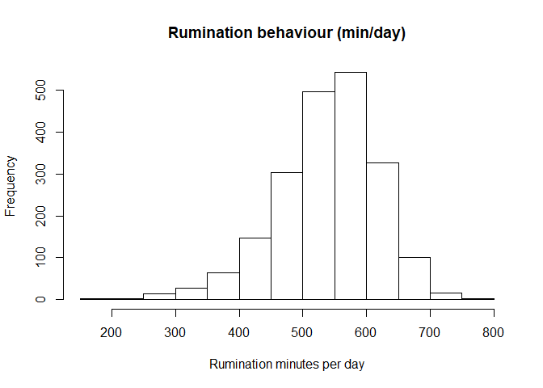
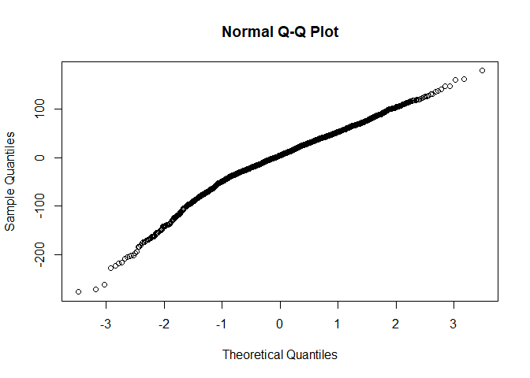

Rumination Time
================

  - [Read the data](#read-the-data)
  - [Data preparation](#data-preparation)
      - [Baseline model without any
        variable](#baseline-model-without-any-variable)
      - [Full model using the nested repeated measures
        GLMM](#full-model-using-the-nested-repeated-measures-glmm)
      - [Comparison of baseline and nested
        model](#comparison-of-baseline-and-nested-model)
      - [Full model](#full-model)
      - [Model fit 2-way interactions](#model-fit-2-way-interactions)
  - [Final model](#final-model)
      - [Model fit](#model-fit)
      - [Type 3 Analysis of Variance](#type-3-analysis-of-variance)
      - [Summary](#summary)
      - [Parameter estimate confidence
        intervals](#parameter-estimate-confidence-intervals)
      - [Least square means](#least-square-means)
      - [Interaction term contrasts](#interaction-term-contrasts)

# Read the data

  - Filter only the locomotion scores
  - Refactor the scores to only 3 classes (1-2 vs 3 vs 4-5)
  - Refactor the observation moments

<!-- end list -->

``` r
load("../Data/AllData.RData")
```

# Data preparation

``` r
AnalysisData <- AllData %>% filter(
                                SensorType  %like% "ruminatingTimeDataDay"
    ) %>%
   dplyr::mutate(
                  CalvingTime = as.Date(CalvingTime,format = "%Y-%m-%dT%H:%M:%OSZ"),
                  CalvingSeason = case_when(
                    between(month(CalvingTime), 1, 3) ~ "Winter",
                    between(month(CalvingTime), 4, 6) ~ "Spring",
                    between(month(CalvingTime), 7, 9) ~ "Summer",
                    between(month(CalvingTime), 10, 12) ~ "Autumn")
                  ) %>% 
  dplyr::group_by(
    AnimalNumber,
    HerdIdentifier,
    ObservationMoment,
    LocomotionScore,
    ObservationPeriod,
    LactationNumber,
    Parity,
    CalvingSeason
    ) %>% 
  dplyr::summarise(
    SensorValue = mean(SensorValue,na.rm = TRUE),
    SensorValues = n()
    )  %>%  
  dplyr::filter(
    SensorValues == 4
  ) %>%  
  dplyr::arrange(AnimalNumber,HerdIdentifier) %>%
  dplyr::group_by(AnimalNumber, HerdIdentifier) %>%
  dplyr::mutate(LocomotionMoments = length(LocomotionScore)) %>%
  filter(LocomotionMoments == 4) %>%    #4 locomotionscores minimum
  drop_na()

AnalysisData %>% select("HerdIdentifier", "AnimalNumber", "LactationNumber") %>% n_distinct()
```

    ## [1] 526

``` r
hist(AnalysisData$SensorValue,
     main = "Rumination behaviour (min/day)",
     xlab = "Rumination minutes per day")
```

<!-- -->

## Baseline model without any variable

``` r
baselineLMM <- lmer(
                  SensorValue ~ 1 + (1| AnimalNumber), 
                  REML = F,
                  data = AnalysisData
                  )
qqnorm(residuals(baselineLMM))
```

<!-- -->

## Full model using the nested repeated measures GLMM

``` r
LMM <- lmer(
                  SensorValue ~ 
                    LocomotionScore + ObservationPeriod + ObservationMoment + CalvingSeason +
                    ObservationPeriod:ObservationMoment +
                    ObservationPeriod:LocomotionScore +
                    ObservationMoment:LocomotionScore + 
                    ObservationPeriod:LocomotionScore:ObservationMoment + 
                    HerdIdentifier + 
                    Parity +  (1 | AnimalNumber),
                  REML = FALSE,
                  data = AnalysisData
                  )
qqnorm(residuals(LMM))
```

<!-- -->

## Comparison of baseline and nested model

``` r
anova(LMM, baselineLMM, test="Chisq")
```

    ## Data: AnalysisData
    ## Models:
    ## baselineLMM: SensorValue ~ 1 + (1 | AnimalNumber)
    ## LMM: SensorValue ~ LocomotionScore + ObservationPeriod + ObservationMoment + 
    ## LMM:     CalvingSeason + ObservationPeriod:ObservationMoment + ObservationPeriod:LocomotionScore + 
    ## LMM:     ObservationMoment:LocomotionScore + ObservationPeriod:LocomotionScore:ObservationMoment + 
    ## LMM:     HerdIdentifier + Parity + (1 | AnimalNumber)
    ##             Df   AIC   BIC logLik deviance  Chisq Chi Df Pr(>Chisq)    
    ## baselineLMM  3 23376 23393 -11685    23370                             
    ## LMM         26 22961 23107 -11454    22909 461.59     23  < 2.2e-16 ***
    ## ---
    ## Signif. codes:  0 '***' 0.001 '**' 0.01 '*' 0.05 '.' 0.1 ' ' 1

## Full model

``` r
LMMdrop <- drop1(LMM, test="Chisq")
if("Pr(>F)" %in% colnames(LMMdrop))
{
  Pvalues <- LMMdrop$`Pr(>F)`
} else 
{
  Pvalues <- LMMdrop$`Pr(Chi)`
}
LMMdrop
```

    ## Single term deletions using Satterthwaite's method:
    ## 
    ## Model:
    ## SensorValue ~ LocomotionScore + ObservationPeriod + ObservationMoment + 
    ##     CalvingSeason + ObservationPeriod:ObservationMoment + ObservationPeriod:LocomotionScore + 
    ##     ObservationMoment:LocomotionScore + ObservationPeriod:LocomotionScore:ObservationMoment + 
    ##     HerdIdentifier + Parity + (1 | AnimalNumber)
    ##                                                     Sum Sq Mean Sq NumDF   DenDF F value    Pr(>F)    
    ## CalvingSeason                                        50091   16697     3  545.29  5.0984  0.001734 ** 
    ## HerdIdentifier                                      355516   50788     7  514.36 15.5083 < 2.2e-16 ***
    ## Parity                                               83589   41794     2  564.70 12.7621 3.794e-06 ***
    ## LocomotionScore:ObservationPeriod:ObservationMoment   5373    2687     2 1737.79  0.8204  0.440430    
    ## ---
    ## Signif. codes:  0 '***' 0.001 '**' 0.01 '*' 0.05 '.' 0.1 ' ' 1

## Model fit 2-way interactions

``` r
LMMReduced = update(LMM, . ~ . - LocomotionScore:ObservationPeriod:ObservationMoment)
drop1(LMMReduced, test="Chisq")
```

    ## Single term deletions using Satterthwaite's method:
    ## 
    ## Model:
    ## SensorValue ~ LocomotionScore + ObservationPeriod + ObservationMoment + 
    ##     CalvingSeason + HerdIdentifier + Parity + (1 | AnimalNumber) + 
    ##     ObservationPeriod:ObservationMoment + LocomotionScore:ObservationPeriod + 
    ##     LocomotionScore:ObservationMoment
    ##                                     Sum Sq Mean Sq NumDF   DenDF F value    Pr(>F)    
    ## CalvingSeason                        50412   16804     3  545.14  5.1236 0.0016754 ** 
    ## HerdIdentifier                      357324   51046     7  514.28 15.5643 < 2.2e-16 ***
    ## Parity                               84416   42208     2  564.70 12.8695 3.424e-06 ***
    ## ObservationPeriod:ObservationMoment  36920   36920     1 1537.23 11.2572 0.0008124 ***
    ## LocomotionScore:ObservationPeriod    11215    5608     2 1772.54  1.7098 0.1812025    
    ## LocomotionScore:ObservationMoment      164      82     2 1731.41  0.0250 0.9753247    
    ## ---
    ## Signif. codes:  0 '***' 0.001 '**' 0.01 '*' 0.05 '.' 0.1 ' ' 1

# Final model

## Model fit

``` r
LMMReduced = update(LMMReduced, . ~ . - LocomotionScore:ObservationMoment - LocomotionScore:ObservationPeriod)
drop1(LMMReduced, test="Chisq")
```

    ## Single term deletions using Satterthwaite's method:
    ## 
    ## Model:
    ## SensorValue ~ LocomotionScore + ObservationPeriod + ObservationMoment + 
    ##     CalvingSeason + HerdIdentifier + Parity + (1 | AnimalNumber) + 
    ##     ObservationPeriod:ObservationMoment
    ##                                     Sum Sq Mean Sq NumDF   DenDF F value    Pr(>F)    
    ## LocomotionScore                       9915    4958     2 1931.17  1.5077 0.2216879    
    ## CalvingSeason                        48102   16034     3  542.78  4.8761 0.0023548 ** 
    ## HerdIdentifier                      363378   51911     7  513.38 15.7867 < 2.2e-16 ***
    ## Parity                               83461   41731     2  564.23 12.6907 4.063e-06 ***
    ## ObservationPeriod:ObservationMoment  39783   39783     1 1532.97 12.0985 0.0005187 ***
    ## ---
    ## Signif. codes:  0 '***' 0.001 '**' 0.01 '*' 0.05 '.' 0.1 ' ' 1

## Type 3 Analysis of Variance

``` r
Anova(LMMReduced, ddf="Satterthwaite")
```

    ## Analysis of Deviance Table (Type II Wald chisquare tests)
    ## 
    ## Response: SensorValue
    ##                                        Chisq Df Pr(>Chisq)    
    ## LocomotionScore                       3.0153  2  0.2214274    
    ## ObservationPeriod                   315.5414  1  < 2.2e-16 ***
    ## ObservationMoment                     1.9095  1  0.1670147    
    ## CalvingSeason                        14.6282  3  0.0021636 ** 
    ## HerdIdentifier                      110.5068  7  < 2.2e-16 ***
    ## Parity                               25.3814  2   3.08e-06 ***
    ## ObservationPeriod:ObservationMoment  12.0985  1  0.0005046 ***
    ## ---
    ## Signif. codes:  0 '***' 0.001 '**' 0.01 '*' 0.05 '.' 0.1 ' ' 1

## Summary

``` r
print(summary(LMMReduced, ddf="Satterthwaite"),correlation=FALSE)
```

    ## Linear mixed model fit by maximum likelihood . t-tests use Satterthwaite's method ['lmerModLmerTest']
    ## Formula: SensorValue ~ LocomotionScore + ObservationPeriod + ObservationMoment +  
    ##     CalvingSeason + HerdIdentifier + Parity + (1 | AnimalNumber) +      ObservationPeriod:ObservationMoment
    ##    Data: AnalysisData
    ## 
    ##      AIC      BIC   logLik deviance df.resid 
    ##  22953.9  23066.3 -11456.9  22913.9     2023 
    ## 
    ## Scaled residuals: 
    ##     Min      1Q  Median      3Q     Max 
    ## -4.9073 -0.5034  0.0493  0.5685  3.1735 
    ## 
    ## Random effects:
    ##  Groups       Name        Variance Std.Dev.
    ##  AnimalNumber (Intercept) 1695     41.17   
    ##  Residual                 3288     57.34   
    ## Number of obs: 2043, groups:  AnimalNumber, 511
    ## 
    ## Fixed effects:
    ##                                                       Estimate Std. Error        df t value Pr(>|t|)    
    ## (Intercept)                                           552.0946     9.5394  590.2439  57.875  < 2e-16 ***
    ## LocomotionScore3                                        0.5373     4.1221 1872.0727   0.130 0.896303    
    ## LocomotionScore4-5                                     -5.9421     3.7407 1987.9768  -1.588 0.112334    
    ## ObservationPeriodPost Partum                           36.9976     3.6225 1545.4877  10.213  < 2e-16 ***
    ## ObservationMomentSecond                               -12.4013     3.6044 1534.2629  -3.441 0.000596 ***
    ## CalvingSeasonSpring                                     3.2342     7.2009  564.5709   0.449 0.653503    
    ## CalvingSeasonSummer                                   -14.1360     5.7654  534.7454  -2.452 0.014530 *  
    ## CalvingSeasonWinter                                     7.5367     6.7913  549.0062   1.110 0.267585    
    ## HerdIdentifier544                                      27.5659     9.5770  512.7772   2.878 0.004164 ** 
    ## HerdIdentifier2011                                    -38.7737     8.9951  512.7416  -4.311 1.95e-05 ***
    ## HerdIdentifier2297                                     16.7181     9.6881  513.5278   1.726 0.085013 .  
    ## HerdIdentifier2514                                    -23.3921    10.5337  516.5538  -2.221 0.026806 *  
    ## HerdIdentifier2746                                     -7.1910    10.1831  512.6176  -0.706 0.480407    
    ## HerdIdentifier3314                                    -35.1327    10.2798  525.6436  -3.418 0.000681 ***
    ## HerdIdentifier5888                                     -9.4535    10.1657  510.7511  -0.930 0.352843    
    ## Parity3                                               -15.4632     5.6050  580.0576  -2.759 0.005984 ** 
    ## Parity>3                                              -26.7395     5.3350  556.1482  -5.012 7.25e-07 ***
    ## ObservationPeriodPost Partum:ObservationMomentSecond   17.6772     5.0821 1532.9675   3.478 0.000519 ***
    ## ---
    ## Signif. codes:  0 '***' 0.001 '**' 0.01 '*' 0.05 '.' 0.1 ' ' 1

## Parameter estimate confidence intervals

``` r
confint(LMMReduced, parm="beta_")
```

    ## Computing profile confidence intervals ...

    ##                                                           2.5 %     97.5 %
    ## (Intercept)                                          533.376873 570.834654
    ## LocomotionScore3                                      -7.549662   8.620936
    ## LocomotionScore4-5                                   -13.286812   1.399070
    ## ObservationPeriodPost Partum                          29.893834  44.102721
    ## ObservationMomentSecond                              -19.469890  -5.331898
    ## CalvingSeasonSpring                                  -10.917773  17.361742
    ## CalvingSeasonSummer                                  -25.457442  -2.816907
    ## CalvingSeasonWinter                                   -5.800204  20.868034
    ## HerdIdentifier544                                      8.756477  46.368112
    ## HerdIdentifier2011                                   -56.443456 -21.116297
    ## HerdIdentifier2297                                    -2.311097  35.737001
    ## HerdIdentifier2514                                   -44.086442  -2.716478
    ## HerdIdentifier2746                                   -27.197283  12.796354
    ## HerdIdentifier3314                                   -55.330054 -14.958019
    ## HerdIdentifier5888                                   -29.419697  10.504485
    ## Parity3                                              -26.472307  -4.463916
    ## Parity>3                                             -37.237274 -16.276629
    ## ObservationPeriodPost Partum:ObservationMomentSecond   7.710123  27.644253

## Least square means

``` r
multcomp::cld(lsmeans::lsmeans(LMMReduced, ~ HerdIdentifier), alpha=0.05, Letters=letters, adjust="tukey")
```

    ##  HerdIdentifier lsmean   SE  df lower.CL upper.CL .group
    ##  2011              513 5.07 555      499      527  a    
    ##  3314              517 6.95 543      498      536  ab   
    ##  2514              529 7.53 531      508      549  abc  
    ##  5888              543 7.22 540      523      562   bcd 
    ##  2746              545 6.90 542      526      564   bcd 
    ##  3                 552 7.59 545      531      573    cde
    ##  2297              569 6.45 538      551      586     de
    ##  544               580 6.06 538      563      596      e
    ## 
    ## Results are averaged over the levels of: LocomotionScore, ObservationPeriod, ObservationMoment, CalvingSeason, Parity 
    ## Degrees-of-freedom method: kenward-roger 
    ## Confidence level used: 0.95 
    ## Conf-level adjustment: sidak method for 8 estimates 
    ## P value adjustment: tukey method for comparing a family of 8 estimates 
    ## significance level used: alpha = 0.05

``` r
multcomp::cld(lsmeans::lsmeans(LMMReduced, ~ CalvingSeason), alpha=0.05, Letters=letters, adjust="tukey")
```

    ##  CalvingSeason lsmean   SE  df lower.CL upper.CL .group
    ##  Summer           530 3.90 562      520      540  a    
    ##  Autumn           544 4.61 569      533      556  ab   
    ##  Spring           547 5.62 595      533      561  ab   
    ##  Winter           552 5.31 576      539      565   b   
    ## 
    ## Results are averaged over the levels of: LocomotionScore, ObservationPeriod, ObservationMoment, HerdIdentifier, Parity 
    ## Degrees-of-freedom method: kenward-roger 
    ## Confidence level used: 0.95 
    ## Conf-level adjustment: sidak method for 4 estimates 
    ## P value adjustment: tukey method for comparing a family of 4 estimates 
    ## significance level used: alpha = 0.05

``` r
multcomp::cld(lsmeans::lsmeans(LMMReduced, ~ LocomotionScore), alpha=0.05, Letters=letters, adjust="tukey")
```

    ##  LocomotionScore lsmean   SE   df lower.CL upper.CL .group
    ##  4-5                539 3.48 1339      531      548  a    
    ##  1-2                545 2.86  856      538      552  a    
    ##  3                  546 4.09 1792      536      555  a    
    ## 
    ## Results are averaged over the levels of: ObservationPeriod, ObservationMoment, CalvingSeason, HerdIdentifier, Parity 
    ## Degrees-of-freedom method: kenward-roger 
    ## Confidence level used: 0.95 
    ## Conf-level adjustment: sidak method for 3 estimates 
    ## P value adjustment: tukey method for comparing a family of 3 estimates 
    ## significance level used: alpha = 0.05

``` r
multcomp::cld(lsmeans::lsmeans(LMMReduced, ~ ObservationPeriod), alpha=0.05, Letters=letters, adjust="tukey")
```

    ## NOTE: Results may be misleading due to involvement in interactions

    ##  ObservationPeriod lsmean   SE  df lower.CL upper.CL .group
    ##  Pre Partum           520 2.91 987      514      527  a    
    ##  Post Partum          566 2.82 900      560      573   b   
    ## 
    ## Results are averaged over the levels of: LocomotionScore, ObservationMoment, CalvingSeason, HerdIdentifier, Parity 
    ## Degrees-of-freedom method: kenward-roger 
    ## Confidence level used: 0.95 
    ## Conf-level adjustment: sidak method for 2 estimates 
    ## significance level used: alpha = 0.05

``` r
multcomp::cld(lsmeans::lsmeans(LMMReduced, ~ ObservationMoment), alpha=0.05, Letters=letters, adjust="tukey")
```

    ## NOTE: Results may be misleading due to involvement in interactions

    ##  ObservationMoment lsmean   SE  df lower.CL upper.CL .group
    ##  Second               542 2.85 927      535      548  a    
    ##  First                545 2.87 946      539      552  a    
    ## 
    ## Results are averaged over the levels of: LocomotionScore, ObservationPeriod, CalvingSeason, HerdIdentifier, Parity 
    ## Degrees-of-freedom method: kenward-roger 
    ## Confidence level used: 0.95 
    ## Conf-level adjustment: sidak method for 2 estimates 
    ## significance level used: alpha = 0.05

``` r
multcomp::cld(lsmeans::lsmeans(LMMReduced, ~ Parity), alpha=0.05, Letters=letters, adjust="tukey")
```

    ##  Parity lsmean   SE  df lower.CL upper.CL .group
    ##  >3        531 3.98 553      521      540  a    
    ##  3         542 4.46 605      531      553  a    
    ##  2         557 3.93 633      548      567   b   
    ## 
    ## Results are averaged over the levels of: LocomotionScore, ObservationPeriod, ObservationMoment, CalvingSeason, HerdIdentifier 
    ## Degrees-of-freedom method: kenward-roger 
    ## Confidence level used: 0.95 
    ## Conf-level adjustment: sidak method for 3 estimates 
    ## P value adjustment: tukey method for comparing a family of 3 estimates 
    ## significance level used: alpha = 0.05

``` r
multcomp::cld(lsmeans::lsmeans(LMMReduced, ~ ObservationMoment|ObservationPeriod), alpha=0.05, Letters=letters, adjust="tukey")
```

    ## ObservationPeriod = Pre Partum:
    ##  ObservationMoment lsmean   SE   df lower.CL upper.CL .group
    ##  Second               514 3.42 1529      507      522  a    
    ##  First                527 3.43 1538      519      534   b   
    ## 
    ## ObservationPeriod = Post Partum:
    ##  ObservationMoment lsmean   SE   df lower.CL upper.CL .group
    ##  First                564 3.36 1476      556      571  a    
    ##  Second               569 3.33 1463      561      576  a    
    ## 
    ## Results are averaged over the levels of: LocomotionScore, CalvingSeason, HerdIdentifier, Parity 
    ## Degrees-of-freedom method: kenward-roger 
    ## Confidence level used: 0.95 
    ## Conf-level adjustment: sidak method for 2 estimates 
    ## significance level used: alpha = 0.05

## Interaction term contrasts

``` r
summary(multcomp::glht(LMMReduced,  lsm(pairwise ~ ObservationMoment|ObservationPeriod, adjust="tukey")))
```

    ## Note: df set to 1539

    ## $`ObservationPeriod = Pre Partum`
    ## 
    ##   Simultaneous Tests for General Linear Hypotheses
    ## 
    ## Fit: lmer(formula = SensorValue ~ LocomotionScore + ObservationPeriod + 
    ##     ObservationMoment + CalvingSeason + HerdIdentifier + Parity + 
    ##     (1 | AnimalNumber) + ObservationPeriod:ObservationMoment, 
    ##     data = AnalysisData, REML = FALSE)
    ## 
    ## Linear Hypotheses:
    ##                     Estimate Std. Error t value Pr(>|t|)    
    ## First - Second == 0   12.401      3.604   3.441 0.000596 ***
    ## ---
    ## Signif. codes:  0 '***' 0.001 '**' 0.01 '*' 0.05 '.' 0.1 ' ' 1
    ## (Adjusted p values reported -- single-step method)
    ## 
    ## 
    ## $`ObservationPeriod = Post Partum`
    ## 
    ##   Simultaneous Tests for General Linear Hypotheses
    ## 
    ## Fit: lmer(formula = SensorValue ~ LocomotionScore + ObservationPeriod + 
    ##     ObservationMoment + CalvingSeason + HerdIdentifier + Parity + 
    ##     (1 | AnimalNumber) + ObservationPeriod:ObservationMoment, 
    ##     data = AnalysisData, REML = FALSE)
    ## 
    ## Linear Hypotheses:
    ##                     Estimate Std. Error t value Pr(>|t|)
    ## First - Second == 0   -5.276      3.584  -1.472    0.141
    ## (Adjusted p values reported -- single-step method)
