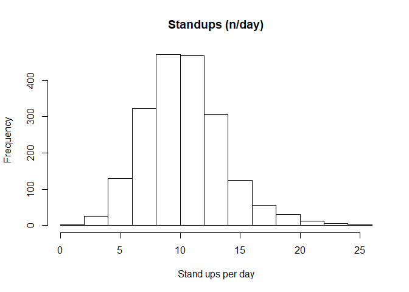
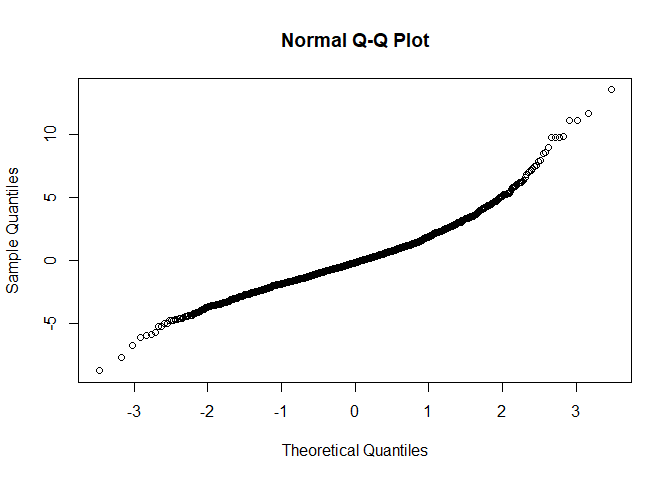
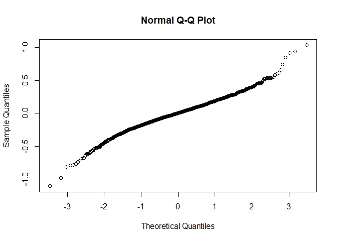
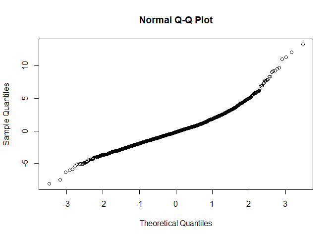

Stand ups
================

  - [Read the data](#read-the-data)
  - [Data preparation](#data-preparation)
  - [Model building](#model-building)
      - [Baseline models](#baseline-models)
          - [Linear model](#linear-model)
          - [Non-Linear model](#non-linear-model)
      - [Full model using the nested
        LMM](#full-model-using-the-nested-lmm)
      - [Comparison of baseline and nested
        model](#comparison-of-baseline-and-nested-model)
      - [Full model](#full-model)
      - [Model fit 2-way interactions](#model-fit-2-way-interactions)
  - [Final model](#final-model)
      - [Final model fit](#final-model-fit)
      - [Type 3 Analysis of Variance](#type-3-analysis-of-variance)
      - [Summary](#summary)
      - [Parameter estimate confidence
        intervals](#parameter-estimate-confidence-intervals)
      - [Least square means](#least-square-means)
      - [Interaction term contrasts](#interaction-term-contrasts)

# Read the data

  - Filter only the locomotion scores
  - Refactor the scores to only 3 classes (1-2 vs 3 vs 4-5)
  - Refactor the observation moments

<!-- end list -->

``` r
load("../Data/AllData.RData")
```

# Data preparation

``` r
AnalysisData <- AllData %>% filter(
                                SensorType %like% "standupSummary"  &
                                SensorValue < 50 & # Values < 100 very unlikely
                                SensorValue > 0
    ) %>%
  dplyr::mutate(
                  CalvingTime = as.Date(CalvingTime,format = "%Y-%m-%dT%H:%M:%OSZ"),
                  CalvingSeason = case_when(
                    between(month(CalvingTime), 1, 3) ~ "Winter",
                    between(month(CalvingTime), 4, 6) ~ "Spring",
                    between(month(CalvingTime), 7, 9) ~ "Summer",
                    between(month(CalvingTime), 10, 12) ~ "Autumn")
                  ) %>% 
  dplyr::group_by(
    AnimalNumber,
    HerdIdentifier,
    ObservationMoment,
    LocomotionScore,
    ObservationPeriod,
    LactationNumber,
    Parity,
    CalvingSeason
    ) %>% 
  dplyr::summarise(
    SensorValue = mean(SensorValue,na.rm = TRUE),
    SensorValues = n()
    )  %>%  
  dplyr::filter(
    SensorValues == 4
  ) %>%   
  dplyr::arrange(AnimalNumber,HerdIdentifier) %>%
  dplyr::group_by(AnimalNumber, HerdIdentifier) %>%
  dplyr::mutate(LocomotionMoments = length(LocomotionScore)) %>%
  filter(LocomotionMoments == 4) %>%    #4 locomotionscores minimum
  drop_na()

AnalysisData %>% select("HerdIdentifier", "AnimalNumber", "LactationNumber") %>% n_distinct()
```

    ## [1] 503

``` r
hist(AnalysisData$SensorValue,
     main = "Standups (n/day)",
     xlab = "Stand ups per day",
     breaks = c(15))
```

<!-- -->

# Model building

## Baseline models

### Linear model

``` r
baselineLIN <- lmer(
                  SensorValue ~ 1 + (1| AnimalNumber), 
                  REML = F,
                  data = AnalysisData
                  )
qqnorm(residuals(baselineLIN))
```

<!-- -->

### Non-Linear model

#### Log transformed LMM model

``` r
baselineLMM <- lmer(
                  log(SensorValue) ~ 1 + (1| AnimalNumber), 
                  REML = TRUE,
                  data = AnalysisData
                  )
qqnorm(residuals(baselineLMM))
```

<!-- -->

Best fit with linear model

## Full model using the nested LMM

``` r
LMM <- lmer(
                  SensorValue ~ 
                    LocomotionScore + ObservationPeriod + ObservationMoment + CalvingSeason +
                    ObservationPeriod:ObservationMoment +
                    ObservationPeriod:LocomotionScore +
                    ObservationMoment:LocomotionScore + 
                    ObservationPeriod:LocomotionScore:ObservationMoment + 
                    HerdIdentifier + 
                    Parity +  (1 | AnimalNumber),
                  data = AnalysisData
                  )
qqnorm(residuals(LMM))
```

<!-- -->

## Comparison of baseline and nested model

``` r
anova(LMM,baselineLIN, test="Chisq")
```

    ## refitting model(s) with ML (instead of REML)

    ## Data: AnalysisData
    ## Models:
    ## baselineLIN: SensorValue ~ 1 + (1 | AnimalNumber)
    ## LMM: SensorValue ~ LocomotionScore + ObservationPeriod + ObservationMoment + 
    ## LMM:     CalvingSeason + ObservationPeriod:ObservationMoment + ObservationPeriod:LocomotionScore + 
    ## LMM:     ObservationMoment:LocomotionScore + ObservationPeriod:LocomotionScore:ObservationMoment + 
    ## LMM:     HerdIdentifier + Parity + (1 | AnimalNumber)
    ##             Df    AIC    BIC  logLik deviance  Chisq Chi Df Pr(>Chisq)    
    ## baselineLIN  3 9743.8 9760.6 -4868.9   9737.8                             
    ## LMM         26 9675.0 9820.0 -4811.5   9623.0 114.82     23  3.523e-14 ***
    ## ---
    ## Signif. codes:  0 '***' 0.001 '**' 0.01 '*' 0.05 '.' 0.1 ' ' 1

## Full model

``` r
LMMdrop <- drop1(LMM, test="Chisq")
if("Pr(>F)" %in% colnames(LMMdrop))
{
  Pvalues <- LMMdrop$`Pr(>F)`
} else 
{
  Pvalues <- LMMdrop$`Pr(Chi)`
}
LMMdrop
```

    ## Single term deletions
    ## 
    ## Model:
    ## SensorValue ~ LocomotionScore + ObservationPeriod + ObservationMoment + 
    ##     CalvingSeason + ObservationPeriod:ObservationMoment + ObservationPeriod:LocomotionScore + 
    ##     ObservationMoment:LocomotionScore + ObservationPeriod:LocomotionScore:ObservationMoment + 
    ##     HerdIdentifier + Parity + (1 | AnimalNumber)
    ##                                                     Df    AIC    LRT   Pr(Chi)    
    ## <none>                                                 9675.0                     
    ## CalvingSeason                                        3 9684.1 15.106  0.001728 ** 
    ## HerdIdentifier                                       7 9706.3 45.327 1.182e-07 ***
    ## Parity                                               2 9692.7 21.747 1.895e-05 ***
    ## LocomotionScore:ObservationPeriod:ObservationMoment  2 9671.4  0.432  0.805893    
    ## ---
    ## Signif. codes:  0 '***' 0.001 '**' 0.01 '*' 0.05 '.' 0.1 ' ' 1

## Model fit 2-way interactions

``` r
LMMReduced = update(LMM, . ~ . - LocomotionScore:ObservationPeriod:ObservationMoment)
drop1(LMMReduced, test="Chisq")
```

    ## Single term deletions
    ## 
    ## Model:
    ## SensorValue ~ LocomotionScore + ObservationPeriod + ObservationMoment + 
    ##     CalvingSeason + HerdIdentifier + Parity + (1 | AnimalNumber) + 
    ##     ObservationPeriod:ObservationMoment + LocomotionScore:ObservationPeriod + 
    ##     LocomotionScore:ObservationMoment
    ##                                     Df    AIC    LRT   Pr(Chi)    
    ## <none>                                 9671.4                     
    ## CalvingSeason                        3 9680.6 15.203  0.001651 ** 
    ## HerdIdentifier                       7 9702.7 45.259 1.218e-07 ***
    ## Parity                               2 9689.2 21.744 1.898e-05 ***
    ## ObservationPeriod:ObservationMoment  1 9694.0 24.536 7.294e-07 ***
    ## LocomotionScore:ObservationPeriod    2 9668.6  1.120  0.571336    
    ## LocomotionScore:ObservationMoment    2 9668.0  0.550  0.759695    
    ## ---
    ## Signif. codes:  0 '***' 0.001 '**' 0.01 '*' 0.05 '.' 0.1 ' ' 1

``` r
if (last(Pvalues) < 0.05) {
  finalLMM <- LMM
} else {
  finalLMM <- LMMReduced
}
```

``` r
LMMReduced = update(finalLMM, . ~ . - LocomotionScore:ObservationMoment - LocomotionScore:ObservationPeriod)
drop1(LMMReduced, test="Chisq")
```

    ## Single term deletions
    ## 
    ## Model:
    ## SensorValue ~ LocomotionScore + ObservationPeriod + ObservationMoment + 
    ##     CalvingSeason + HerdIdentifier + Parity + (1 | AnimalNumber) + 
    ##     ObservationPeriod:ObservationMoment
    ##                                     Df    AIC    LRT   Pr(Chi)    
    ## <none>                                 9665.1                     
    ## LocomotionScore                      2 9661.3  0.285  0.866971    
    ## CalvingSeason                        3 9674.0 14.950  0.001859 ** 
    ## HerdIdentifier                       7 9696.3 45.207 1.247e-07 ***
    ## Parity                               2 9682.8 21.793 1.852e-05 ***
    ## ObservationPeriod:ObservationMoment  1 9688.7 25.642 4.111e-07 ***
    ## ---
    ## Signif. codes:  0 '***' 0.001 '**' 0.01 '*' 0.05 '.' 0.1 ' ' 1

# Final model

## Final model fit

``` r
drop1(LMMReduced, test="Chisq")
```

    ## Single term deletions
    ## 
    ## Model:
    ## SensorValue ~ LocomotionScore + ObservationPeriod + ObservationMoment + 
    ##     CalvingSeason + HerdIdentifier + Parity + (1 | AnimalNumber) + 
    ##     ObservationPeriod:ObservationMoment
    ##                                     Df    AIC    LRT   Pr(Chi)    
    ## <none>                                 9665.1                     
    ## LocomotionScore                      2 9661.3  0.285  0.866971    
    ## CalvingSeason                        3 9674.0 14.950  0.001859 ** 
    ## HerdIdentifier                       7 9696.3 45.207 1.247e-07 ***
    ## Parity                               2 9682.8 21.793 1.852e-05 ***
    ## ObservationPeriod:ObservationMoment  1 9688.7 25.642 4.111e-07 ***
    ## ---
    ## Signif. codes:  0 '***' 0.001 '**' 0.01 '*' 0.05 '.' 0.1 ' ' 1

## Type 3 Analysis of Variance

``` r
Anova(LMMReduced, ddf="Satterthwaite")
```

    ## Analysis of Deviance Table (Type II Wald chisquare tests)
    ## 
    ## Response: SensorValue
    ##                                       Chisq Df Pr(>Chisq)    
    ## LocomotionScore                      0.3101  2   0.856359    
    ## ObservationPeriod                    0.2645  1   0.607073    
    ## ObservationMoment                    3.8121  1   0.050883 .  
    ## CalvingSeason                       14.7759  3   0.002018 ** 
    ## HerdIdentifier                      45.9982  7  8.749e-08 ***
    ## Parity                              21.6756  2  1.964e-05 ***
    ## ObservationPeriod:ObservationMoment 25.7702  1  3.846e-07 ***
    ## ---
    ## Signif. codes:  0 '***' 0.001 '**' 0.01 '*' 0.05 '.' 0.1 ' ' 1

## Summary

``` r
print(summary(LMMReduced, ddf="Satterthwaite"),correlation=FALSE)
```

    ## Warning in summary.merMod(LMMReduced, ddf = "Satterthwaite"): additional arguments ignored

    ## Linear mixed model fit by REML ['lmerMod']
    ## Formula: SensorValue ~ LocomotionScore + ObservationPeriod + ObservationMoment +  
    ##     CalvingSeason + HerdIdentifier + Parity + (1 | AnimalNumber) +      ObservationPeriod:ObservationMoment
    ##    Data: AnalysisData
    ## 
    ## REML criterion at convergence: 9642.9
    ## 
    ## Scaled residuals: 
    ##     Min      1Q  Median      3Q     Max 
    ## -3.3889 -0.5626 -0.0768  0.4331  5.6269 
    ## 
    ## Random effects:
    ##  Groups       Name        Variance Std.Dev.
    ##  AnimalNumber (Intercept) 4.340    2.083   
    ##  Residual                 5.734    2.395   
    ## Number of obs: 1955, groups:  AnimalNumber, 489
    ## 
    ## Fixed effects:
    ##                                                      Estimate Std. Error t value
    ## (Intercept)                                          10.94558    0.48626  22.510
    ## LocomotionScore3                                      0.04911    0.17709   0.277
    ## LocomotionScore4-5                                    0.08930    0.16328   0.547
    ## ObservationPeriodPost Partum                          0.60718    0.15435   3.934
    ## ObservationMomentSecond                               0.76638    0.15397   4.978
    ## CalvingSeasonSpring                                   0.81813    0.33820   2.419
    ## CalvingSeasonSummer                                   0.33679    0.28776   1.170
    ## CalvingSeasonWinter                                  -0.48908    0.32956  -1.484
    ## HerdIdentifier544                                    -0.80534    0.48471  -1.661
    ## HerdIdentifier2011                                    0.26560    0.46035   0.577
    ## HerdIdentifier2297                                    0.14537    0.49354   0.295
    ## HerdIdentifier2514                                   -1.10305    0.49432  -2.231
    ## HerdIdentifier2746                                   -1.39388    0.53544  -2.603
    ## HerdIdentifier3314                                   -1.87398    0.55775  -3.360
    ## HerdIdentifier5888                                   -1.29992    0.51031  -2.547
    ## Parity3                                              -0.29912    0.27787  -1.076
    ## Parity>3                                             -1.16509    0.25741  -4.526
    ## ObservationPeriodPost Partum:ObservationMomentSecond -1.10247    0.21717  -5.076

## Parameter estimate confidence intervals

``` r
confint(LMMReduced, parm="beta_")
```

    ## Computing profile confidence intervals ...

    ##                                                           2.5 %     97.5 %
    ## (Intercept)                                          10.0018990 11.8870333
    ## LocomotionScore3                                     -0.2983697  0.3943597
    ## LocomotionScore4-5                                   -0.2347524  0.4052427
    ## ObservationPeriodPost Partum                          0.3054055  0.9098215
    ## ObservationMomentSecond                               0.4650700  1.0679847
    ## CalvingSeasonSpring                                   0.1639447  1.4753924
    ## CalvingSeasonSummer                                  -0.2201976  0.8951330
    ## CalvingSeasonWinter                                  -1.1268604  0.1507553
    ## HerdIdentifier544                                    -1.7435857  0.1346563
    ## HerdIdentifier2011                                   -0.6253980  1.1584666
    ## HerdIdentifier2297                                   -0.8101535  1.1022971
    ## HerdIdentifier2514                                   -2.0599816 -0.1444800
    ## HerdIdentifier2746                                   -2.4303235 -0.3554538
    ## HerdIdentifier3314                                   -2.9529019 -0.7912193
    ## HerdIdentifier5888                                   -2.2879892 -0.3106128
    ## Parity3                                              -0.8370410  0.2403561
    ## Parity>3                                             -1.6638308 -0.6660784
    ## ObservationPeriodPost Partum:ObservationMomentSecond -1.5278126 -0.6773869

## Least square means

``` r
multcomp::cld(lsmeans::lsmeans(LMMReduced, ~ HerdIdentifier), alpha=0.05, Letters=letters, adjust="tukey")
```

    ##  HerdIdentifier lsmean    SE  df lower.CL upper.CL .group
    ##  3314             9.21 0.390 491     8.14     10.3  a    
    ##  2746             9.69 0.360 486     8.70     10.7  ab   
    ##  5888             9.78 0.335 489     8.86     10.7  ab   
    ##  2514             9.98 0.309 482     9.13     10.8  abc  
    ##  544             10.28 0.286 489     9.49     11.1  abcd 
    ##  3               11.08 0.394 489    10.00     12.2   bcd 
    ##  2297            11.23 0.304 486    10.39     12.1    cd 
    ##  2011            11.35 0.241 500    10.69     12.0     d 
    ## 
    ## Results are averaged over the levels of: LocomotionScore, ObservationPeriod, ObservationMoment, CalvingSeason, Parity 
    ## Degrees-of-freedom method: kenward-roger 
    ## Confidence level used: 0.95 
    ## Conf-level adjustment: sidak method for 8 estimates 
    ## P value adjustment: tukey method for comparing a family of 8 estimates 
    ## significance level used: alpha = 0.05

``` r
multcomp::cld(lsmeans::lsmeans(LMMReduced, ~ Parity), alpha=0.05, Letters=letters, adjust="tukey") 
```

    ##  Parity lsmean    SE  df lower.CL upper.CL .group
    ##  >3       9.65 0.188 504     9.19     10.1  a    
    ##  3       10.51 0.221 555     9.98     11.0   b   
    ##  2       10.81 0.188 561    10.36     11.3   b   
    ## 
    ## Results are averaged over the levels of: LocomotionScore, ObservationPeriod, ObservationMoment, CalvingSeason, HerdIdentifier 
    ## Degrees-of-freedom method: kenward-roger 
    ## Confidence level used: 0.95 
    ## Conf-level adjustment: sidak method for 3 estimates 
    ## P value adjustment: tukey method for comparing a family of 3 estimates 
    ## significance level used: alpha = 0.05

``` r
multcomp::cld(lsmeans::lsmeans(LMMReduced, ~ CalvingSeason), alpha=0.05, Letters=letters, adjust="tukey")
```

    ##  CalvingSeason lsmean    SE  df lower.CL upper.CL .group
    ##  Winter          9.67 0.250 527     9.04     10.3  a    
    ##  Autumn         10.16 0.226 522     9.59     10.7  ab   
    ##  Summer         10.49 0.194 503    10.01     11.0   b   
    ##  Spring         10.97 0.257 550    10.33     11.6   b   
    ## 
    ## Results are averaged over the levels of: LocomotionScore, ObservationPeriod, ObservationMoment, HerdIdentifier, Parity 
    ## Degrees-of-freedom method: kenward-roger 
    ## Confidence level used: 0.95 
    ## Conf-level adjustment: sidak method for 4 estimates 
    ## P value adjustment: tukey method for comparing a family of 4 estimates 
    ## significance level used: alpha = 0.05

``` r
multcomp::cld(lsmeans::lsmeans(LMMReduced, ~ LocomotionScore), alpha=0.05, Letters=letters, adjust="tukey")
```

    ##  LocomotionScore lsmean    SE   df lower.CL upper.CL .group
    ##  1-2               10.3 0.135  723     9.95     10.6  a    
    ##  3                 10.3 0.184 1538     9.89     10.8  a    
    ##  4-5               10.4 0.161 1141     9.98     10.8  a    
    ## 
    ## Results are averaged over the levels of: ObservationPeriod, ObservationMoment, CalvingSeason, HerdIdentifier, Parity 
    ## Degrees-of-freedom method: kenward-roger 
    ## Confidence level used: 0.95 
    ## Conf-level adjustment: sidak method for 3 estimates 
    ## P value adjustment: tukey method for comparing a family of 3 estimates 
    ## significance level used: alpha = 0.05

``` r
multcomp::cld(lsmeans::lsmeans(LMMReduced, ~ ObservationPeriod), alpha=0.05, Letters=letters, adjust="tukey")
```

    ##  ObservationPeriod lsmean    SE  df lower.CL upper.CL .group
    ##  Pre Partum          10.3 0.136 793     9.99     10.6  a    
    ##  Post Partum         10.4 0.133 737    10.05     10.6  a    
    ## 
    ## Results are averaged over the levels of: LocomotionScore, ObservationMoment, CalvingSeason, HerdIdentifier, Parity 
    ## Degrees-of-freedom method: kenward-roger 
    ## Confidence level used: 0.95 
    ## Conf-level adjustment: sidak method for 2 estimates 
    ## significance level used: alpha = 0.05

``` r
multcomp::cld(lsmeans::lsmeans(LMMReduced, ~ ObservationMoment), alpha=0.05, Letters=letters, adjust="tukey")
```

    ##  ObservationMoment lsmean    SE  df lower.CL upper.CL .group
    ##  First               10.2 0.135 767     9.91     10.5  a    
    ##  Second              10.4 0.134 755    10.13     10.7   b   
    ## 
    ## Results are averaged over the levels of: LocomotionScore, ObservationPeriod, CalvingSeason, HerdIdentifier, Parity 
    ## Degrees-of-freedom method: kenward-roger 
    ## Confidence level used: 0.95 
    ## Conf-level adjustment: sidak method for 2 estimates 
    ## significance level used: alpha = 0.05

``` r
multcomp::cld(lsmeans::lsmeans(LMMReduced, ~ ObservationMoment|ObservationPeriod), alpha=0.05, Letters=letters, adjust="tukey")
```

    ## ObservationPeriod = Pre Partum:
    ##  ObservationMoment lsmean    SE   df lower.CL upper.CL .group
    ##  First               9.91 0.156 1213     9.56     10.3  a    
    ##  Second             10.68 0.156 1214    10.33     11.0   b   
    ## 
    ## ObservationPeriod = Post Partum:
    ##  ObservationMoment lsmean    SE   df lower.CL upper.CL .group
    ##  Second             10.18 0.153 1152     9.84     10.5  a    
    ##  First              10.52 0.154 1170    10.17     10.9   b   
    ## 
    ## Results are averaged over the levels of: LocomotionScore, CalvingSeason, HerdIdentifier, Parity 
    ## Degrees-of-freedom method: kenward-roger 
    ## Confidence level used: 0.95 
    ## Conf-level adjustment: sidak method for 2 estimates 
    ## significance level used: alpha = 0.05

## Interaction term contrasts

``` r
summary(multcomp::glht(LMMReduced,  lsm(pairwise ~ ObservationMoment|ObservationPeriod, adjust="tukey")))
```

    ## $`ObservationPeriod = Pre Partum`
    ## 
    ##   Simultaneous Tests for General Linear Hypotheses
    ## 
    ## Fit: lmer(formula = SensorValue ~ LocomotionScore + ObservationPeriod + 
    ##     ObservationMoment + CalvingSeason + HerdIdentifier + Parity + 
    ##     (1 | AnimalNumber) + ObservationPeriod:ObservationMoment, 
    ##     data = AnalysisData)
    ## 
    ## Linear Hypotheses:
    ##                     Estimate Std. Error t value Pr(>|t|)    
    ## First - Second == 0  -0.7664     0.1540  -4.978  7.2e-07 ***
    ## ---
    ## Signif. codes:  0 '***' 0.001 '**' 0.01 '*' 0.05 '.' 0.1 ' ' 1
    ## (Adjusted p values reported -- single-step method)
    ## 
    ## 
    ## $`ObservationPeriod = Post Partum`
    ## 
    ##   Simultaneous Tests for General Linear Hypotheses
    ## 
    ## Fit: lmer(formula = SensorValue ~ LocomotionScore + ObservationPeriod + 
    ##     ObservationMoment + CalvingSeason + HerdIdentifier + Parity + 
    ##     (1 | AnimalNumber) + ObservationPeriod:ObservationMoment, 
    ##     data = AnalysisData)
    ## 
    ## Linear Hypotheses:
    ##                     Estimate Std. Error t value Pr(>|t|)  
    ## First - Second == 0   0.3361     0.1530   2.196   0.0283 *
    ## ---
    ## Signif. codes:  0 '***' 0.001 '**' 0.01 '*' 0.05 '.' 0.1 ' ' 1
    ## (Adjusted p values reported -- single-step method)
